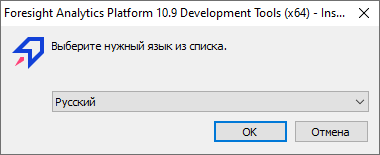
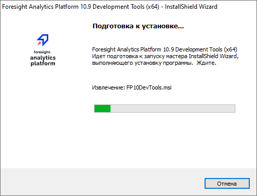
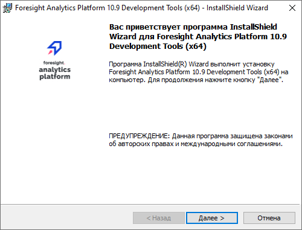
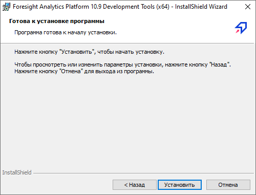
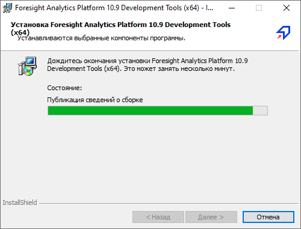
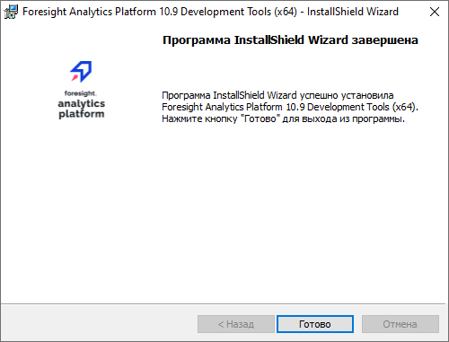
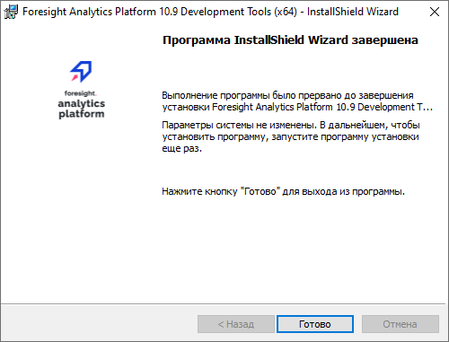

# Установка инструментов разработчика

Установка инструментов разработчика
-

# Установка инструментов разработчика

Инструменты разработчика - это набор Interop-сборок продукта «Форсайт. Аналитическая платформа»,
 зарегистрированных в глобальном кеше сборок (GAC). Регистрация сборок
 в глобальном кеше необходима для возможности использовать компоненты продукта
 «Форсайт. Аналитическая платформа»
 в прикладных приложениях, написанных на базе платформы .NET.

Установка инструментов разработчика осуществляется с помощью [дистрибутива](DistributionKit.htm#32_and_64)
 FP10DevTools.exe. Кроме
 регистрации сборок в глобальном кеше данный дистрибутив также прописывает
 в системную переменную PATH путь
 установки «Форсайт. Аналитическая платформа».

## Процесс установки надстроек

Для установки дистрибутива номер сборки инструментов разработчика должен
 совпадать с номером сборки продукта «Форсайт. Аналитическая платформа».

После запуска программа установки проверяет наличие других сборок устанавливаемой
 версии инструментов разработчика:

	- если на компьютере установлена другая сборка, то будет предложено
	 обновление инструментов разработчика;

	- если другой сборки не обнаружено, то будет запущена установка
	 надстройки, состоящая из следующих операций:

[Выбор
 языка для установки](javascript:TextPopup(this))

	По умолчанию будет предложен язык, установленный
	 в региональных настройках (см. Панель управления > Язык и
	 региональные настройки > вкладка «Форматы»):

	

[Подготовка
 к установке](javascript:TextPopup(this))

	Выполняется извлечение необходимых файлов:

	

	Для прерывания работы инсталлятора нажмите
	 кнопку «Отмена».

[Переход
 к запуску установки](javascript:TextPopup(this))

	Если необходимые файлы извлечены, то
	 отображается вводная информация:

	

	Для перехода к запуску установки нажмите
	 кнопку «Далее».

[Запуск
 установки инструментов разработчика](javascript:TextPopup(this))

	Инсталлятор готов к установке инструментов
	 разработчика:

	

	Для начала установки нажмите кнопку «Установить».

[Установка
 инструментов разработчика](javascript:TextPopup(this))

	Выполняется установка компонентов:

	

	Для прерывания работы инсталлятора нажмите
	 кнопку «Отмена».

[Завершение
 установки](javascript:TextPopup(this))

	Установка выполнена успешно:

	

	Если установка была прервана или завершилась
	 с ошибками:

	

См. также:

[Комплект
 поставки продукта «Форсайт. Аналитическая платформа»](DistributionKit.htm)

		Справочная
		 система на версию 10.9
		 от 18/08/2025,
		 © ООО «ФОРСАЙТ»,
