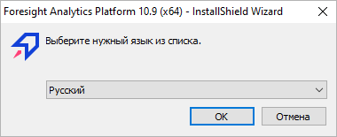
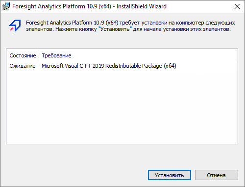
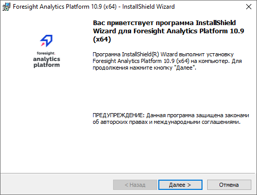
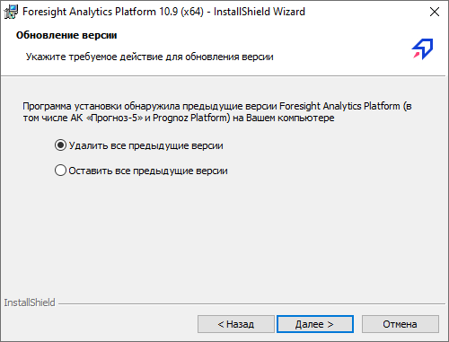
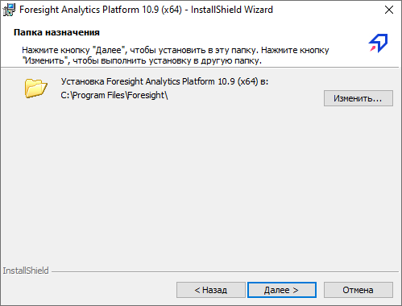
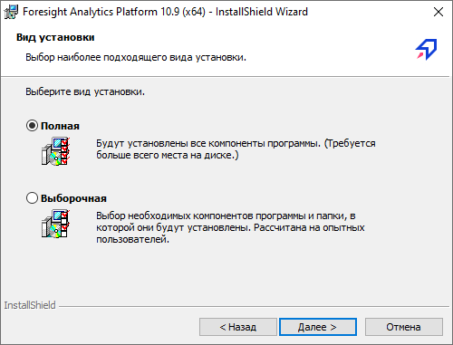
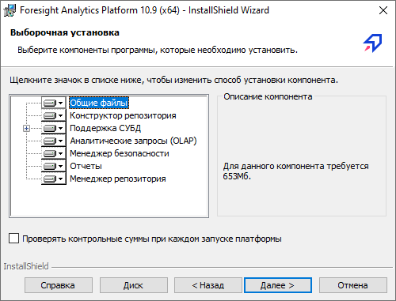
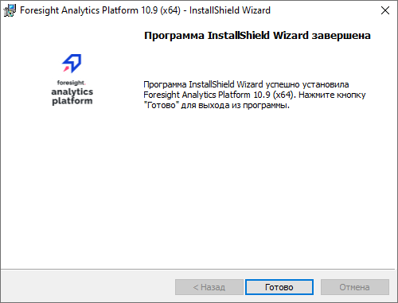

# Установка настольного приложения продукта «Форсайт.&#160;Аналитическая платформа»

Установка настольного приложения продукта «Форсайт. Аналитическая платформа»
-

# Установка настольного приложения
 продукта «Форсайт. Аналитическая платформа»

Для установки настольного приложения продукта «Форсайт. Аналитическая платформа»
 в ОС Windows:

	- Ознакомьтесь с [особенностями
	 установки](Setup_AK_InstallFeature.htm) настольного приложения.

	- Убедитесь, что установка производится от имени пользователя,
	 обладающего правами локального администратора компьютера.

	- Запустите один из [инсталляторов](DistributionKit.htm#32_and_64),
	 входящих в [комплект поставки продукта
	 «Форсайт. Аналитическая платформа»](DistributionKit.htm):

		- FP10Full_x64.exe;

		- FP10Standard_x64.exe.

Примечание.
 Для корректной работы платформы разрядность продукта «Форсайт. Аналитическая платформа» должна
 совпадать с разрядностью ОС Windows.

После запуска программа установки проверит
 наличие более ранней сборки устанавливаемой версии продукта «Форсайт. Аналитическая платформа»
 и в случае обнаружения предложит [обновить
 «Форсайт. Аналитическая платформа»](../Update/Update.htm).

При необходимости инсталляторы FP10Full_x64.exe и FP10Standard_x64.exe можно запустить
 с параметрами. Для получения подробной информации обратитесь к разделу
 «[Запуск дистрибутива
 с параметрами](../01_SysReq/Setup_SysReq_Client_Printer.htm)».

	- Если более ранней сборки не обнаружено, будет выдано окно для
	 выбора языка установки:

Примечание.
 Диалог выбора языка не отображается, если для запуска дистрибутива был
 использован [параметр
 «L»](../01_SysReq/Setup_SysReq_Client_Printer.htm).

По умолчанию будет предложен язык, установленный
 в региональных настройках (см. Панель управления > Язык и региональные
 настройки > вкладка «Форматы»).
 Выбранный язык также будет использован в качестве языка интерфейса продукта
 «Форсайт. Аналитическая платформа».

Примечание.
 [Язык
 интерфейса](GetStarted.chm::/Interface/Intro_Language.htm)
 продукта «Форсайт. Аналитическая платформа»
 можно изменить после установки.

	- Далее будет проверено наличие дополнительного программного обеспечения
	 (пререквизитов) на рабочей станции. Если необходимые пререквизиты
	 не установлены (или установлена более ранняя версия), то будет предложена
	 их установка, например:

После нажатия кнопки «Установить»
 будет произведена попытка последовательной установки всех предлагаемых
 компонентов. Если необходимые пререквизиты отсутствуют в папке «ISSetupPrerequisites», то установка
 «Форсайт. Аналитическая платформа»
 будет остановлена и будет выдано соответствующее сообщение.

Если необходимые пререквизиты входят в комплект
 поставки, то в столбце «Состояние»
 будет отражено состояние установки для каждого компонента: успешно, установка,
 ожидание.

После установки некоторых пререквизитов может
 появиться сообщение о необходимости перезагрузки ОС. При положительном
 ответе будет осуществлена перезагрузка, в противном случае - продолжена
 установка. При появлении сообщения рекомендуется перезагрузить компьютер,
 так как это необходимо для корректной установки оставшихся пререквизитов
 и «Форсайт. Аналитическая платформа».
 После перезагрузки установка будет продолжена автоматически: будет открыт
 диалог для продолжения установки пререквизитов или будет открыта первая
 страница мастера установки «Форсайт. Аналитическая платформа».

	- На первой странице мастера установки отображается вводная информация:

Для продолжения установки нажмите кнопку
 «Далее».

	- Если на рабочей станции установлены более ранние версии Prognoz Platform или «Форсайт. Аналитическая платформа»,
	 то появится следующая страница:

Выберите действие:

		- Удалить все предыдущие
		 версии. Все имеющиеся более ранние версии Prognoz Platform и «Форсайт. Аналитическая платформа»
		 будут удалены с компьютера;

		- Оставить все предыдущие
		 версии. Все имеющиеся версии Prognoz Platform
		 и «Форсайт. Аналитическая платформа»
		 будут оставлены.

Нажмите кнопку «Далее».

	- На следующем этапе установки необходимо определить папку, в
	 которую будут установлены компоненты продукта «Форсайт. Аналитическая платформа»:

Путь установки продукта «Форсайт. Аналитическая платформа»
 по умолчанию C:\Program Files\Foresight\.

Для изменения папки нажмите кнопку «Изменить».

	- На следующей странице укажите конфигурацию установки:

Выберите вариант и нажмите кнопку «Далее»:

		- Полная. На компьютер
		 будет установлен полный набор компонентов продукта «Форсайт. Аналитическая платформа».
		 Данный вариант установки рекомендуется в большинстве случаев;

		- Выборочная.
		 Пользователю предлагается самостоятельно определить список устанавливаемых
		 компонентов:

Недоступно для исключения при установке:

			- Общие файлы.
			 Файлы и библиотеки, необходимые для правильной работы всего
			 набора компонентов «Форсайт. Аналитическая платформа»;

			- Конструктор репозитория.
			 Модуль, осуществляющий работу с существующим репозиторием;

			- Поддержка СУБД.
			 Набор компонентов для поддержки различных СУБД: Oracle, Microsoft
			 SQL Server, OLE DB, PostgreSQL, SQLite.

Компоненты, которые при установке могут быть
 исключены и не будут установлены в виде отдельного файла формата *.exe:

			- Аналитические
			 запросы (OLAP). Инструмент «Аналитические запросы (OLAP)»;

			- Экспресс-статистика.
			 Модуль экспресс-статистики данных;

			- Менеджер
			 безопасности. Приложение, реализующее комплекс средств
			 для контроля целостности программной системы и информации
			 в этой системе;

			- Отчёты.
			 Инструмент «Отчёты», позволяющий создавать отчёты произвольной
			 формы и аналитические записки, содержащие таблицы данных,
			 диаграммы, карты, основанные на многомерных и реляционных
			 источниках данных, и другие объекты;

			- Менеджер
			 репозитория. Приложение, используемое для автоматизации
			 процесса обновления версий продукта «Форсайт. Аналитическая платформа»
			 и версий репозитория платформы.

При выделении компонента в области «Описание компонента» будет представлена
 информация о требуемом месте для установки компонента.

Флажок «Проверять
 контрольные суммы при каждом запуске платформы» определяет, будет
 ли проводиться [проверка
 целостности продукта «Форсайт. Аналитическая платформа»](admin.chm::/04_SecurityPolicy/Integrity_control.htm).
 При установленном флажке проверка контрольных сумм для исполняемых файлов
 производится в момент их загрузки. При каждом запуске «Форсайт. Аналитическая платформа»
 загружается минимальный набор исполняемых файлов, а по мере обращения
 к функциональности загружаются дополнительные библиотеки, необходимые
 для работы. По умолчанию флажок снят и проверка целостности продукта «Форсайт. Аналитическая платформа»
 не производится. Значение опции применяется только для устанавливаемого
 релиза.

Для просмотра информации о дисковом пространстве,
 требуемом для установки выбранных компонентов, и о свободном пространстве
 на жестком диске рабочей станции нажмите кнопку «Диск».
 Будет отображена информация об имеющихся томах жесткого диска, об их размерах,
 размерах свободного пространства и размерах, требуемых для установки выбранных
 компонентов.

После определения состава компонентов нажмите
 кнопку «Далее».

	- Для начала установки нажмите кнопку «Установить»:

	- Для завершения установки нажмите кнопку «Готово»:

После выполнения действий будет установлено настольное приложение продукта
 «Форсайт. Аналитическая платформа».

Также при установке «Форсайт. Аналитическая платформа»
 может быть выполнена настройка репозиториев и параметров автообновления.
 Для получения подробной информации обратитесь к разделу «[Настройка
 репозиториев и автообновления из файла](../Update/Tuner.htm)».

Настольное приложение может быть запущено из [командной
 строки](../07_AK_Run_Additional/UsingCommandLine.htm) с использованием определённого синтаксиса, например, для автоматического
 подключения к репозиторию и/или открытия объекта. При запуске платформы
 из командной строки возможно использование [ключей](../07_AK_Run_Additional/UseKeys.htm).
 Запуск настольного приложения из [командной
 строки](../07_AK_Run_Additional/UsingCommandLine.htm) с различными параметрами используется для формирования и тестирования
 команд, которые в дальнейшем могут быть сохранены в виде ярлыков и использоваться
 для автоматического запуска разрабатываемых приложений, а также видоизменять
 сам процесс запуска.

При возникновении проблем при установке «Форсайт. Аналитическая платформа»
 обратитесь к разделу «[Проблемы
 при запуске, входе и проверке пользователя](FAQ.chm::/Errors/StartingError.htm)».

См. также:

[Настройка репозиториев и автообновления
 из файла](../Update/Tuner.htm) | [Обновление
 продукта «Форсайт. Аналитическая платформа»](../Update/Update.htm)
 | [Запуск
 дистрибутива с параметром](../01_SysReq/Setup_SysReq_Client_Printer.htm) | [Комплект
 поставки продукта «Форсайт. Аналитическая платформа»](DistributionKit.htm)

		Справочная
		 система на версию 10.9
		 от 18/08/2025,
		 © ООО «ФОРСАЙТ»,
