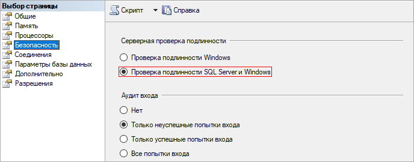

# Подготовка сервера Microsoft SQL Server

Подготовка сервера Microsoft SQL Server
-

# Подготовка сервера Microsoft SQL Server

Процедура подготовки сервера Microsoft SQL Server производится администратором
 СУБД любым из доступных способов, например, с помощью приложения «SQL Server Management Studio», доступного
 на [официальном сайте Microsoft](https://docs.microsoft.com/ru-ru/sql/ssms/download-sql-server-management-studio-ssms?view=sql-server-2017).

Предварительно необходимо проверить настройки сервера. В настройках
 безопасности должен использоваться режим проверки подлинности SQL Server
 и Windows:

Подготовка сервера состоит из следующих шагов:

	- Создание базы данных.

	- Создание пользовательской схемы в базе данных.

	- Создание пользователя.

	- Раздача прав.

## Создание базы данных

Создаваемая база данных необходима для хранения метаданных платформы.

Создание базы данных можно произвести с помощью следующего скрипта:

USE MASTER;

GO

CREATE DATABASE DB_NAME;

GO

где:

	- DB_NAME. Идентификатор создаваемой базы данных.

## Создание пользовательской схемы в базе данных

Данный шаг можно пропустить. По умолчанию используется схема «dbo»,
 но при необходимости можно создать пользовательскую схему в базе данных.

CREATE SCHEMA [SCHEMA_NAME] AUTHORIZATION [DB_OWNER]

где:

	- SCHEMA_NAME. Идентификатор пользовательской схемы.

## Создание пользователя БД

Создаваемый пользователь необходим для обеспечения доступа к созданной
 ранее базе данных.

Создание пользователя можно произвести с помощью следующего скрипта:

CREATE LOGIN USER_NAME WITH PASSWORD = 'PASSWORD',
 DEFAULT_DATABASE = master

GO

где:

	- USER_NAME. Имя нового пользователя. Должно совпадать с DB_NAME;

	- PASSWORD. Пароль пользователя.

## Раздача прав

Раздачу прав можно произвести с помощью следующего скрипта:

USE DB_NAME

GO

ALTER AUTHORIZATION ON database::DB_NAME TO USER_NAME

GO

где:

	- DB_NAME. Идентификатор созданной ранее базы данных;

	- USER_NAME. Имя созданного ранее пользователя.

После успешного выполнения всех шагов можно перейти к [созданию
 репозитория](../05_RepoMngr/Setup_RepoMngr_Work_Main.htm). Если в дальнейшем предполагается хранение дистрибутивов
 продукта «Форсайт. Аналитическая платформа»
 на сервере БД и обновление оттуда на компьютерах пользователей, то рекомендуется
 сразу же подготовить служебного пользователя [PPUPDATE](../Update/PPUPDATE.htm).

См. также:

[Подготовка серверной части СУБД](Setup_DB_Server_Config.htm)

		Справочная
		 система на версию 10.9
		 от 18/08/2025,
		 © ООО «ФОРСАЙТ»,
