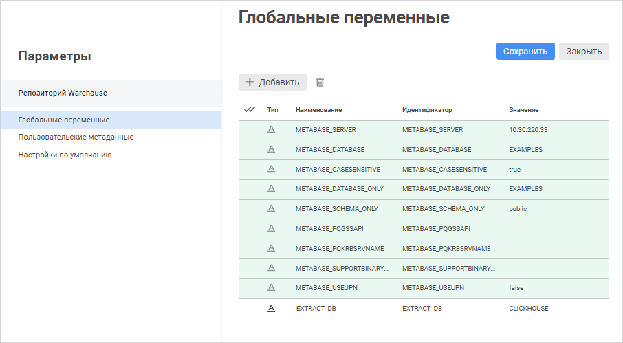

# Подключение репозитория, созданного в продукте FlyBI

Подключение репозитория, созданного в продукте FlyBI
-

# Подключение репозитория, созданного в продукте FlyBI

Для подключения репозитория, созданного в продукте [FlyBI](https://help.fsight.ru/FlyBI/ru/starting/flybi_start.htm),
 в веб-приложение «Форсайт. Аналитическая платформа»:

	- Пересоздайте служебного пользователя с учётными данными, которые
	 использовались при [создании репозитория](https://help.fsight.ru/FlyBI/ru/setup/repository.htm) в
	 продукте FlyBI, с помощью приложения [PP.Util](Service_Applications/PP_Util.htm).
	 Приложение расположено в папке установки BI-сервера /opt/foresight/fp10.x-biserver/bin. Для запуска
	 приложения используйте скрипт PP.Util_start.sh со следующими параметрами:

sudo ./PP.Util_start.sh /create_audit_user
 metabase_id login password audit_login audit_password db_login db_password

Где:

		- metabase_id. Идентификатор
		 репозитория. Обязательный параметр;

		- login. Имя владельца
		 схемы ADMIN для подключения к репозиторию. Обязательный параметр;

		- password. Пароль
		 владельца схемы ADMIN для подключения к репозиторию. Обязательный
		 параметр;

		- audit_login. Имя
		 создаваемого служебного пользователя. Обязательный параметр;

Примечание.
 Имя служебного пользователя P4AUDIT зарезервировано системой и недоступно
 для использования.

		- audit_password.
		 Пароль создаваемого служебного пользователя. Обязательный параметр;

		- db_login. Имя пользователя
		 базы данных, у которого есть привилегии на создание пользователей
		 в СУБД. Необязательный параметр. Если имя пользователя не указано,
		 то оно будет запрошено в интерактивном режиме;

		- db_password. Пароль
		 пользователя базы данных, у которого есть привилегии на создание
		 пользователей в СУБД. Необязательный параметр. Если пароль не
		 указан, то он будет запрошен в интерактивном режиме.

Например:

sudo ./PP.Util_start.sh /create_audit_user
 REPOSITORY_ID FLYBI FLYBI USER_SERVICE USER_SERVICE

Указанные учётные данные владельца репозитория
 и служебного пользователя используются по умолчанию при выполнении скрипта
 [CreateRepo.sh](https://help.fsight.ru/FlyBI/ru/setup/repository.htm)
 в продукте FlyBI.

	- Сохраните учётные данные служебного пользователя:

sudo ./PP.Util_start.sh /save_audit_creds
 "SERVER_DATABASE|TYPE" login [password]

Где:

		- SERVER_DATABASE.
		 IP-адрес или псевдоним, под которым зарегистрирован [сервер
		 базы данных](../06_AK_Client_Config/UiNav_RepoConfig_repo1.htm#driver). Обязательный параметр;

		- TYPE. Тип используемого
		 [драйвера](../06_AK_Client_Config/UiNav_RepoConfig_repo1.htm#driver).
		 Обязательный параметр. Допустимы следующие значения: «POSTGRES»,
		 «MSSQL», «ORCL»;

		- login. Имя служебного
		 пользователя. Обязательный параметр, является регистрозависимым;

		- password. Пароль
		 служебного пользователя. Необязательный параметр, является регистрозависимым.
		 Если пароль не указан, то он будет запрошен в интерактивном режиме.

Например:

sudo ./PP.Util_start.sh /save_audit_creds
 "127.0.0.1|POSTGRES" USER_SERVICE USER_SERVICE

После выполнения действий учётные данные
 служебного пользователя сохраняются в файле [settings.xml](../UiWebSetup/03_Setup_Web/BI_Server_Settings_XML.htm),
 расположенном по пути /opt/foresight/fp10.x-biserver/etc.

	- Настройте [доступ
	 к репозиторию](../06_AK_Client_Config/UiNav_RepoConfig.htm) с помощью окна «[Настройка
	 подключения к репозиторию](../06_AK_Client_Config/UiNav_RepoConfig_repo1.htm)» или файла [Metabases.xml](../06_AK_Client_Config/Configuring_repository_list_in_the_system_registry.htm#metabase_xml_list),
	 расположенного по пути /opt/foresight/fp10.x-biserver/etc.

Примечание.
 При настройке подключения к репозиторию на каждом клиентском компьютере
 или на компьютере с установленным BI-сервером IP-адрес или псевдоним сервера
 должен совпадать с сервером, указанным в параметре SERVER_DATABASE
 при сохранении учётных данных служебного пользователя.

	- [Перезапустите
	 BI-сервер](../UiWebSetup/01_BIServer/bi-service_restart.htm).

После выполнения действий репозиторий будет подключён для работы в веб-приложении.

Особенности синхронизации [навигатора проектов FlyBI](https://help.fsight.ru/FlyBI/ru/navigator/work_with_navigator.htm)
 с [навигатором
 объектов «Форсайт. Аналитическая платформа»](GetStarted.chm::/Interface/Interface_Navigator.htm):

	- в навигаторе объектов содержатся служебные папки:

		- USER_FILE_DATA.
		 Папка располагается в корне навигатора объектов и содержит дочерние
		 папки, соответствующие именам пользователей, под учётными записями
		 которых были созданы объекты в продукте FlyBI;

		- USER_SOURCES_<имя пользователя>. Папка располагается в
		 соответствующей папке пользователя и содержит базы данных, которые
		 используются для построения моделей данных;

		- USER_TABLES_<имя пользователя>. Папка располагается в
		 соответствующей папке пользователя и содержит объекты, основанные
		 на используемых базах данных: таблицы, запросы;

		- Общие БД. Папка
		 располагается в папке USER_FILE_DATA и содержит базы данных, которые
		 добавляются в качестве [преднастроенных подключений](https://help.fsight.ru/FlyBI/ru/project/datamodel/datasources/add_data_sources.htm)
		 в продукте FlyBI.

	- [проекты](https://help.fsight.ru/FlyBI/ru/project/work_with_project.htm) преобразуются в [информационные панели](dataanalysis.chm::/Dashboard.htm);

	- [модели данных](https://help.fsight.ru/FlyBI/ru/project/datamodel/create_data_model.htm) входят в состав информационных
	 панелей и не преобразуются в отдельные объекты.

[Менеджер безопасности FlyBI](https://help.fsight.ru/FlyBI/ru/setup/securitymanager/security_manager.htm) полностью совпадает
 с [менеджером
 безопасности «Форсайт. Аналитическая платформа»](admin.chm::/Admin_Title.htm).

## Работа с СУБД ClickHouse

Для работы с СУБД ClickHouse обратитесь к разделу «[Настройка ClickHouse](UiDashboard.chm::/DataModel/ClickHouse.htm)»
 и добавьте глобальную переменную EXTRACT_DB:

	- Выполните команду 
	 «Параметры» на боковой панели
	 [навигатора
	 объектов](GetStarted.chm::/Interface/Interface_Navigator.htm). После чего будет открыта страница «[Глобальные
	 переменные](UiNav.chm::/02_Navigator/UiNav_GlobalVariables.htm)»:

	- Нажмите кнопку 
	 «Добавить» и задайте параметры
	 глобальной переменной в столбцах:

		- Тип.
		 Выберите в раскрывающемся списке строковый тип переменной;

		- Наименование.
		 Введите наименование переменной: EXTRACT_DB;

		- Идентификатор.
		 Введите идентификатор переменной: EXTRACT_DB;

		- Значение.
		 Введите идентификатор базы данных, которая будет использоваться
		 по умолчанию для подключения к СУБД ClickHouse и хранения данных,
		 например: CLICKHOUSE. База данных с идентификатором CLICKHOUSE
		 используется в продукте FlyBI по умолчанию.

	- Нажмите кнопку «Сохранить»
	 и «Закрыть».

После выполнения действий будет добавлена глобальная переменная EXTRACT_DB.

Если в [менеджере
 безопасности](admin.chm::/03_Admin/Users/Admin_Users.htm)
 уже создан специальный пользователь для работы с СУБД, то выполните действия:

	- Сохраните учётные данные пользователя с помощью приложения PP.Util:

sudo ./PP.Util_start.sh /save_creds
 metabase_id /DEC login [password]

Где:

		- metabase_id. Идентификатор
		 репозитория;

		- login. Имя пользователя.
		 Обязательный параметр, является регистрозависимым;

		- password. Пароль
		 пользователя. Необязательный параметр, является регистрозависимым.
		 Если пароль не указан, то он будет запрошен в интерактивном режиме.

Например:

sudo ./PP.Util_start.sh /save_creds
 REPOSITORY_ID /DEC USER_EXTRACT USER_EXTRACT_PASSWORD

	- [Перезапустите
	 BI-сервер](../UiWebSetup/01_BIServer/bi-service_restart.htm).

После выполнения действия учётные данные пользователя будут сохранены
 в файл [Metabases.xml](../06_AK_Client_Config/Configuring_repository_list_in_the_system_registry.htm#metabase_xml_list).

См.
 также:

[Создание
 и управление репозиториями метаданных](Setup_RepoMngr_Work_Main.htm)

		Справочная
		 система на версию 10.9
		 от 18/08/2025,
		 © ООО «ФОРСАЙТ»,
