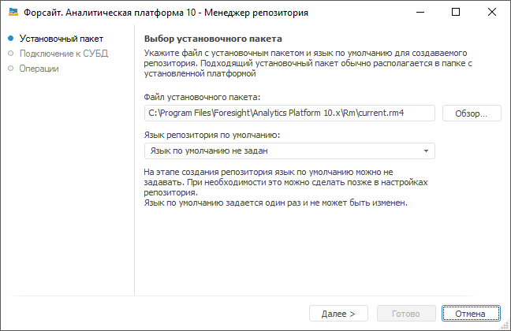
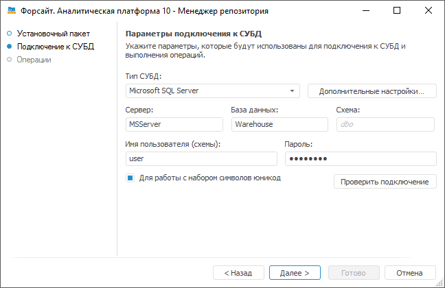

# Создание репозитория метаданных: Windows

Создание репозитория метаданных: Windows
-

# Создание репозитория метаданных

После выбора данной операции в [окне
 менеджера репозитория](Setup_RepoMngr_Work_Main.htm) нажмите кнопку «Продолжить»,
 появится страница:

	- Файл установочного пакета.
	 Для создания нового репозитория автоматически будет выбран путь к
	 файлу с расширением *.rm4, в котором хранятся исполняемые скрипты.
	 Данный файл входит в стандартный установочный пакет и находится по
	 пути «S\Rm\current.rm4», где S - путь до места установки «Форсайт. Аналитическая платформа».

	- Язык
	 репозитория по умолчанию. Язык репозитория по умолчанию задаётся
	 один раз и не может быть изменен. На этапе создания язык указывать
	 необязательно. Его можно задать позже в [настройках
	 репозитория](uinav.chm::/02_Navigator/Repo_Default.htm#language).

	Указанный язык репозитория используется по умолчанию в инструментах
	 продукта «Форсайт. Аналитическая платформа» и влияет на возможность
	 перевода на различные языки следующих объектов:

		- [наименований
		 объектов](uinav.chm::/03_objects/uinav_obj_basicpropnames.htm) репозитория;

		- [справочников
		 НСИ](UiNav.chm::/Multilanguage/UiRds_Locale.htm);

		- [баз
		 данных временных рядов](UiDw.chm::/FAQ/Translation.htm);

		- [объектов
		 пользовательских классов](UiDevEnv.chm::/04_NavigatorSetting/Classes_Object/UiNav_Classes_Object.htm). Выбранный язык будет
		 использоваться в качестве языка по умолчанию в ресурсах. Подробнее
		 о ресурсах вы можете узнать в разделе «[Перевод в ресурсах](UiNav.chm::/Multilanguage/Resources.htm)».

Для перехода на следующую страницу нажмите кнопку «Далее».

На странице «Подключение
 к СУБД» определите параметры, которые будут использоваться для
 подключения к СУБД и выполнения операций:

Примечание.
 Набор доступных настроек зависит от выбранной СУБД.

Создание базы данных и пользователя описано в статье «[Подготовка
 серверной части СУБД](../03_DB_Server_Config/Setup_DB_Server_Config.htm)».

	- Тип
	 СУБД. В раскрывающемся списке выберите тип СУБД. Более подробно
	 о доступных СУБД читайте в подразделе «[Поддерживаемые
	 СУБД](../01_SysReq/database_Support.htm)»;

	- Дополнительные настройки.
	 Кнопка становится доступной, если производится настройка подключения
	 к СУБД [Microsoft
	 SQL Server](../03_DB_Server_Config/Setup_DB_Server_Config_MSQL.htm) или [PostgreSQL
	 Database](../03_DB_Server_Config/Postgres_server_preparation.htm). В дополнительных параметрах указывается:

		- Учитывать регистр при работе
		 с СУБД. По умолчанию флажок снят и работа с СУБД выполняется
		 без учёта регистра. При установленном флажке все команды будут
		 выполняться с учётом регистра;

Примечание.
 При [подготовке
 серверной части СУБД PostgreSQL](../03_DB_Server_Config/Postgres_server_preparation.htm) параметры задаются в верхнем регистре.
 Для корректного подключения к СУБД установите флажок.

		- Файловая группа.
		 Поле доступно, если выбрана СУБД [Microsoft
		 SQL Server](../03_DB_Server_Config/Setup_DB_Server_Config_MSQL.htm). Если пользователем в дополнительных параметрах
		 не задана файловая группа, то по умолчанию в поле отображается
		 DEFAULT, и при подключении будет использоваться файловая группа,
		 отмеченная в свойствах БД флажком «по умолчанию»;

		- Имя пользователя-администратора
		 схемы в базе данных. Поле доступно, если выбрана СУБД [Microsoft
		 SQL Server](../03_DB_Server_Config/Setup_DB_Server_Config_MSQL.htm). По умолчанию будут использоваться данные DATABASE
		 OWNER. В случае если неизвестны учетные данные DATABASE OWNER,
		 то укажите пользователя, который обладает привилегией DB_OWNER
		 на сервере СУБД. От имени указанного пользователя будут выполняться
		 системные процедуры;

	- Сервер. Введите IP-адрес
	 или DNS-имя, под которым зарегистрирован сервер с подключаемой базой
	 данных. Поле доступно, если выбран тип СУБД: Oracle, Microsoft SQL
	 Server, PostgreSQL Database.

Если порт сервера СУБД отличается от [порта
 по умолчанию](../01_SysReq/EnviromentRequirements.htm#ports_and_protocols), то значение поля задаётся в формате:

		- для Microsoft SQL Server: <IP-адрес
		 или DNS-имя сервера>,<номер
		 порта>;

		- для PostgreSQL Database: <IP-адрес
		 или DNS-имя сервера>:<номер
		 порта>.

При использовании СУБД Oracle порт сервера
 определяется в файле tnsnames.ora.

	- База данных. Поле доступно,
	 если выбран тип СУБД [Microsoft
	 SQL Server](../03_DB_Server_Config/Setup_DB_Server_Config_MSQL.htm) или [PostgreSQL
	 Database](../03_DB_Server_Config/Postgres_server_preparation.htm). Задайте имя базы данных для хранения метаданных;

	- Имя файла БД.
	 Поле доступно, если выбран тип СУБД [SQLite
	 Database](../03_DB_Server_Config/Config_SQLite.htm). Укажите путь к существующему файлу или путь и наименование
	 нового файла, который будет создан. При выполнении скрипта в файле
	 будет создана база данных репозитория. Один файл используется для
	 хранения данных и метаданных одного репозитория.

Примечание.
 Если указывается существующий файл, то этот файл должен быть пустым или
 содержать какие-либо данные в формате СУБД SQLite.

	- Схема. Поле отображается,
	 если выбран тип СУБД [Microsoft
	 SQL Server](../03_DB_Server_Config/Setup_DB_Server_Config_MSQL.htm) или [PostgreSQL
	 Database](../03_DB_Server_Config/Postgres_server_preparation.htm). Для использования пользовательской схемы в БД укажите
	 её идентификатор. По умолчанию для Microsoft SQL Server используется
	 схема «dbo», для PostgreSQL - «public».

Примечание.
 Из-за особенностей работы СУБД PostgreSQL рекомендуется использовать [пользовательскую
 схему](../03_DB_Server_Config/Postgres_server_preparation.htm#create_schema).

	- Имя пользователя (схемы).
	 Имя пользователя, являющегося владельцем базы данных (схемы). Как
	 правило используется имя, совпадающее с идентификатором схемы. Но
	 для [Microsoft
	 SQL Server](../03_DB_Server_Config/Setup_DB_Server_Config_MSQL.htm) существует возможность создать пользователя с новыми
	 учетными данными, который будет ассоциирован как пользователь, под
	 которым должны выполняться серверные процедуры передачи прав на таблицы
	 репозитория;

	- Пароль. Введите пароль
	 пользователя для доступа к СУБД;

	- Для работы с набором символов
	 юникод. Установка флажка позволяет использовать в созданном
	 репозитории набор символов Unicode для вставки различных национальных
	 символов (например, иероглифов) в символьные поля таблиц.

Для проверки корректности введенных данных нажмите кнопку «Проверить
 подключение». В случае успешного (неуспешного) подключения появится
 соответствующее сообщение. Если при проверке подключения не найдена файловая
 группа, указанная в дополнительных настройках, то выдается соответствующее
 сообщение.

Для начала процесса создания репозитория нажмите
 кнопку «Далее», при этом на экране
 будет отображаться ход выполнения операции:

Окончание процесса сопровождается соответствующим информационным сообщением.
 Создание репозитория завершено. Создайте [служебного
 пользователя подсистемы безопасности](Setup_RepoMngr_Service_User.htm) и при необходимости произведите
 [настройку окна
 регистрации](../06_AK_Client_Config/Setup_ClientConfig.htm).

См. также:

[Создание
 и управление репозиториями метаданных](Setup_RepoMngr_Work_Main.htm) | [Менеджер
 репозитория](RepoMngr_Windows.htm)

		Справочная
		 система на версию 10.9
		 от 18/08/2025,
		 © ООО «ФОРСАЙТ»,
