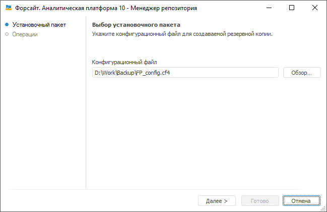

# Создание резервной копии репозитория метаданных

Создание резервной копии репозитория метаданных
-

# Создание резервной копии репозитория метаданных

Создание резервной копии версии репозитория может понадобиться для восстановления
 утерянных или измененных данных.

В менеджере репозитория доступно создание резервной копии для СУБД Microsoft
 SQL Server и Oracle.

Совет. Для корректного
 создания резервной копии версии репозитория используйте средства СУБД,
 так как в новых версиях СУБД появляется новая функциональность, которая
 может не поддерживаться менеджером репозитория или быть несовместимой
 с ним.

## Создание резервной копии с помощью менеджера репозитория

После выбора данной операции в [окне
 менеджера репозитория](Setup_RepoMngr_Work_Main.htm) нажмите кнопку «Продолжить»,
 появится страница:

В поле «Конфигурационный файл»
 укажите конфигурационный файл, созданный ранее.
 Все созданные резервные копии сохраняются в том же каталоге, в котором
 находится конфигурационный файл.

В процессе создания резервных копий данных необходимо указывать имя
 и пароль пользователя, обладающего правами доступа ко всем схемам, данные
 которых используются в текущей (архивируемой) схеме. В конце операции
 будет выдано сообщение с количеством созданных архивных копий.

## Конфигурационный файл

Конфигурационный файл содержит настройки подключения к базе метаданных
 и базам данных, созданных в «Форсайт. Аналитическая платформа».

Для создания конфигурационного файла в [навигаторе
 объектов](GetStarted.chm::/Interface/Interface_Navigator.htm)  выполните пункт главного меню «Сервис
 > Создать конфигурационный файл». Будет открыт стандартный диалог
 сохранения файла.

Примечание.
 Конфигурационный файл настраивается на каталог, в котором он был сохранен.
 Для успешного создания резервной копии необходимо наличие доступа к данному
 каталогу на сервере СУБД. Для этого расположите файл по доступному для
 сервера сетевому пути или создайте на сервере каталог с аналогичным путем.

См. также:

[Создание
 и управление репозиториями метаданных](Setup_RepoMngr_Work_Main.htm) | [Менеджер
 репозитория](RepoMngr_Windows.htm)

		Справочная
		 система на версию 10.9
		 от 18/08/2025,
		 © ООО «ФОРСАЙТ»,
