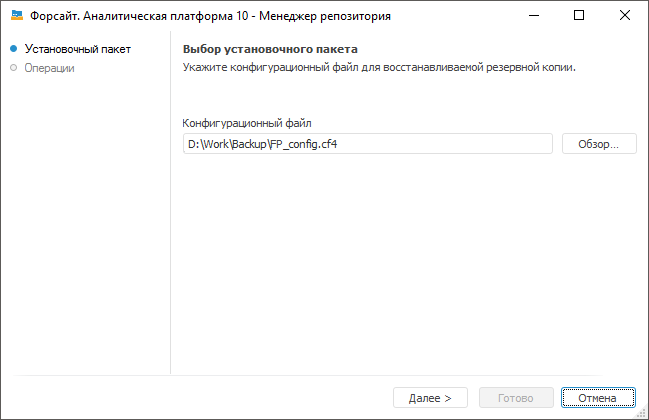

# Восстановление репозитория метаданных из резервной копии

Восстановление репозитория метаданных из резервной копии
-

# Восстановление репозитория метаданных из резервной копии

После выбора данной операции в [окне
 менеджера репозитория](Setup_RepoMngr_Work_Main.htm) нажмите кнопку «Продолжить»,
 появится страница:

Укажите путь к [конфигурационному
 файлу](Setup_RepoMngr_CreateRepoBackup.htm#config), который был использован для создания резервной копии.
 Процедура восстановления репозитория использует резервные копии, созданные
 [при резервном копировании](Setup_RepoMngr_CreateRepoBackup.htm).
 Копии располагаются в той же папке, в которой находится конфигурационный
 файл.

При нажатии кнопки «Далее» происходит
 извлечение данных и восстановление репозитория из резервных копий.

См. также:

[Создание
 и управление репозиториями метаданных](Setup_RepoMngr_Work_Main.htm) | [Менеджер
 репозитория](RepoMngr_Windows.htm)

		Справочная
		 система на версию 10.9
		 от 18/08/2025,
		 © ООО «ФОРСАЙТ»,
