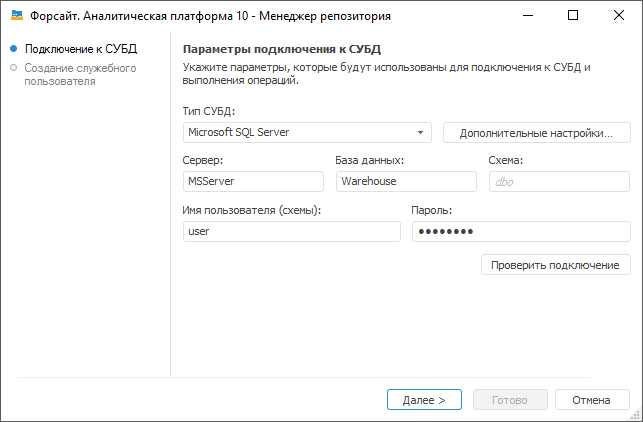
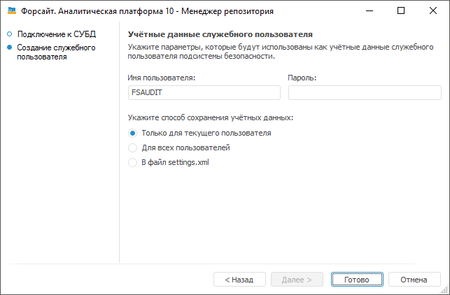

# Создание служебного пользователя: Windows

Создание служебного пользователя: Windows
-

# Создание служебного пользователя

	Служебный пользователь подсистемы безопасности обеспечивает:

		- вход в систему;

		- корректную работу аудита и блокировку пользователей;

		- использование [роли
		 приложения](admin.chm::/03_admin/Access_control_settings.htm#role) при работе с СУБД;

		- использование функции [хеширования
		 паролей](admin.chm::/03_admin/Access_control_settings.htm#hash).

	Примечание.
	 Создание служебного пользователя необходимо для репозитория, созданного
	 на базе СУБД PostgreSQL, Oracle или Microsoft SQL Server.

	Для создания служебного пользователя подсистемы безопасности в ОС
	 Windows:

		- [Создайте учётные данные служебного пользователя
		 на сервере базы данных](#create).

Важно.
	 На сервере базы данных поддерживается использование только одной учётной
	 записи служебного пользователя. Если на сервере базы данных содержится
	 несколько репозиториев, то создайте служебного пользователя с одинаковыми
	 учётными данными для каждого репозитория.

		- [Сохраните созданные учётные
		 данные служебного пользователя](#add_service_user) на каждом компьютере пользователя,
		 если предполагается одновременное использование настольного и
		 веб-приложения. Если предполагается использование только веб-приложения,
		 то сохраните учётные данные служебного пользователя на компьютере
		 с установленным BI-сервером.

	При работе с настольным приложением пользователи
	 напрямую взаимодействуют с СУБД. При работе с веб-приложением взаимодействие
	 с СУБД осуществляется через BI-сервер.

	После выполнения действий будет создан служебный пользователь подсистемы
	 безопасности на сервере базы данных и сохранён в соответствии с выбранным
	 способом на каждом компьютере пользователя или на компьютере с установленным
	 BI-сервером.

	Совет. Настоятельно
	 рекомендуется отключить политику обязательной периодической смены
	 пароля для учётной записи служебного пользователя подсистемы безопасности
	 в СУБД.

	Для изменения пароля служебного пользователя подсистемы безопасности
	 используйте [менеджер
	 безопасности](admin.chm::/03_admin/users/admin_service_user.htm).

## Создание учётных данных служебного пользователя

	Для создания учётных данных служебного пользователя на сервере базы
	 данных используйте [менеджер репозитория](#repomanager)
	 или приложение [PP.Util.exe](#pp_util).

### Менеджер репозитория

	Для создания учётных данных служебного пользователя:

		- Запустите [менеджер
		 репозитория](Setup_RepoMngr_Work_Main.htm) от имени администратора.

		- [Настройте
		 подключение к СУБД](Setup_RepoMngr_Service_User.htm#connection).

		- [Настройте
		 параметры служебного пользователя](Setup_RepoMngr_Service_User.htm#service_user).

#### Настройка подключения к СУБД

	Для настройки подключения к СУБД:

		- Выберите операцию «Создать
		 служебного пользователя подсистемы безопасности» в [окне
		 менеджера репозитория](Setup_RepoMngr_Work_Main.htm) и нажмите кнопку «Продолжить».

	После выполнения действий будет открыта
	 страница «Подключение к СУБД»:

	

	Примечание.
	 Набор доступных параметров зависит от выбранного типа СУБД.

		- Задайте параметры подключения к СУБД:

			- Тип
			 СУБД. Выберите тип СУБД [Oracle](../03_DB_Server_Config/Setup_DB_Server_Config_Oracle.htm),
			 [Microsoft
			 SQL Server](../03_DB_Server_Config/Setup_DB_Server_Config_MSQL.htm) или [PostgreSQL](../03_DB_Server_Config/Postgres_server_preparation.htm).
			 Для получения подробной информации о доступных версиях СУБД
			 обратитесь к разделу «[Поддерживаемые
			 СУБД](../01_SysReq/database_Support.htm)»;

			- Дополнительные
			 настройки. Кнопка становится доступной, если производится
			 настройка подключения к СУБД Microsoft SQL Server или PostgreSQL.
			 В дополнительных параметрах указывается:

			-

				- Учитывать регистр
				 при работе с СУБД. По умолчанию флажок снят и работа
				 с СУБД выполняется без учета регистра. При установленном
				 флажке все команды будут выполняться с учетом регистра;

				- Файловая группа.
				 Поле доступно, если выбрана СУБД Microsoft SQL Server.
				 Если пользователем в дополнительных параметрах не задана
				 файловая группа, то по умолчанию в поле отображается DEFAULT,
				 и при подключении будет использоваться файловая группа,
				 отмеченная в свойствах БД флажком «по умолчанию»;

				- Имя пользователя-администратора
				 схемы в базе данных. Поле доступно, если выбрана
				 СУБД Microsoft SQL Server. По умолчанию будут использоваться
				 данные DATABASE OWNER. В случае если неизвестны учетные
				 данные DATABASE OWNER, то укажите пользователя, который
				 обладает привилегией DB_OWNER на сервере СУБД. От имени
				 указанного пользователя будут выполняться системные процедуры;

			- Сервер.
			 Введите IP-адрес или DNS-имя, под которым зарегистрирован
			 сервер.

	Если порт сервера СУБД отличается от
	 [порта
	 по умолчанию](../01_SysReq/EnviromentRequirements.htm#ports_and_protocols), то значение параметра задаётся в формате:

				- для Microsoft SQL Server: <IP-адрес
				 или DNS-имя сервера>,<номер
				 порта>;

				- для PostgreSQL: <IP-адрес
				 или DNS-имя сервера>:<номер
				 порта>.

	При использовании СУБД Oracle порт сервера
	 определяется в файле tnsnames.ora.

			- База данных.
			 Поле доступно, если выбран тип СУБД Microsoft SQL Server или
			 PostgreSQL. Задайте имя базы данных для хранения метаданных;

			- Схема. Поле
			 отображается, если выбран тип СУБД Microsoft SQL Server или
			 PostgreSQL. Для использования пользовательской схемы в БД
			 укажите её идентификатор. По умолчанию используется «dbo»;

			- Имя пользователя
			 (схемы). Имя пользователя, являющегося владельцем базы
			 данных (схемы);

			- Пароль.
			 Введите пароль пользователя для доступа к СУБД.

		- Нажмите кнопку «Проверить
		 подключение» для проверки корректности введенных данных.
		 В случае успешного/неуспешного подключения появится соответствующее
		 сообщение. Если при проверке подключения не найдена файловая группа,
		 указанная в дополнительных настройках, то также будет выдано соответствующее
		 сообщение.

	После выполнения действий будет настроено подключение к СУБД, на
	 базе которой создан репозиторий.

	Для создания учётных данных служебного пользователя нажмите кнопку
	 «Далее».

#### Настройка параметров служебного пользователя

	Для настройки параметров служебного пользователя:

		- Перейдите на страницу «Создание
		 служебного пользователя»:

	

		- Задайте параметры учётных данных служебного пользователя:

			- Имя пользователя.
			 Введите имя служебного пользователя. По умолчанию имя пользователя
			 используется в верхнем регистре для избежания конфликтов с
			 СУБД.

	Примечание.
	 Имя служебного пользователя P4AUDIT зарезервировано системой и недоступно для использования.

			- Пароль. Введите
			 пароль служебного пользователя. Для СУБД Microsoft SQL Server
			 пароль должен соответствовать [требованиям](https://docs.microsoft.com/ru-ru/windows/security/threat-protection/security-policy-settings/password-must-meet-complexity-requirements),
			 указанным к сложности пароля.

		- Выберите способ сохранения учётных данных:

			- Только для текущего
			 пользователя. Учётные данные будут храниться в ветке
			 [реестра](../UiWebSetup/03_Setup_Web/BI_Server_Registry_Key.htm)
			 текущего пользователя [HKEY_CURRENT_USER\SOFTWARE\Foresight\Foresight Analytics Platform\10.0\Audit\Credentials\Item0]
			 и доступны для использования только текущему пользователю
			 на компьютере;

			- Для всех пользователей.
			 Учётные данные будут храниться в ветке [реестра](../UiWebSetup/03_Setup_Web/BI_Server_Registry_Key.htm)
			 локальной машины [HKEY_LOCAL_MACHINE\SOFTWARE\Foresight\Foresight Analytics Platform\10.0\Audit\Credentials\Item0]
			 и доступны для использования всем пользователям на компьютере.

	Примечание.
	 Сохранение учётных данных в реестр локальной машины выполняется от
	 имени пользователя, обладающего правами администратора.

			- В файл settings.xml.
			 Учётные данные будут храниться в файле [settings.xml](../UiWebSetup/03_Setup_Web/BI_Server_Settings_XML.htm),
			 расположенном по пути %PROGRAMDATA%\Foresight\Foresight Analytics Platform.

	Примечание.
	 По умолчанию папка ProgramData скрыта в операционной системе.

	Файл доступен для использования только
	 текущему пользователю на компьютере. Если файл содержится по указанному
	 пути, то он будет перезаписан. Если файл отсутствует, то он будет
	 создан.

		- Нажмите кнопку «Готово».

	После выполнения действий будут созданы учётные данные служебного
	 пользователя на сервере базы данных и сохранены в соответствии с выбранным
	 способом на текущем компьютере пользователя. Если учётные данные служебного
	 пользователя не созданы на сервере базы данных и у администратора/пользователя
	 нет привилегии на создание пользователей в СУБД, то будет выдан [диалог
	 авторизации в базе данных](uinavobj.chm::/database/uidb_database_authorization.htm).

	Примечание.
	 Если осуществляется работа с сервером базы данных СУБД Oracle, то
	 в диалоге укажите учётные данные пользователя «Sys» и выберите режим
	 «SYSDBA» в параметрах подключения к серверу.

### PP.Util.exe

	Для создания учётных данных служебного пользователя запустите приложение
	 [PP.Util.exe](Service_Applications/PP_Util.htm), которое
	 расположено в папке установки «Форсайт. Аналитическая платформа»,
	 со следующими параметрами:

	PP.Util.exe /create_audit_user metabase_id login
	 password audit_login audit_password db_login db_password

	Где:

	- metabase_id. Идентификатор
	 репозитория. Обязательный параметр;

Примечание.
 Репозиторий с указанным идентификатором должен содержаться в [списке
 репозиториев](../06_AK_Client_Config/UiNav_RepoConfig.htm#params). Если в [настройках
 подключения к репозиторию](../06_AK_Client_Config/UiNav_RepoConfig.htm) указана пользовательская схема, то учётные
 данные служебного пользователя будут созданы для неё.

	- login. Имя владельца
	 схемы ADMIN для подключения к репозиторию. Обязательный параметр;

	- password. Пароль владельца
	 схемы ADMIN для подключения к репозиторию. Обязательный параметр;

	- audit_login. Имя создаваемого
	 служебного пользователя. Обязательный параметр;

Примечание.
 Имя служебного пользователя P4AUDIT зарезервировано системой и недоступно для использования.

	- audit_password. Пароль
	 создаваемого служебного пользователя. Обязательный параметр;

	- db_login. Имя пользователя
	 базы данных, у которого есть привилегии на создание пользователей
	 в СУБД. Необязательный параметр. Если имя пользователя не указано,
	 то оно будет запрошено в интерактивном режиме;

	- db_password. Пароль
	 пользователя базы данных, у которого есть привилегии на создание пользователей
	 в СУБД. Необязательный параметр. Если пароль не указан, то он будет
	 запрошен в интерактивном режиме.

После выполнения действий будут созданы учётные данные служебного пользователя
 на сервере базы данных.

## Сохранение созданных учётных данных
	 служебного пользователя

	Для сохранения созданных учётных данных служебного пользователя
	 на каждом компьютере пользователя или на компьютере с установленным
	 BI-сервером используйте приложение [PP.Util.exe](Setup_RepoMngr_Service_User.htm#pp_util_exe)
	 или [экспортируйте](Setup_RepoMngr_Service_User.htm#reg)
	 данные реестра в reg-файл с компьютера, на котором создан служебный
	 пользователь. Экспорт данных реестра актуален, если при создании служебного
	 пользователя был выбран [способ сохранения
	 учётных данных](#service_user) «Только для текущего
	 пользователя» или «Для всех
	 пользователей». Если при создании служебного пользователя был
	 выбран способ сохранения учётных данных «В
	 файл settings.xml», то скопируйте сгенерированный файл [settings.xml](../UiWebSetup/03_Setup_Web/BI_Server_Settings_XML.htm)
	 на каждый компьютер пользователя или на компьютер с установленным
	 BI-сервером.

	Приоритет поиска сохранённых учётных данных служебного пользователя:

		- [settings.xml](../UiWebSetup/03_Setup_Web/BI_Server_Settings_XML.htm).

		- Раздел [HKEY_CURRENT_USER].

		- Раздел [HKEY_LOCAL_MACHINE].

### PP.Util.exe

	Для сохранения созданных учётных данных служебного пользователя
	 запустите приложение [PP.Util.exe](Service_Applications/PP_Util.htm),
	 которое расположено в папке установки «Форсайт. Аналитическая платформа»,
	 со следующими параметрами:

	PP.Util.exe /save_audit_creds /ALG enc_alg /SCOPE
	 scope realm|/DC login password

	Где:

	- enc_alg. Алгоритм шифрования,
	 который будет применяться при шифровании учётных данных:

		- gos. По умолчанию.
		 Используется шифрование алгоритмом ГОСТ 28147-89;

		- pro. Используется
		 шифрование с помощью Data Protection API (DPAPI) в ОС Windows.
		 Данный алгоритм шифрования недоступен для ОС Linux;

		- sim. Учётные данные
		 сохраняются в открытом виде.

Важно.
 Для обеспечения безопасности в промышленной эксплуатации продукта «Форсайт. Аналитическая платформа»
 используйте значение gos или pro.

Необязательный параметр. Если параметр не
 задан, то используется значение по умолчанию;

	- scope. Способ сохранения
	 учётных данных:

		- hkcu.
		 Только для текущего пользователя. Учётные данные будут храниться
		 в ветке [реестра](../UiWebSetup/03_Setup_Web/BI_Server_Registry_Key.htm)
		 текущего пользователя [HKEY_CURRENT_USER\SOFTWARE\Foresight\Foresight Analytics Platform\10.0\Audit\Credentials\Item0]
		 и доступны для использования только текущему пользователю на компьютере;

		- hklm.
		 Для всех пользователей. Учётные данные будут храниться в ветке
		 [реестра](../UiWebSetup/03_Setup_Web/BI_Server_Registry_Key.htm)
		 локальной машины [HKEY_LOCAL_MACHINE\SOFTWARE\Foresight\Foresight Analytics Platform\10.0\Audit\Credentials\Item0]
		 и доступны для использования всем пользователям на компьютере;

		- file.
		 По умолчанию. В файл [settings.xml](../UiWebSetup/03_Setup_Web/BI_Server_Settings_XML.htm).

В ОС Windows учётные данные будут храниться
 в файле [settings.xml](../UiWebSetup/03_Setup_Web/BI_Server_Settings_XML.htm),
 расположенном по пути %PROGRAMDATA%\Foresight\Foresight Analytics Platform.

Примечание.
 По умолчанию папка ProgramData скрыта в операционной системе.

Если файл содержится по указанным путям,
 то он будет перезаписан. Если файл отсутствует, то он будет создан.

Необязательный параметр, используется только
 в ОС Windows. Если параметр не задан, то используется значение по умолчанию.

В ОС Linux учётные данные могут храниться
 только в файле [settings.xml](../UiWebSetup/03_Setup_Web/BI_Server_Settings_XML.htm),
 расположенном по пути /opt/foresight/fp10.x-biserver/etc.

	- realm|/DC. Область действия
	 учётных данных служебного пользователя. Выберите один из способов:

		- realm. Если в [списке репозиториев](../06_AK_Client_Config/UiNav_RepoConfig.htm)
		 содержится более одного репозитория и учётные данные служебного
		 пользователя должны отличаться для каждого из них, то задайте
		 идентификатор вида «SERVER_DATABASE|TYPE» для сервера базы данных,
		 указанного в [настройках
		 подключения к конкретному репозиторию](../06_AK_Client_Config/UiNav_RepoConfig_repo1.htm), где:

			- SERVER_DATABASE.
			 IP-адрес или псевдоним, под которым зарегистрирован [сервер
			 базы данных](../06_AK_Client_Config/UiNav_RepoConfig_repo1.htm#driver);

Примечание.
 При [настройке
 подключения к репозиторию](../06_AK_Client_Config/UiNav_RepoConfig_repo1.htm) на каждом клиентском компьютере или на компьютере
 с установленным BI-сервером IP-адрес или псевдоним сервера должен совпадать
 с сервером, указанным в параметре SERVER_DATABASE.

			- TYPE. Тип используемого
			 [драйвера](../06_AK_Client_Config/UiNav_RepoConfig_repo1.htm#driver).
			 Допустимы следующие значения: «POSTGRES», «MSSQL», «ORCL»;

Например: "127.0.0.1|POSTGRES".

Примечание.
 Для избежания синтаксических ошибок значение задаётся в верхних двойных
 кавычках.

Если порт сервера СУБД отличается
 от [порта
 по умолчанию](../01_SysReq/EnviromentRequirements.htm#ports_and_protocols), то значение параметра SERVER_DATABASE
 задаётся в формате:

			- для Microsoft SQL Server: <IP-адрес
			 или DNS-имя сервера>,<номер
			 порта>;

			- для PostgreSQL: <IP-адрес
			 или DNS-имя сервера>:<номер
			 порта>.

При использовании СУБД Oracle порт сервера
 определяется в файле tnsnames.ora.

		- /DC. Если в списке
		 репозиториев содержится один или более репозиториев, но учётные
		 данные служебного пользователя должны быть одинаковыми для всех
		 репозиториев, то используйте данный параметр без указания дополнительных
		 настроек.

Обязательный параметр;

	- login. Имя существующего
	 служебного пользователя. Обязательный параметр, является регистрозависимым;

	- password. Пароль существующего
	 служебного пользователя. Необязательный параметр, является регистрозависимым.
	 Если пароль не указан, то он будет запрошен в интерактивном режиме.

	После выполнения действий учётные данные служебного пользователя
	 будут сохранены на каждом компьютере пользователя или на компьютере
	 с установленным BI-сервером.

	Важно.
	 Служебный пользователь может быть заблокирован при попытке входа в
	 репозиторий, если его учётные данные, добавленные с помощью приложения
	 [PP.Util.exe](Service_Applications/PP_Util.htm), не совпадают
	 с исходными учётными данными, заданными при [создании](Setup_RepoMngr_Service_User.htm#service_user).
	 Для разблокировки служебного пользователя обратитесь к администратору
	 СУБД.

### Экспорт учётных данных служебного пользователя

	Для сохранения созданных учётных данных служебного пользователя
	 экспортируйте ветку системного реестра с компьютера, на котором были
	 созданы учётные данные служебного пользователя в зашифрованном виде:

		- [HKEY_CURRENT_USER\SOFTWARE\Foresight\Foresight Analytics Platform\10.0\Audit] при выбранном
		 способе сохранения учётных данных «Только
		 для текущего пользователя»;

		- [HKEY_LOCAL_MACHINE\SOFTWARE\Foresight\Foresight Analytics Platform\10.0\Audit] при выбранном
		 способе сохранения учётных данных «Для
		 всех пользователей».

	После выполнения действий импортируйте полученный reg-файл в реестр
	 на каждом компьютере пользователя или на компьютере с установленным
	 BI-сервером.

См. также:

[Создание
 и управление репозиториями метаданных](Setup_RepoMngr_Work_Main.htm) | [Менеджер
 репозитория Windows](RepoMngr_Windows.htm)

		Справочная
		 система на версию 10.9
		 от 18/08/2025,
		 © ООО «ФОРСАЙТ»,
