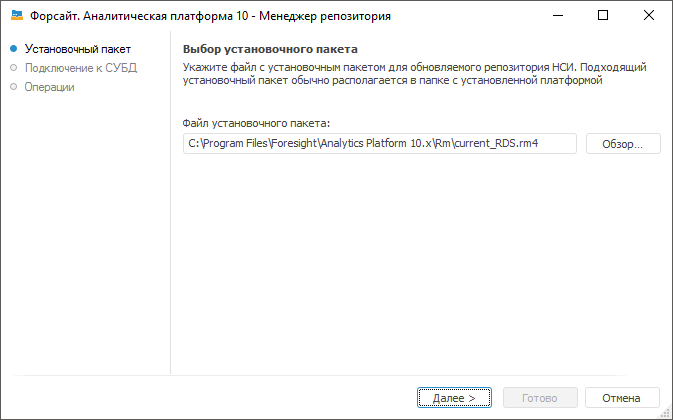

# Обновление версии репозитория метаданных НСИ

Обновление версии репозитория метаданных НСИ
-

# Обновление версии репозитория метаданных НСИ

С выходом новых версий продукта «Форсайт. Аналитическая платформа»
 состав репозитория метаданных НСИ может изменится, поэтому потребуется
 обновление репозитория метаданных НСИ. Для выполнения процесса обновления
 используйте [менеджер репозитория](RepoMngr_Windows.htm).

[Для запуска
 программы](javascript:TextPopup(this))

	- загрузите исполняемый файл RepoMngr.exe, находящийся в папке
	 с установленным продуктом «Форсайт. Аналитическая платформа»;

	- выполните команду «Форсайт. Аналитическая платформа 10.9 > Менеджер репозитория (x64)»,
	 расположенную в главном меню Windows.

Примечание.
 Репозиторий метаданных НСИ применяется при создании [автоматических
 кубов](UiNavObj.chm::/Cube/CreateCube/Master_Auto/UiMd_Cube_CreateCube_Master_Auto.htm).

На вкладке «Репозиторий НСИ»
 выберите операцию «Обновить репозиторий
 НСИ».

После выбора данной операции появится стартовая страница мастера:

Автоматически будет выбран путь к файлу с расширением *.rm4, в котором
 хранятся исполняемые скрипты. Данный файл входит в стандартный установочный
 пакет и находится по пути «S\Rm\current_RDS.rm4», где S - путь до места
 установки «Форсайт. Аналитическая платформа».

Дальнейшие действия совпадают с действиями при [обновлении
 версии репозитория метаданных](Setup_RepoMngr_UpdateRepo.htm).

См. также:

[Создание
 и управление репозиториями метаданных](Setup_RepoMngr_Work_Main.htm) | [Менеджер
 репозитория](RepoMngr_Windows.htm)

		Справочная
		 система на версию 10.9
		 от 18/08/2025,
		 © ООО «ФОРСАЙТ»,
