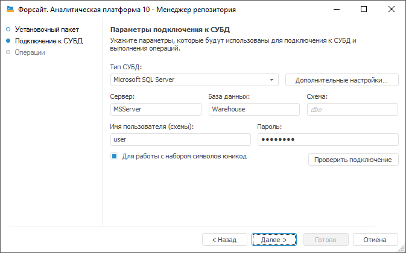
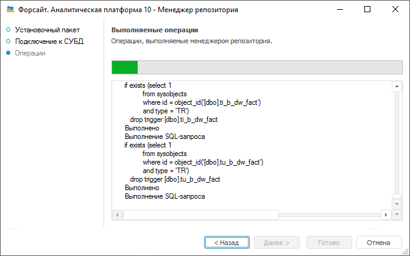

# Создание репозитория метаданных НСИ

Создание репозитория метаданных НСИ
-

# Создание репозитория метаданных НСИ

Репозиторий метаданных нормативно-справочной информации (НСИ) используется
 при создании объектов по схеме «сверху-вниз» - [автоматических
 кубов](uinavobj.chm::/Cube/CreateCube/Master_Auto/UiMd_Cube_CreateCube_Master_Auto.htm).

После выбора данной операции в [окне
 менеджера репозитория](Setup_RepoMngr_Work_Main.htm) нажмите кнопку «Продолжить»,
 появится страница:

Автоматически будет выбран путь к файлу с расширением *.rm4, в котором
 хранятся исполняемые скрипты. Данный файл входит в стандартный установочный
 пакет и находится по пути «S\Rm\current_RDS.rm4», где S - путь до места
 установки «Форсайт. Аналитическая платформа».

Для перехода на следующую страницу мастера нажмите
 кнопку «Далее»:

На странице определите параметры подключения к СУБД:

Примечание.
 Набор доступных настроек зависит от выбранной СУБД.

	- Тип
	 СУБД. В раскрывающемся списке выберите тип СУБД. Более подробно
	 о доступных СУБД читайте в подразделе «[Поддерживаемые
	 СУБД](../01_SysReq/database_Support.htm)»;

	- Дополнительные настройки.
	 Кнопка становится доступной, если производится настройка подключения
	 к СУБД [Microsoft
	 SQL Server](../03_DB_Server_Config/Setup_DB_Server_Config_MSQL.htm) или [PostgreSQL
	 Database](../03_DB_Server_Config/Postgres_server_preparation.htm). В дополнительных параметрах указывается:

	-

		- Учитывать регистр при работе
		 с СУБД. По умолчанию флажок снят и работа с СУБД выполняется
		 без учета регистра. При установленном флажке все команды будут
		 выполняться с учетом регистра;

		- Файловая группа.
		 Поле доступно, если выбрана СУБД [Microsoft
		 SQL Server](../03_DB_Server_Config/Setup_DB_Server_Config_MSQL.htm). Если пользователем в дополнительных параметрах
		 не задана файловая группа, то по умолчанию в поле отображается
		 DEFAULT, и при подключении будет использоваться файловая группа,
		 отмеченная в свойствах БД флажком «по умолчанию»;

		- Имя пользователя-администратора
		 схемы в базе данных. Поле доступно, если выбрана СУБД [Microsoft
		 SQL Server](../03_DB_Server_Config/Setup_DB_Server_Config_MSQL.htm). По умолчанию будут использоваться данные DATABASE
		 OWNER. В случае если неизвестны учетные данные DATABASE OWNER,
		 то укажите пользователя, который обладает привилегией DB_OWNER
		 на сервере СУБД. От имени указанного пользователя будут выполняться
		 системные процедуры;

	- Сервер. Введите IP-адрес
	 или псевдоним, под которым зарегистрирован сервер;

	- База данных. Поле доступно,
	 если выбран тип СУБД [Microsoft
	 SQL Server](../03_DB_Server_Config/Setup_DB_Server_Config_MSQL.htm) или [PostgreSQL
	 Database](../03_DB_Server_Config/Postgres_server_preparation.htm). Задайте имя базы данных;

	- Имя файла БД.
	 Поле доступно, если выбран тип СУБД [SQLite
	 Database](../03_DB_Server_Config/Config_SQLite.htm). Укажите путь к существующему файлу или путь и наименование
	 нового файла, который будет создан. При выполнении скрипта в файле
	 будет создана база данных репозитория. Один файл используется для
	 хранения данных и метаданных одного репозитория;

Примечание.
 Если указывается существующий файл, то этот файл должен быть пустым или
 содержать какие-либо данные в формате СУБД SQLite.

	- Схема. Поле отображается,
	 если выбран тип СУБД [Microsoft
	 SQL Server](../03_DB_Server_Config/Setup_DB_Server_Config_MSQL.htm) или [PostgreSQL
	 Database](../03_DB_Server_Config/Postgres_server_preparation.htm). Для использования пользовательской схемы в БД укажите
	 ее идентификатор. По умолчанию используется dbo;

	- Имя пользователя (схемы).
	 Введите имя пользователя, являющегося владельцем базы данных;

	- Пароль. Введите пароль
	 пользователя для доступа к СУБД;

	- Для работы с набором символов
	 юникод. Установка флажка позволяет использовать в созданном
	 репозитории набор символов Unicode для вставки различных национальных
	 символов (например, иероглифов) в символьные поля таблиц.

Для проверки корректности введенных данных нажмите кнопку «Проверить
 подключение». В случае успешного (неуспешного) подключения появится
 соответствующее сообщение. Если при проверке подключения не найдена указанная
 в дополнительных настройках файловая группа, выдается соответствующее
 сообщение.

Для начала процесса создания репозитория метаданных
 НСИ нажмите на кнопку «Далее»,
 при этом на экране будет отображаться ход выполнения операции:

Окончание процесса сопровождается соответствующим информационным сообщением.

См. также:

[Создание
 и управление репозиториями метаданных](Setup_RepoMngr_Work_Main.htm) | [Менеджер
 репозитория](RepoMngr_Windows.htm) | [Создание
 пользователя PPUPDATE](../Update/PPUPDATE.htm)

		Справочная
		 система на версию 10.9
		 от 18/08/2025,
		 © ООО «ФОРСАЙТ»,
