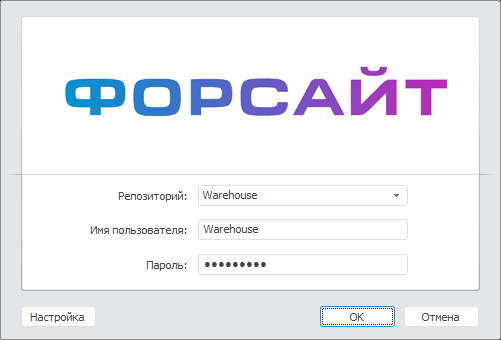
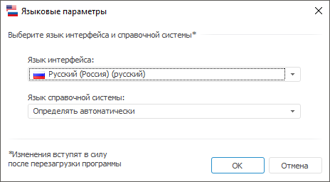

# Смена пиктограммы и изображения в окне регистрации

Смена пиктограммы и изображения в окне регистрации
-

# Смена пиктограммы и изображения в окне регистрации

Для изменения стандартной пиктограммы в заголовке окна и стандартного
 изображения поместите новое изображение и пиктограмму в папку, в которую
 установлен «Форсайт. Аналитическая платформа».

Примечание.
 Смена пиктограммы и изображения в окне регистрации доступна только в настольном
 приложении.

Изображение должно быть в формате *.bmp или *.png с наименованием «Login»,
 пиктограмма должна быть в формате *.ico с наименованием «Login». Рекомендуется
 использовать изображение размером до 469х150 пикселей. Если у изображения
 будет больший размер, то оно будет обрезано.

Примечание.
 Добавленная пиктограмма будет также использоваться в [навигаторе
 объектов](GetStarted.chm::/Interface/Interface_Navigator.htm) и заголовке окна «[Языковые
 параметры](GetStarted.chm::/Interface/Intro_Language.htm)».

Пример окна регистрации с измененными изображением:

Пример окна «Языковые параметры»
 с измененной пиктограммой:

Для того чтобы вернуть стандартную пиктограмму продукта «Форсайт. Аналитическая платформа»
 и стандартное изображение в окне регистрации, удалите файлы пиктограммы
 и изображения из папки установки «Форсайт. Аналитическая платформа».

См. также:

[Настройка
 интерфейса окна регистрации](Setup_ClientConfig.htm)

		Справочная
		 система на версию 10.9
		 от 18/08/2025,
		 © ООО «ФОРСАЙТ»,
