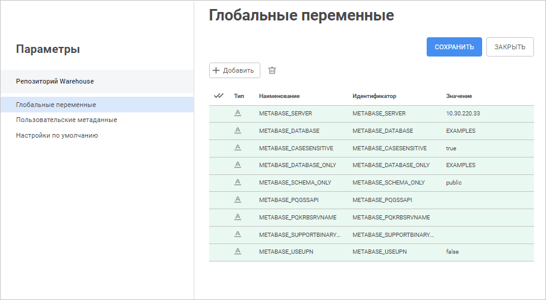
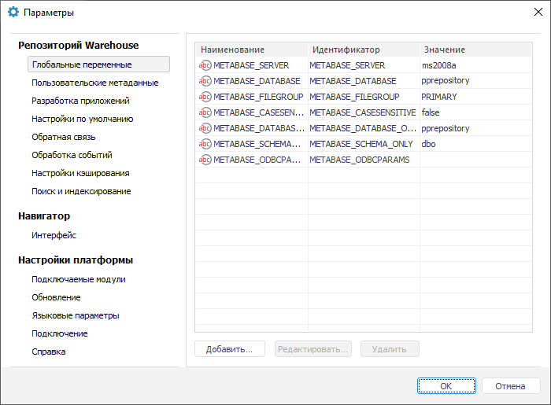

# Настройка текущего репозитория

Настройка текущего репозитория
-

# Настройка текущего репозитория

Для настройки параметров текущего открытого репозитория используйте
 окно «Параметры».

[Для открытия
 окна](javascript:TextPopup(this))

		- в веб-приложении выполните команду 
		 «Параметры» на боковой
		 панели [навигатора
		 объектов](GetStarted.chm::/Interface/Interface_Navigator.htm);

		- в настольном приложении выполните команду «Сервис
		 > Параметры» в главном меню навигатора объектов.

	Веб-приложение

	 Настольное
	 приложение

		

		

Доступны следующие настройки репозитория:

	- [настройка
	 глобальных переменных](uinav.chm::/02_Navigator/UiNav_GlobalVariables.htm);

	- [настройка
	 пользовательских метаданных](uidevenv.chm::/04_NavigatorSetting/Classes_Object/Classes_Events.htm);

	- [настройки
	 по умолчанию](uinav.chm::/02_Navigator/Repo_Default.htm).

В настольном приложении дополнительно доступны расширенные настройки
 репозитория:

	- [настройка
	 подключения репозитория к системе управления версиями](uidevenv.chm::/04_NavigatorSetting/VCS/Add_In_VCS.htm);

	- [настройка
	 параметров обработки ошибок](UiDevEnv.chm::/04_NavigatorSetting/Feedback.htm);

	- [настройка
	 обработчиков событий](UiDevEnv.chm::/04_NavigatorSetting/EventHandler.htm);

	- [настройка
	 кеширования метаданных](UiNav.chm::/02_Navigator/cache_settings.htm);

	- [настройка
	 поиска и индексирования](../BISearch/Desktop_application_setting.htm);

	- [настройка интерфейса](Interface_settings.htm);

	- [подключение
	 дополнительных модулей](UiNav.chm::/02_Navigator/CommonSettings/Integration.htm);

	- [настройка автоматического
	 обновления](../Update/AutomaticUpdate.htm);

	- [выбор
	 языка интерфейса и справочной системы](getstarted.chm::/Interface/Intro_Language.htm);

	- [настройка
	 подключения к прокси-серверу](UiNav.chm::/02_Navigator/CommonSettings/ProxyServer.htm);

	- [выбор
	 типа справочной системы](uinav.chm::/02_Navigator/UiNav_RepoConfig_Help.htm).

См. также:

[Настройка
 доступа к репозиторию](UiNav_RepoConfig.htm) | [Настройка
 подключения к репозиторию](UiNav_RepoConfig_repo1.htm)

		Справочная
		 система на версию 10.9
		 от 18/08/2025,
		 © ООО «ФОРСАЙТ»,
