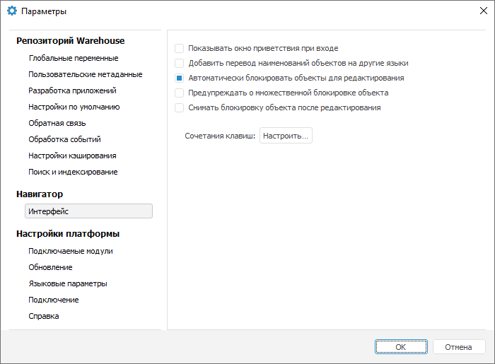

# Настройка интерфейса

Настройка интерфейса
-

# Настройка интерфейса

Для изменения настроек отображения интерфейса и объектов репозитория
 используйте вкладку «Интерфейс»
 диалога «Параметры».

[Для открытия
 диалога «Параметры»](javascript:TextPopup(this))

		- Перейдите в навигатор объектов.

		- Выполните команду главного меню «Сервис
		 > Параметры».

Доступны следующие настройки:

	- [отображение
	 окна приветствия](getstarted.chm::/GetStarted/Get_Started.htm#features);

	- [перевод
	 наименований объектов репозитория на другие языки](uinav.chm::/03_Objects/Translate_names.htm);

	- [блокировка
	 объектов](UiNav.chm::/02_Navigator/UiNav_BlockObjects.htm);

	- [сочетание
	 клавиш](getstarted.chm::/Interface/Interface_Description.htm#shortcut_keys).

См. также:

[Настройка
 текущего репозитория](Current_Repository_Settings.htm) | [Настройка доступа
 к репозиторию](UiNav_RepoConfig.htm)

		Справочная
		 система на версию 10.9
		 от 18/08/2025,
		 © ООО «ФОРСАЙТ»,
