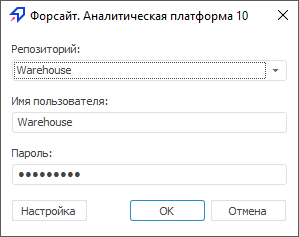

# Отключение изображения в окне регистрации

Отключение изображения в окне регистрации
-

# Отключение изображения в окне регистрации

Для отключения стандартного изображения в окне регистрации создайте
 параметр Visible типа REG_DWORD со
 значением «0» в разделе реестра [HKEY_CURRENT_USER\SOFTWARE\Foresight\Foresight Analytics Platform\10.0\Splash].

После выполнения действия окно регистрации примет вид:

Также отключить стандартное изображение в окне регистрации можно, используя
 [настройку репозиториев и автообновления
 из файла](../Update/Tuner.htm).

Примечание.
 Отключение изображения в окне регистрации доступно только в настольном
 приложении.

См. также:

[Настройка
 интерфейса окна регистрации](Setup_ClientConfig.htm)

		Справочная
		 система на версию 10.9
		 от 18/08/2025,
		 © ООО «ФОРСАЙТ»,
