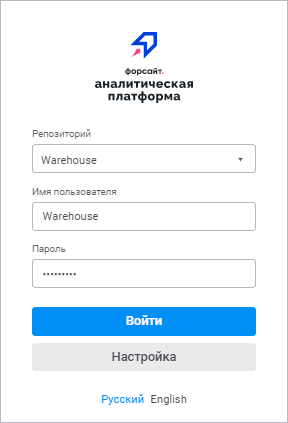
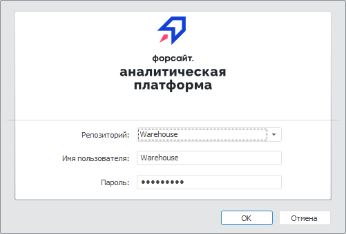

# Управление отображением кнопки «Настройка» в окне регистрации

Управление отображением кнопки «Настройка» в окне регистрации
-

# Управление отображением кнопки «Настройка» в окне регистрации

По умолчанию в веб-приложении скрыта кнопка «Настройка»
 в [окне
 регистрации](GetStarted.chm::/GetStarted/Get_Started.htm),
 а в настольном приложении кнопка отображается.

Для управления отображением кнопки:

	- Создайте параметр в реестре:

		- в веб-приложении - строковый параметр [AccessMode](../UiWebSetup/03_Setup_Web/BI_Server_Registry_Key.htm#system)
		 в разделе реестра [HKLM\SOFTWARE\Foresight\Foresight Analytics Platform\10.0\PP\BIS\System\MbDefs]
		 на компьютере с установленным BI-сервером или сформируйте раздел
		 [System](../UiWebSetup/03_Setup_Web/BI_Server_Settings_XML.htm#system)
		 в файле [settings.xml](../UiWebSetup/03_Setup_Web/BI_Server_Settings_XML.htm);

		- в настольном приложении - параметр VisibleAdvanced
		 типа REG_DWORD в разделе реестра [HKLM\SOFTWARE\Foresight\Foresight Analytics Platform\10.0\Login] на локальных
		 компьютерах всех пользователей.

	- Задайте параметру значение:

		- 0. Кнопка не отображается;

		- 1. Кнопка отображается.

Также в настольном приложении для управления
 отображением кнопки можно использовать [настройки
 для «Форсайт. Аналитическая платформа»
 из файла](../Update/Tuner.htm).

После выполнения действий окно регистрации примет
 следующий вид:

	Веб-приложение
	 Настольное
	 приложение

		Если параметр AccessMode
		 принимает значение «0»:

		

		Если параметр AccessMode
		 принимает значение «1»:

		

		Если параметр VisibleAdvanced
		 принимает значение «0»:

		

		Если параметр VisibleAdvanced
		 принимает значение «1»:

		

См. также:

[Настройка
 интерфейса окна регистрации](Setup_ClientConfig.htm)

		Справочная
		 система на версию 10.9
		 от 18/08/2025,
		 © ООО «ФОРСАЙТ»,
