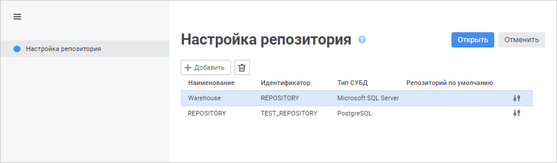
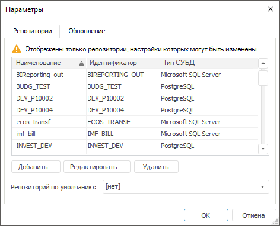

# Настройка доступа к репозиторию

Настройка доступа к репозиторию
-

# Настройка доступа к репозиторию

Продукт «Форсайт. Аналитическая платформа»
 позволяет одновременно работать с [несколькими
 репозиториями](getstarted.chm::/Interface/Interface_Navigator.htm#connection) и хранить параметры для подключения к
 ним. Настройка параметров подключения к репозиториям осуществляется перед
 началом работы:

	- в [окне
	 регистрации](GetStarted.chm::/GetStarted/Get_Started.htm)
	 с помощью мастера настройки репозитория в веб-приложении или окна
	 «Параметры» в настольном приложении;

	- из файла [Metabases.xml](Configuring_repository_list_in_the_system_registry.htm#metabase_xml_list),
	 путь до которого указан в [системном
	 реестре](Configuring_repository_list_in_the_system_registry.htm#repository_list);

	- из [файла](../Update/Tuner.htm) при установке настольного
	 приложения «Форсайт. Аналитическая платформа»
	 или при запуске файла Tuner.exe.

## Формирование списка репозиториев

Для формирования списка репозиториев нажмите кнопку «Настройка»
 в [окне
 регистрации](GetStarted.chm::/GetStarted/Get_Started.htm).

Примечание.
 По умолчанию в веб-приложении скрыта кнопка «Настройка».
 Для получения подробной информации обратитесь к разделу «[Управление
 отображением кнопки «Настройка» в окне регистрации](Setup_SysReq_Client.htm)».

После выполнения действия:

	- в веб-приложении будет открыта страница «Настройка
	 репозитория» в мастере настройки репозитория;

	- в настольном приложении будет открыта вкладка «Репозитории»
	 в окне «Параметры».

	Веб-приложение

	 Настольное
	 приложение

		

		

В настольном приложении не отображаются репозитории с [настроенной
 аутентификацией](../UiWebSetup/Authentication/Authentication.htm#web), доступной в веб-приложении.

Операции со списком репозиториев:

[Добавление
 репозитория](javascript:TextPopup(this))

	Для добавления репозитория:

		- Нажмите кнопку 
		 «Добавить». После чего
		 будет открыто окно «[Настройка
		 подключения к репозиторию](UiNav_RepoConfig_repo1.htm)».

		- Задайте [параметры подключения
		 к репозиторию](UiNav_RepoConfig_repo1.htm).

		- Проверьте [настройки
		 подключения к репозиторию](UiNav_RepoConfig_repo1.htm). Настройки регистрозависимости должны
		 совпадать с соответствующими настройками, заданными при [создании
		 репозитория](../05_RepoMngr/Setup_RepoMngr_CreateRepo.htm#dbms).

	После выполнения действий репозиторий будет добавлен в список репозиториев
	 и доступен для [открытия](#open).

[Редактирование
 репозитория](javascript:TextPopup(this))

	Для редактирования репозитория:

		- в веб-приложении:

			- выделите репозиторий и нажмите кнопку  «Редактировать»;

			- дважды щёлкните по репозиторию;

		- в настольном приложении:

			- выделите репозиторий и нажмите кнопку «Редактировать»;

			- выполните команду «Редактировать»
			 в контекстном меню репозитория;

			- дважды щёлкните по репозиторию;

			- выделите репозиторий и нажмите клавишу ENTER.

	После выполнения одного из действий будет открыто окно «[Настройка подключения к репозиторию](UiNav_RepoConfig_repo1.htm)».
	 Измените [параметры подключения
	 к репозиторию](UiNav_RepoConfig_repo1.htm), заданные при [добавлении](#add).

[Выбор
 репозитория по умолчанию](javascript:TextPopup(this))

	Для выбора репозитория по умолчанию, который будет автоматически
	 отображаться в [окне
	 регистрации](GetStarted.chm::/GetStarted/Get_Started.htm)
	 при запуске «Форсайт. Аналитическая платформа»:

		- в веб-приложении установите флажок «[Репозиторий по умолчанию](UiNav_RepoConfig_repo1.htm#repo)»
		 в окне «[Настройка
		 подключения к репозиторию](UiNav_RepoConfig_repo1.htm)» для конкретного репозитория;

		- в настольном приложении выберите в раскрывающемся списке
		 «Репозиторий по умолчанию»
		 существующий репозиторий.

	После выполнения действий будет выбран репозиторий по умолчанию.

[Открытие
 репозитория](javascript:TextPopup(this))

	Для открытия репозитория в веб-приложении выделите его в списке
	 репозиториев и нажмите кнопку «Открыть».
	 После чего будет открыто [окно регистрации](GetStarted.chm::/GetStarted/Get_Started.htm)
	 для входа в систему.

[Удаление репозитория](javascript:TextPopup(this))

	Для удаления репозитория:

		- в веб-приложении выделите репозиторий и нажмите кнопку 
		 «Удалить»;

		- в настольном приложении:

			- выделите репозиторий и нажмите кнопку «Удалить»;

			- выполните команду «Удалить»
			 в контекстном меню репозитория;

			- выделите репозиторий и нажмите клавишу DELETE.

	После выполнения одного из действий репозиторий будет удалён из
	 списка репозиториев.

Примечание.
 Список репозиториев сохраняется в [реестре](Configuring_repository_list_in_the_system_registry.htm#repository_list)
 операционной системы. Пользователь операционной системы, под которым осуществляется
 работа со списком репозиториев, должен обладать правами на внесение изменений
 в реестр.

См. также:

[Создание
 и управление репозиториями метаданных](../05_RepoMngr/Setup_RepoMngr_Work_Main.htm) | [Настройка
 подключения к репозиторию](UiNav_RepoConfig_repo1.htm) | [Настройка
 списка репозиториев](Configuring_repository_list_in_the_system_registry.htm)

		Справочная
		 система на версию 10.9
		 от 18/08/2025,
		 © ООО «ФОРСАЙТ»,
