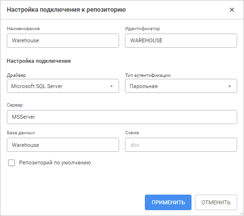
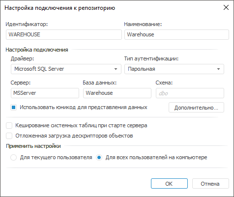
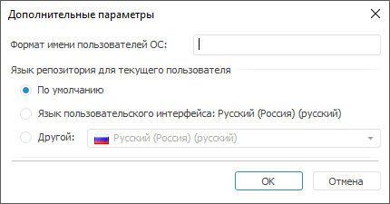
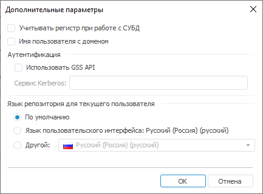
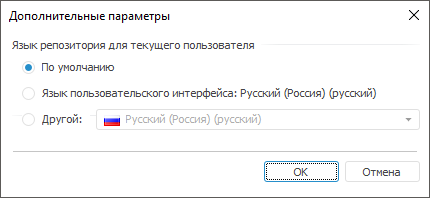

# Настройка подключения к репозиторию

Настройка подключения к репозиторию
-

# Настройка подключения к репозиторию

Для настройки подключения к репозиторию и работы с ним используйте окно
 «Настройка подключения к репозиторию»
 или задайте [настройки платформы из файла](../Update/Tuner.htm)
 для настольного приложения.

[Для
 открытия окна](javascript:TextPopup(this))

		- Нажмите кнопку «Настройка»
		 в [окне
		 регистрации](GetStarted.chm::/GetStarted/Get_Started.htm).
		 После чего будет открыт [мастер
		 настройки репозитория](UiNav_RepoConfig.htm#params) в веб-приложении или окно «[Параметры](UiNav_RepoConfig.htm#params)» в настольном
		 приложении.

	Примечание.
	 По умолчанию в веб-приложении скрыта кнопка «Настройка».
	 Для получения подробной информации обратитесь к разделу «[Управление
	 отображением кнопки «Настройка» в окне регистрации](Setup_SysReq_Client.htm)».

		- Выполните одно из действий:

			- в веб-приложении:

				- нажмите кнопку  «Добавить»;

				- выделите репозиторий и нажмите кнопку  «Редактировать»;

				- дважды щёлкните по репозиторию;

			- в настольном приложении:

				- нажмите кнопку «Добавить»;

				- выделите репозиторий и нажмите кнопку «Редактировать»;

				- выполните команду «Редактировать»
				 в контекстном меню репозитория;

				- дважды щёлкните по репозиторию;

				- выделите репозиторий и нажмите клавишу ENTER.

	Веб-приложение

	 Настольное
	 приложение

		

		

Задайте параметры:

	- Наименование. Введите
	 наименование репозитория, которое будет отображаться в [окне регистрации](GetStarted.chm::/GetStarted/Get_Started.htm)
	 при запуске продукта «Форсайт. Аналитическая платформа».
	 Наименование может не совпадать с идентификатором;

	- Идентификатор. Введите
	 идентификатор репозитория - схему метаданных, хранящуюся на сервере
	 базы данных;

	- Драйвер.
	 Выберите в раскрывающемся списке используемый драйвер. Для получения
	 подробной информации о доступных драйверах обратитесь к разделу «[Поддерживаемые СУБД](../01_SysReq/database_Support.htm)».

В зависимости от выбранного типа драйвера
 задайте дополнительные параметры СУБД:

		- Сервер. Введите
		 IP-адрес или DNS-имя, под которым зарегистрирован сервер с подключаемой
		 базой данных (репозиторий). Поле отображается, если выбран тип
		 драйвера: Oracle, Microsoft SQL Server, Microsoft SQL Server (ODBC),
		 PostgreSQL.

Если порт сервера СУБД отличается от [порта
 по умолчанию](../01_SysReq/EnviromentRequirements.htm#ports_and_protocols), то значение параметра задаётся в формате:

			- для Microsoft SQL Server: <IP-адрес
			 или DNS-имя сервера>,<номер
			 порта>;

			- для PostgreSQL: <IP-адрес
			 или DNS-имя сервера>:<номер
			 порта>.

При использовании СУБД Oracle порт сервера
 определяется в файле tnsnames.ora;

Примечание.
 При настройке подключения к репозиторию на каждом клиентском компьютере
 IP-адрес или DNS-имя сервера должно совпадать с сервером, указанным при
 [создании
 служебного пользователя](../05_RepoMngr/Setup_RepoMngr_Service_User.htm#connection).

		- Схема/База данных.
		 Введите идентификатор базы данных, к которой будет осуществляться
		 подключение. Идентификатор базы данных должен совпадать с идентификатором
		 репозитория. Поле «Схема»
		 отображается, если выбран тип драйвера Oracle. Поле «База
		 данных» отображается, если выбран тип драйвера: Microsoft
		 SQL Server, Microsoft SQL Server (ODBC), PostgreSQL;

		- Схема. Введите идентификатор
		 пользовательской схемы, если она была создана при [подготовке
		 серверной части СУБД](../03_DB_Server_Config/Setup_DB_Server_Config.htm). Поле отображается, если выбран тип драйвера:
		 Microsoft SQL Server, Microsoft SQL Server (ODBC), PostgreSQL.
		 По умолчанию для Microsoft SQL Server используется схема «dbo»,
		 а для PostgreSQL - «public».

В настольном приложении доступны дополнительные
 параметры подключения к SQLite и WEB Service:

		- Имя файла. Выберите
		 файл с настройками подключения к базе данных с помощью кнопки
		  «Выбрать
		 файл». После чего будет открыт стандартный диалог выбора
		 файла. Поле отображается, если выбран тип драйвера SQLite;

		- Точка входа. Введите
		 IP-адрес или DNS-имя, на котором установлен [BI-сервер](../UiWebSetup/UiWebSetup_TitlePage.htm).
		 Поле отображается, если выбран тип драйвера WEB Service;

		- Идентификатор репозитория.
		 Введите идентификатор базы данных, к которой будет осуществляться
		 подключение. Поле отображается, если выбран тип драйвера WEB Service;

	- Тип
	 аутентификации. Выберите в раскрывающемся списке один из способов
	 [аутентификации
	 пользователя](../UiWebSetup/Authentication/Authentication.htm) на сервере базы данных:

		- Парольная. По умолчанию.
		 Аутентификация пользователя производится с использованием имени
		 пользователя и пароля в явном виде;

		- Интегрированная доменная.
		 Аутентификация пользователя производится с использованием доменного
		 имени пользователя и пароля (текущей учётной записи ОС). Если
		 тип аутентификации выбран для Oracle в ОС Windows, то выполните
		 [дополнительные
		 настройки сервера](../03_DB_Server_Config/Setup_DB_Server_Config_Oracle_Tuning.htm);

		- Доменная. Аутентификация
		 пользователя производится с использованием домена, имени пользователя
		 и пароля в явном виде. Тип аутентификации доступен, если выбран
		 тип драйвера: Oracle, Microsoft SQL Server, Microsoft SQL Server
		 (ODBC), PostgreSQL.

Примечание.
 Для использования типа аутентификации «Интегрированная
 доменная» или «Доменная»
 предварительно добавьте [доменных
 пользователей](Admin.chm::/03_Admin/Users/Admin_UserCreate_Domain.htm) или [доменные
 группы](Admin.chm::/03_Admin/Groups/Admin_GroupsCreateDomain.htm) в [менеджере
 безопасности](Admin.chm::/01_RunSecManager/Admin_Organizational_Starting.htm).

Параметр «Тип
 аутентификации» доступен для всех типов СУБД, кроме SQLite;

	- Учитывать регистр при работе
	 с СУБД. Установите флажок для работы с репозиторием, объектами
	 и их полями в СУБД с различным регистром символов в их физическом
	 имени при необходимости. После установки флажка объекты базы данных
	 будут доступны только при указании их точного физического имени. Если
	 флажок снят, то наименование репозитория, физические имена объектов
	 и их полей в СУБД преобразуются к нижнему регистру в момент обращения
	 платформы к серверу.

Важно.
 Параметр задаётся один раз при первичной настройке подключения к репозиторию.
 Повторное изменение параметра может привести к потере данных.

Настройки регистрозависимости при заполнении
 параметров подключения к репозиторию должны совпадать с соответствующими
 настройками, заданными при [создании
 репозитория](../05_RepoMngr/Setup_RepoMngr_CreateRepo.htm#dbms).

В настольном приложении параметр «Учитывать
 регистр при работе с СУБД» содержится в окне «[Дополнительные параметры](#more)»;

	- Репозиторий
	 по умолчанию. Установите флажок для автоматического отображения
	 данного репозитория в [окне регистрации](GetStarted.chm::/GetStarted/Get_Started.htm)
	 при запуске продукта «Форсайт. Аналитическая платформа»
	 при необходимости.

Примечание.
 Репозиторий по умолчанию может быть только один. Если по умолчанию уже
 используется другой репозиторий, то после установки флажка репозиторий
 по умолчанию будет изменён на текущий подключаемый репозиторий.

Если репозиторий по умолчанию не задан, то
 при запуске продукта «Форсайт. Аналитическая платформа»
 в окне регистрации будет отображаться последний подключаемый репозиторий.
 Если была проведена очистка кеша веб-приложения, то в окне регистрации
 будет отображаться репозиторий, указанный в файле [PP.xml](../UiWebSetup/03_Setup_Web/PP_config_Java.htm#pp_xml)
 в разделе [<metabase>](../UiWebSetup/03_Setup_Web/PP_config_Java.htm#metabase).

В настольном приложении [выбор
 репозитория по умолчанию](UiNav_RepoConfig.htm#default) осуществляется в окне «[Параметры](UiNav_RepoConfig.htm)».

После выполнения действий будет настроено подключение к репозиторию.

Для сохранения настроек нажмите кнопку «Применить»
 в веб-приложении или «ОК» в настольном
 приложении.

## Дополнительные параметры в настольном приложении

В настольном приложении содержатся дополнительные параметры для настройки
 подключения к репозиторию:

	- Использовать юникод для представления
	 данных. Установите флажок для использования кодировки юникод
	 при подключении к серверу. Используется для текстовых констант при
	 создании запросов. Данный флажок актуален только для СУБД Oracle;

	- Кеширование
	 системных таблиц при старте сервера. Установите флажок для
	 кеширования системных таблиц метаданных при запуске процесса BI-сервера.
	 Кеширование позволяет увеличить производительность системы и скорость
	 открытия сложносоставных отчётов, использующих множество источников
	 данных, в веб-приложении за счёт сокращения времени чтения системных
	 таблиц из базы данных. По умолчанию флажок снят.  Для получения
	 подробной информации обратитесь к разделу «[Кеширование
	 системных таблиц](uinav.chm::/02_Navigator/System_Metadata_Table_Caching.htm)».

Важно.
 Кеширование системных таблиц метаданных допустимо только в промышленной
 эксплуатации. При использовании кеширования не должны изменяться данные
 в системных таблицах метаданных.

	- Отложенная
	 загрузка дескрипторов. Установите флажок для выполнения отложенного
	 процесса загрузки дескрипторов объектов репозитория. По умолчанию
	 флажок снят. При установленном флажке при подключении загружаются
	 дескрипторы только тех объектов, которые необходимы для работы в репозитории.

Примечание.
 Отложенная загрузка дескрипторов ускоряет вход в систему только в настольном
 приложении. При работе с веб-приложением не рекомендуется использовать
 отложенную загрузку.

[Особенности
 отложенной загрузки дескрипторов объектов репозитория](javascript:TextPopup(this))

	При установленном флажке при загрузке
	 репозитория из навигатора объектов загрузка дескрипторов объектов
	 репозитория происходит по следующему алгоритму:

			- если не задан последний выбранный объект, то загружаются
			 только первые два уровня дерева объектов репозитория. Если
			 для объектов первого уровня не найдены дочерние объекты, то
			 напротив папки (объекта контейнера) не будет отображаться
			 значок ;

			- если задан последний выбранный объект, то загружаются
			 дескрипторы данного объекта со всеми родительскими объектами
			 и объекты того же уровня для каждого родителя вплоть до корня.

	При навигации по дереву объектов репозитория
	 загружаются дескрипторы только для дочерних элементов раскрытого уровня.

	При поиске объектов в навигаторе учитываются,
	 в том числе, и незагруженные объекты репозитория.

	Методы работы с объектами репозитория
	 подгружают объекты по необходимости.

	Для объекта «Связь
	 с репозиторием» возможность отложенной загрузки дескриптора
	 осуществляется согласно настройке, заданной на странице «[Свойства базы данных](UiNavObj.chm::/Link_with/UiDb_relational_LinkWith_master_property.htm)»
	 мастера.

	При добавлении объекта в обновление загружаются
	 дескрипторы всех его дочерних, зависимых и родительских объектов.
	 При выполнении обновления загружаются дескрипторы только необходимых
	 объектов. При выполнении повторного обновления будут подгружены дескрипторы
	 тех объектов, которые подгружались ранее. Если для загруженных объектов
	 были добавлены дочерние объекты, то при обновлении будут подгружены
	 добавленные объекты.

	Все [специальные объекты](KeSom.chm::/Enums/MetabaseSpecialObject.htm)
	 загружаются независимо от того, включена отложенная загрузка или нет.

	При включенной настройке нет возможности
	 включить опцию «[Отображать пустые папки](UiNav.chm::/GUI/View.htm)».

	При компиляции и запуске на выполнение
	 форм и сборок выполняется загрузка дескрипторов для всех необходимых
	 незагруженных объектов, а также выполняется загрузка необходимых для
	 компиляции и выполнения форм, сборок, модулей и ресурсов.

	- Применить настройки.
	 Установите переключатель, позволяющий определить, для каких пользователей
	 данного компьютера будет доступна настройка репозитория:

		- Для текущего пользователя.
		 Настройка репозитория будет доступна только для текущего пользователя
		 компьютера;

		- Для всех пользователей
		 на компьютере. Настройка репозитория будет доступна для
		 всех пользователей данного компьютера.

Если у пользователя ограниченные права доступа
 при запуске «Форсайт. Аналитическая платформа»,
 и установлен переключатель «Для текущего
 пользователя», то настройки нового репозитория [не сохранятся](FAQ.chm::/Errors/Error_while_working.htm#7_3).
 Если установлен переключатель «Для всех
 пользователей на компьютере», то пользователю будет [отказано в доступе](FAQ.chm::/Errors/Error_while_working.htm#7_4).

При нажатии кнопки «Дополнительно»
 будет открыто окно «Дополнительные параметры».
 Набор параметров зависит от выбранного [типа
 драйвера](UiNav_RepoConfig_repo1.htm#driver), который используется для подключения:

	Oracle Microsoft SQL Server

	 Microsoft SQL Server (ODBC)

	 PostgreSQL SQLite, WEB Service

		

		Задайте параметры:

			- Формат имени пользователей
			 ОС. Определите формат имени пользователя при входе
			 в систему. Если на сервере задан префикс перед именами пользователей
			 (параметр [OS_AUTHENT_PREFIX](../03_DB_Server_Config/Setup_DB_Server_Config_Oracle_Tuning.htm)),
			 то его необходимо указать в данном поле. При доменной аутентификации
			 может понадобиться задание формата имен пользователей, так
			 как по умолчанию при доменной аутентификации «Форсайт. Аналитическая платформа»
			 использует следующий формат имен: «ДОМЕН\ИМЯ_ПОЛЬЗОВАТЕЛЯ».
			 Для формирования формата можно использовать статичный текст
			 и подстановки:

				- $User. Имя
				 пользователя;

				- $Domain.
				 Наименование домена;

				- $FullDomain.
				 Полное наименование домена;

				- $FullDomainUser.
				 Полное доменное имя пользователя (включает имя пользователя
				 и полное имя домена, разделённые символом «@»).

		Важно.
		 При написании формата соблюдайте приведенный регистр подстановок.

		Примеры:

		$User@$Domain.COM

		При данном формате имя пользователя
		 будет выглядеть: «IVANOV@EXAMPLE.COM».

		$Domain@$User

		При данном формате имя пользователя
		 будет выглядеть: «EXAMPLE@IVANOV».

		$User@$FullDomain

		При данном формате имя пользователя
		 будет выглядеть: «IVANOV@EXAMPLE.WORLD.COM».

		$FullDomainUser

		При данном формате имя пользователя
		 будет выглядеть: «IVANOV@EXAMPLE.WORLD.COM».

	- Язык репозитория для текущего
	 пользователя. Выберите язык репозитория (схемы). Данная настройка
	 задает язык, на котором будут отображены:

		- наименования [объектов
		 репозитория](uinav.chm::/03_objects/uinav_obj_basicpropnames.htm), [элементов справочников
		 НСИ](UiNav.chm::/Multilanguage/UiRds_Locale.htm), [заголовков
		 экспресс-отчётов](UiExpress.chm::/setup_express_report/uiexpress_purpose_toolbar_title.htm);

		- [ресурсы](UiNav.chm::/Multilanguage/Resources.htm)
		 для создания мультиязычных систем;

		- значения атрибутов базы данных временных рядов, для которых
		 задан [перевод](UiNavObj.chm::/TimeSeriesDatabase/TS_Attributes.htm#transl_attr)
		 на другие языки.

Возможна установка одного из переключателей:

		- По умолчанию. Будет
		 использован язык, заданный при [создании
		 репозитория](../05_RepoMngr/Setup_RepoMngr_CreateRepo.htm);

		- Язык пользовательского
		 интерфейса. В качестве языка репозитория будет использован
		 [язык
		 интерфейса продукта «Форсайт. Аналитическая платформа»](GetStarted.chm::/Interface/Intro_Language.htm);

		- Другой. В раскрывающемся
		 списке выберите один из поддерживаемых языков интерфейса продукта
		 «Форсайт. Аналитическая платформа».

Примечание.
 Если для объектов и наименований настройка языка не была задана, то будет
 использоваться язык [репозитория
 по умолчанию](uinav.chm::/02_Navigator/Repo_Default.htm).

		

		Задайте параметры:

	- Учитывать регистр при работе
	 с СУБД. Установите флажок для работы с репозиторием, объектами
	 и их полями в СУБД с различным регистром символов в их физическом
	 имени при необходимости. После установки флажка объекты базы данных
	 будут доступны только при указании их точного физического имени. Если
	 флажок снят, то наименование репозитория, физические имена объектов
	 и их полей в СУБД преобразуются к нижнему регистру в момент обращения
	 платформы к серверу.

Важно.
 Параметр задаётся один раз при первичной настройке подключения к репозиторию.
 Повторное изменение параметра может привести к потере данных.

Настройки регистрозависимости при заполнении
 параметров подключения к репозиторию должны совпадать с соответствующими
 настройками, заданными при [создании
 репозитория](../05_RepoMngr/Setup_RepoMngr_CreateRepo.htm#dbms).

			- Строка подключения.
			 Укажите дополнительные параметры подключения с использованием
			 драйвера OLE DB или ODBC. Поддерживаемые параметры в разных
			 версиях драйвера OLE DB могут отличаться. Для получения подробной
			 информации обратитесь к документации [Microsoft](https://docs.microsoft.com/ru-ru/sql/connect/oledb/applications/using-connection-string-keywords-with-oledb-driver-for-sql-server?view=sql-server-ver15).

		Параметры подключения, заданные для
		 драйвера ODBC, будут храниться в [системной
		 глобальной переменной](UiNav.chm::/02_Navigator/UiNav_GlobalVariables.htm) METABASE_ODBCPARAMS,
		 которая автоматически добавляется в строку подключения при создании
		 [базы
		 данных](UiNavObj.chm::/database/UiDb_database.htm)
		 и [связи
		 с другим репозиторием](UiNavObj.chm::/Link_with/UiDb_relational_LinkWith.htm).

		При автоматическом создании конфигурационного
		 файла [Scheduler.xml](uiappsrv.chm::/1_Work_AppSrv/UiAppSrv_Work_AppSrv_createXML.htm)
		 для [планировщика
		 задач](uiappsrv.chm::/UiAppSrv_purpose.htm)
		 указанные параметры подключения будут прописываться в атрибуте
		 [ODBCPARAMS](UiAppSrv.chm::/1_Work_AppSrv/configure_file_manual_extend.htm#logondata);

	- Язык репозитория для текущего
	 пользователя. Выберите язык репозитория (схемы). Данная настройка
	 задает язык, на котором будут отображены:

		- наименования [объектов
		 репозитория](uinav.chm::/03_objects/uinav_obj_basicpropnames.htm), [элементов справочников
		 НСИ](UiNav.chm::/Multilanguage/UiRds_Locale.htm), [заголовков
		 экспресс-отчётов](UiExpress.chm::/setup_express_report/uiexpress_purpose_toolbar_title.htm);

		- [ресурсы](UiNav.chm::/Multilanguage/Resources.htm)
		 для создания мультиязычных систем;

		- значения атрибутов базы данных временных рядов, для которых
		 задан [перевод](UiNavObj.chm::/TimeSeriesDatabase/TS_Attributes.htm#transl_attr)
		 на другие языки.

Возможна установка одного из переключателей:

		- По умолчанию. Будет
		 использован язык, заданный при [создании
		 репозитория](../05_RepoMngr/Setup_RepoMngr_CreateRepo.htm);

		- Язык пользовательского
		 интерфейса. В качестве языка репозитория будет использован
		 [язык
		 интерфейса продукта «Форсайт. Аналитическая платформа»](GetStarted.chm::/Interface/Intro_Language.htm);

		- Другой. В раскрывающемся
		 списке выберите один из поддерживаемых языков интерфейса продукта
		 «Форсайт. Аналитическая платформа».

Примечание.
 Если для объектов и наименований настройка языка не была задана, то будет
 использоваться язык [репозитория
 по умолчанию](uinav.chm::/02_Navigator/Repo_Default.htm).

		

		Задайте параметры:

	- Учитывать регистр при работе
	 с СУБД. Установите флажок для работы с репозиторием, объектами
	 и их полями в СУБД с различным регистром символов в их физическом
	 имени при необходимости. После установки флажка объекты базы данных
	 будут доступны только при указании их точного физического имени. Если
	 флажок снят, то наименование репозитория, физические имена объектов
	 и их полей в СУБД преобразуются к нижнему регистру в момент обращения
	 платформы к серверу.

Важно.
 Параметр задаётся один раз при первичной настройке подключения к репозиторию.
 Повторное изменение параметра может привести к потере данных.

Настройки регистрозависимости при заполнении
 параметров подключения к репозиторию должны совпадать с соответствующими
 настройками, заданными при [создании
 репозитория](../05_RepoMngr/Setup_RepoMngr_CreateRepo.htm#dbms).

			- Строка подключения.
			 Укажите дополнительные параметры подключения с использованием
			 драйвера ODBC. Параметры подключения будут храниться в [системной
			 глобальной переменной](UiNav.chm::/02_Navigator/UiNav_GlobalVariables.htm) METABASE_ODBCPARAMS,
			 которая автоматически добавляется в строку подключения при
			 создании [базы
			 данных](UiNavObj.chm::/database/UiDb_database.htm)
			 и [связи
			 с другим репозиторием](UiNavObj.chm::/Link_with/UiDb_relational_LinkWith.htm).

		При автоматическом создании конфигурационного
		 файла [Scheduler.xml](uiappsrv.chm::/1_Work_AppSrv/UiAppSrv_Work_AppSrv_createXML.htm)
		 для [планировщика
		 задач](uiappsrv.chm::/UiAppSrv_purpose.htm)
		 указанные параметры подключения будут прописываться в атрибуте
		 [ODBCPARAMS](UiAppSrv.chm::/1_Work_AppSrv/configure_file_manual_extend.htm#logondata);

	- Язык репозитория для текущего
	 пользователя. Выберите язык репозитория (схемы). Данная настройка
	 задает язык, на котором будут отображены:

		- наименования [объектов
		 репозитория](uinav.chm::/03_objects/uinav_obj_basicpropnames.htm), [элементов справочников
		 НСИ](UiNav.chm::/Multilanguage/UiRds_Locale.htm), [заголовков
		 экспресс-отчётов](UiExpress.chm::/setup_express_report/uiexpress_purpose_toolbar_title.htm);

		- [ресурсы](UiNav.chm::/Multilanguage/Resources.htm)
		 для создания мультиязычных систем;

		- значения атрибутов базы данных временных рядов, для которых
		 задан [перевод](UiNavObj.chm::/TimeSeriesDatabase/TS_Attributes.htm#transl_attr)
		 на другие языки.

Возможна установка одного из переключателей:

		- По умолчанию. Будет
		 использован язык, заданный при [создании
		 репозитория](../05_RepoMngr/Setup_RepoMngr_CreateRepo.htm);

		- Язык пользовательского
		 интерфейса. В качестве языка репозитория будет использован
		 [язык
		 интерфейса продукта «Форсайт. Аналитическая платформа»](GetStarted.chm::/Interface/Intro_Language.htm);

		- Другой. В раскрывающемся
		 списке выберите один из поддерживаемых языков интерфейса продукта
		 «Форсайт. Аналитическая платформа».

Примечание.
 Если для объектов и наименований настройка языка не была задана, то будет
 использоваться язык [репозитория
 по умолчанию](uinav.chm::/02_Navigator/Repo_Default.htm).

		

		Задайте параметры:

	- Учитывать регистр при работе
	 с СУБД. Установите флажок для работы с репозиторием, объектами
	 и их полями в СУБД с различным регистром символов в их физическом
	 имени при необходимости. После установки флажка объекты базы данных
	 будут доступны только при указании их точного физического имени. Если
	 флажок снят, то наименование репозитория, физические имена объектов
	 и их полей в СУБД преобразуются к нижнему регистру в момент обращения
	 платформы к серверу.

Важно.
 Параметр задаётся один раз при первичной настройке подключения к репозиторию.
 Повторное изменение параметра может привести к потере данных.

Настройки регистрозависимости при заполнении
 параметров подключения к репозиторию должны совпадать с соответствующими
 настройками, заданными при [создании
 репозитория](../05_RepoMngr/Setup_RepoMngr_CreateRepo.htm#dbms).

			- Имя пользователя с
			 доменом. Установите флажок для создания доменных
			 пользователей с полным именем пользователя. Доменный
			 пользователь предварительно должен быть [добавлен](Admin.chm::/03_Admin/Users/Admin_UserCreate_Domain.htm)
			 в менеджере безопасности репозитория;

			- Аутентификация.
			 Настройте параметры аутентификации:

				- Использовать GSS
				 API. Установите флажок для использования аутентификации
				 к серверу PostgreSQL по механизму GSS API;

				- Сервис Kerberos.
				 Вместе с GSS API используется сервис Kerberos. GSS API
				 позволяет использовать разные реализации Kerberos без
				 изменения кода приложения. В строке укажите наименование
				 сервера Kerberos, которое задано в настройках сервера
				 PostgreSQL;

		Примечание.
		 Настроить параметры в группе «Аутентификация»
		 возможно только при выборе типа аутентификации «[Доменная](#authentication_type)» или «[Интегрированная доменная](#authentication_type)» на странице
		 «Настройка подключения к репозиторию».

	- Язык репозитория для текущего
	 пользователя. Выберите язык репозитория (схемы). Данная настройка
	 задает язык, на котором будут отображены:

		- наименования [объектов
		 репозитория](uinav.chm::/03_objects/uinav_obj_basicpropnames.htm), [элементов справочников
		 НСИ](UiNav.chm::/Multilanguage/UiRds_Locale.htm), [заголовков
		 экспресс-отчётов](UiExpress.chm::/setup_express_report/uiexpress_purpose_toolbar_title.htm);

		- [ресурсы](UiNav.chm::/Multilanguage/Resources.htm)
		 для создания мультиязычных систем;

		- значения атрибутов базы данных временных рядов, для которых
		 задан [перевод](UiNavObj.chm::/TimeSeriesDatabase/TS_Attributes.htm#transl_attr)
		 на другие языки.

Возможна установка одного из переключателей:

		- По умолчанию. Будет
		 использован язык, заданный при [создании
		 репозитория](../05_RepoMngr/Setup_RepoMngr_CreateRepo.htm);

		- Язык пользовательского
		 интерфейса. В качестве языка репозитория будет использован
		 [язык
		 интерфейса продукта «Форсайт. Аналитическая платформа»](GetStarted.chm::/Interface/Intro_Language.htm);

		- Другой. В раскрывающемся
		 списке выберите один из поддерживаемых языков интерфейса продукта
		 «Форсайт. Аналитическая платформа».

Примечание.
 Если для объектов и наименований настройка языка не была задана, то будет
 использоваться язык [репозитория
 по умолчанию](uinav.chm::/02_Navigator/Repo_Default.htm).

		

		Задайте параметры:

	- Язык репозитория для текущего
	 пользователя. Выберите язык репозитория (схемы). Данная настройка
	 задает язык, на котором будут отображены:

		- наименования [объектов
		 репозитория](uinav.chm::/03_objects/uinav_obj_basicpropnames.htm), [элементов справочников
		 НСИ](UiNav.chm::/Multilanguage/UiRds_Locale.htm), [заголовков
		 экспресс-отчётов](UiExpress.chm::/setup_express_report/uiexpress_purpose_toolbar_title.htm);

		- [ресурсы](UiNav.chm::/Multilanguage/Resources.htm)
		 для создания мультиязычных систем;

		- значения атрибутов базы данных временных рядов, для которых
		 задан [перевод](UiNavObj.chm::/TimeSeriesDatabase/TS_Attributes.htm#transl_attr)
		 на другие языки.

Возможна установка одного из переключателей:

		- По умолчанию. Будет
		 использован язык, заданный при [создании
		 репозитория](../05_RepoMngr/Setup_RepoMngr_CreateRepo.htm);

		- Язык пользовательского
		 интерфейса. В качестве языка репозитория будет использован
		 [язык
		 интерфейса продукта «Форсайт. Аналитическая платформа»](GetStarted.chm::/Interface/Intro_Language.htm);

		- Другой. В раскрывающемся
		 списке выберите один из поддерживаемых языков интерфейса продукта
		 «Форсайт. Аналитическая платформа».

Примечание.
 Если для объектов и наименований настройка языка не была задана, то будет
 использоваться язык [репозитория
 по умолчанию](uinav.chm::/02_Navigator/Repo_Default.htm).

См. также:

[Настройка
 доступа к репозиторию](UiNav_RepoConfig.htm) | [Настройка
 списка репозиториев](Configuring_repository_list_in_the_system_registry.htm) | [Аутентификация
 в платформе](../UiWebSetup/Authentication/Authentication.htm)

		Справочная
		 система на версию 10.9
		 от 18/08/2025,
		 © ООО «ФОРСАЙТ»,
