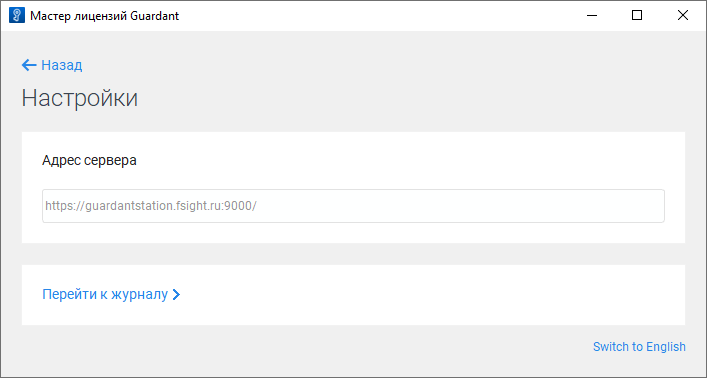
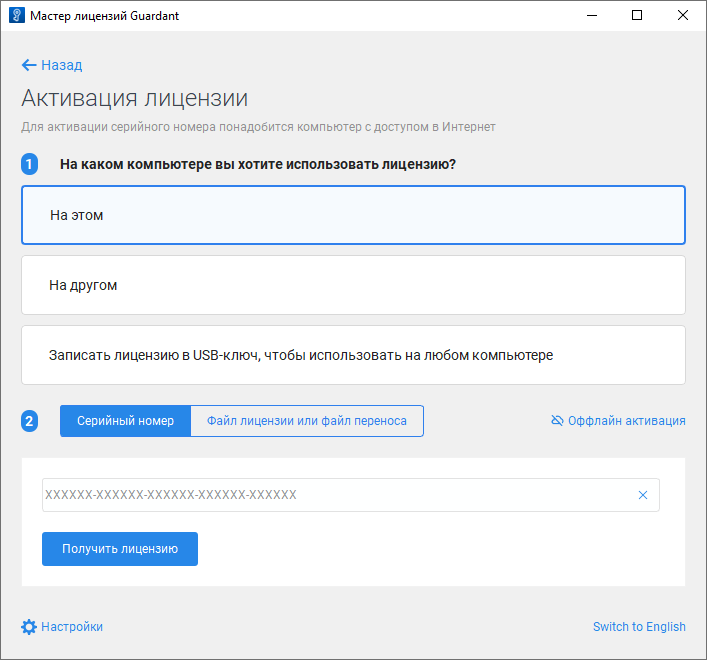
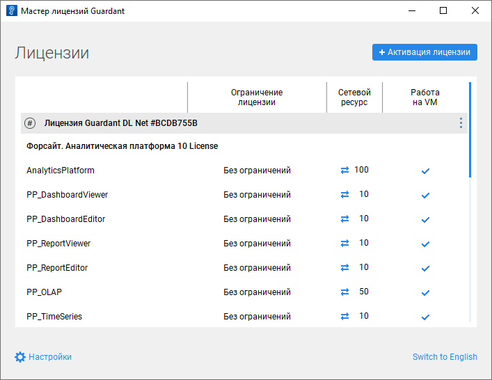

# Активация лицензии при наличии доступа к сети Интернет

Активация лицензии при наличии доступа к сети Интернет
-

# Активация лицензии при наличии доступа к сети Интернет

	Лицензия доступна для активации в [мастере
	 лицензий Guardant](License_Activation_Guardant.htm) в [графическом](#graphic) или [консольном](#console) режиме.

	Для активации лицензии при отсутствии доступа к сети Интернет обратитесь
	 к разделу «[Активация
	 лицензии при отсутствии доступа к сети Интернет](License_Activation_Internet_Access_Denied.htm)».

## Активация лицензии в графическом режиме

	Для активации лицензии в графическом режиме:

		- Запустите мастер лицензий Guardant:

	

		- Нажмите кнопку 
		 «Настройки» и задайте
		 URL-адрес сервиса активации в поле «Адрес
		 сервера»:

	https://guardantstation.fsight.ru:9000/

	

	При необходимости нажмите кнопку «Перейти к журналу» для просмотра
	 отладочной информации мастера лицензий Guardant, которая записывается
	 в файл license_wizard.log в ОС Linux или license_wizard.txt в ОС Windows.

		- Вернитесь назад, на главную страницу мастера, и нажмите
		 кнопку  «Активация лицензии».

		- Убедитесь, что на текущем компьютере доступна сеть Интернет,
		 и выполните действия:

			- Выберите вариант активации лицензии «На
			 этом».

			- Введите серийный номер лицензии.

			- Нажмите кнопку «Получить
			 лицензию».

	

	После выполнения действий лицензия будет активирована при наличии
	 доступа к сети Интернет в графическом режиме мастера лицензий Guardant
	 и доступна в [Guardant Control
	 Center](License_Server_Guardant.htm#work):

	

## Активация лицензии в консольном режиме

	Для активации лицензии в консольном режиме выполните команду:

		ОС
		 Linux ОС Windows

			./license_wizard --console --activate
			 <серийный номер>
			 --host https://guardantstation.fsight.ru:9000/

			license_wizard.exe --console --activate
			 <серийный номер>
			 --host https://guardantstation.fsight.ru:9000/

	В подстановке <серийный номер> укажите полученный серийный
	 номер лицензии.

См. также:

[Мастер
 лицензий Guardant](License_Activation_Guardant.htm) | [Активация
 лицензии при отсутствии доступа к сети Интернет](License_Activation_Internet_Access_Denied.htm) | [Обновление
 лицензии при наличии доступа к сети Интернет](License_Update_Internet_Access.htm) | [Обновление
 лицензии при отсутствии доступа к сети Интернет](License_Update_Internet_Access_Denied.htm) | [Перенос
 лицензии](License_Transfer.htm)

		Справочная
		 система на версию 10.9
		 от 18/08/2025,
		 © ООО «ФОРСАЙТ»,
