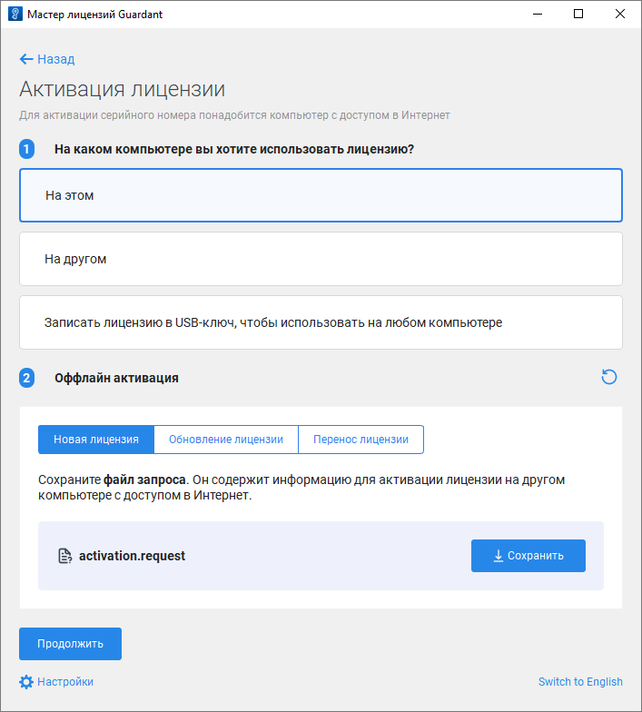
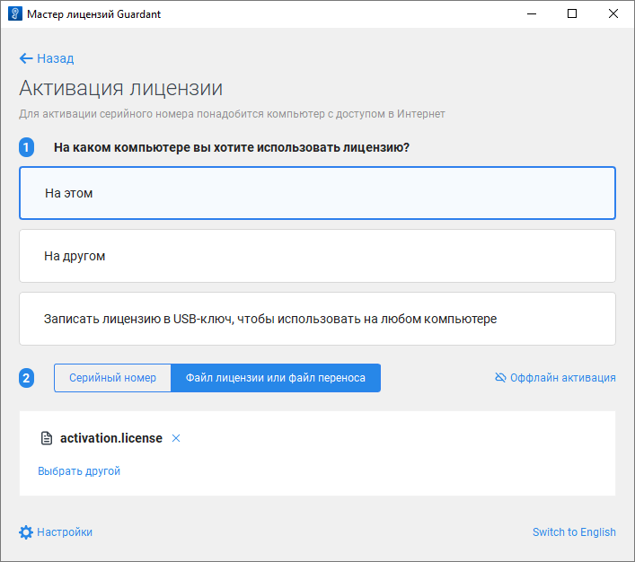
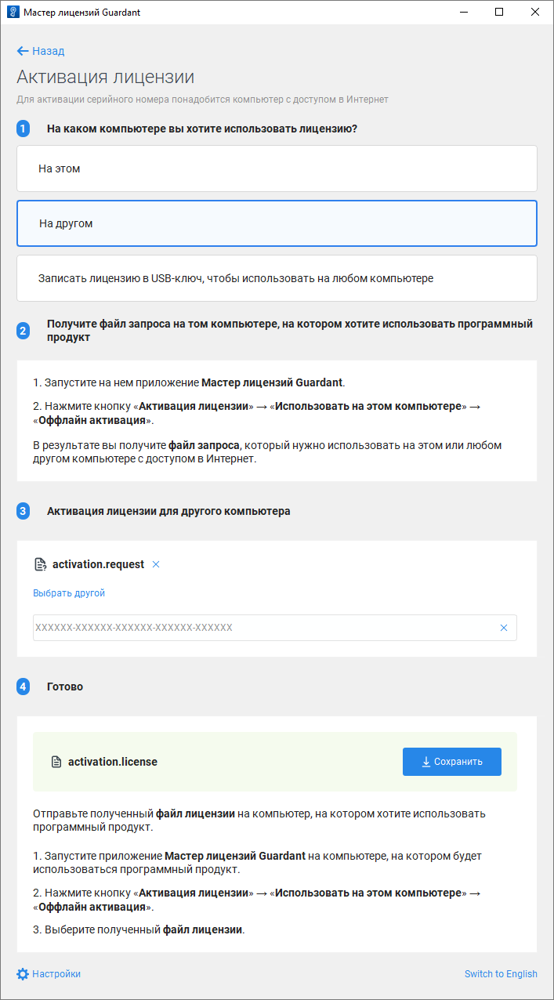

# Активация лицензии при отсутствии доступа к сети Интернет

Активация лицензии при отсутствии доступа к сети Интернет
-

# Активация лицензии при отсутствии доступа к сети Интернет

	Лицензия доступна для активации в [мастере
	 лицензий Guardant](License_Activation_Guardant.htm) в [графическом](#graphic) или [консольном](#console) режиме.

	Для активации лицензии при наличии доступа к сети Интернет обратитесь
	 к разделу «[Активация
	 лицензии при наличии доступа к сети Интернет](License_Activation_Internet_Access.htm)».

## Активация лицензии в графическом режиме

	Для активации лицензии в графическом режиме:

		- Запустите мастер лицензий Guardant:

	

		- Нажмите кнопку 
		 «Активация лицензии».

		- Выполните действия:

			- Выберите вариант активации лицензии «На
			 этом».

			- Нажмите кнопку «Оффлайн
			 активация».

			- Нажмите кнопку «Сохранить»
			 на вкладке «Новая лицензия»
			 для сохранения файла запроса на активацию лицензии с расширением
			 *.request.

	

		- Передайте файл запроса на активацию лицензии с расширением
		 *.request и серийный номер на другой компьютер с доступом к сети
		 Интернет или обратитесь в техническую поддержку по адресу [support@fsight.ru](mailto:support@fsight.ru).
		 Для формирования файла лицензии на компьютере с доступом к сети
		 Интернет обратитесь к подразделу «[Формирование
		 файла лицензии на компьютере с доступом к сети Интернет](#license_file)».

		- Получите файл лицензии с расширением
		 *.license и выполните действия:

			- Нажмите кнопку  «Назад»,
			 расположенную напротив раздела «Оффлайн
			 активация».

			- Перейдите на вкладку «Файл
			 лицензии или файл переноса».

			- Нажмите кнопку «Выбрать
			 файл» и загрузите полученный файл лицензии с расширением
			 *.license.

	

	После выполнения действий лицензия будет активирована при отсутствии
	 доступа к сети Интернет в графическом режиме мастера лицензий Guardant
	 и доступна в [Guardant Control
	 Center](License_Server_Guardant.htm#work):

	

### Формирование файла лицензии на компьютере
	 с доступом к сети Интернет

	Для формирования файла лицензии на компьютере с доступом к сети
	 Интернет:

		- Получите файл запроса на активацию лицензии с расширением
		 *.request и серийный номер лицензии.

		- Запустите мастер лицензий Guardant:

	

		- Нажмите кнопку 
		 «Активация лицензии».

		- Убедитесь, что на текущем компьютере доступна сеть Интернет,
		 и выполните действия:

			- Выберите вариант активации лицензии «На
			 другом».

			- Нажмите кнопку «Продолжить».

			- Нажмите кнопку «Выбрать
			 файл» и загрузите полученный файл запроса на активацию
			 лицензии с расширением *.request.

			- Введите серийный номер лицензии.

			- Нажмите кнопку «Сохранить»
			 для сохранения файла лицензии с расширением *.license.

	

	После выполнения действий будет сохранён файл лицензии с расширением
	 *.license. Передайте сформированный файл на компьютер, на котором
	 был сохранён файл запроса на активацию лицензии, и [активируйте
	 лицензию](#file) с помощью файла.

## Активация лицензии в консольном режиме

	Для активации лицензии в консольном режиме:

		- Создайте файл запроса на активацию лицензии с расширением
		 *.request:

		ОС
		 Linux ОС Windows

			./license_wizard --console --activate-request
			 <путь до файла запроса>

			license_wizard.exe --console --activate-request
			 <путь до файла запроса>

	В подстановке <путь до файла запроса> укажите полный путь до папки,
	 в которой будет сохранён файл запроса на активацию лицензии с расширением
	 *.request, и задайте наименование файла.

		- Передайте файл запроса на активацию лицензии с расширением
		 *.request и серийный номер лицензии на другой компьютер с доступом
		 к сети Интернет или обратитесь в техническую поддержку по адресу
		 [support@fsight.ru](mailto:support@fsight.ru).

	На компьютере с доступом к сети Интернет
	 сформируйте файл лицензии с расширением *.license:

		ОС
		 Linux ОС Windows

			./license_wizard --console --activate-response
			 <серийный номер>
			 <путь до файла запроса>
			 <путь до файла лицензии> --host
			 https://guardantstation.fsight.ru:9000/

			license_wizard.exe --console --activate-response
			 <серийный номер>
			 <путь до файла запроса>
			 <путь до файла лицензии>
			 --host https://guardantstation.fsight.ru:9000/

	В подстановках:

			- <серийный номер>.
			 Укажите полученный серийный номер лицензии;

			- <путь до файла запроса>.
			 Укажите полный путь до файла запроса на активацию лицензии
			 с расширением *.request;

			- <путь до файла лицензии>.
			 Укажите полный путь до папки, в которой будет сохранён файл
			 лицензии с расширением *.license, и задайте наименование файла.

	После выполнения
	 команды будет сохранён файл лицензии с расширением *.license. Передайте
	 сформированный файл на компьютер, на котором был сохранён файл запроса
	 на активацию лицензии.

		- Получите файл лицензии с расширением *.license и выполните
		 команду:

		ОС
		 Linux ОС Windows

			./license_wizard --console --activate-offline
			 <путь до файла лицензии>

			license_wizard.exe --console --activate-offline
			 <путь до файла лицензии>

	В подстановке <путь до файла лицензии> укажите полный путь до полученного
	 файла лицензии с расширением *.license.

См. также:

[Мастер
 лицензий Guardant](License_Activation_Guardant.htm) | [Активация
 лицензии при наличии доступа к сети Интернет](License_Activation_Internet_Access.htm) | [Обновление
 лицензии при наличии доступа к сети Интернет](License_Update_Internet_Access.htm) | [Обновление
 лицензии при отсутствии доступа к сети Интернет](License_Update_Internet_Access_Denied.htm) | [Перенос
 лицензии](License_Transfer.htm)

		Справочная
		 система на версию 10.9
		 от 18/08/2025,
		 © ООО «ФОРСАЙТ»,
