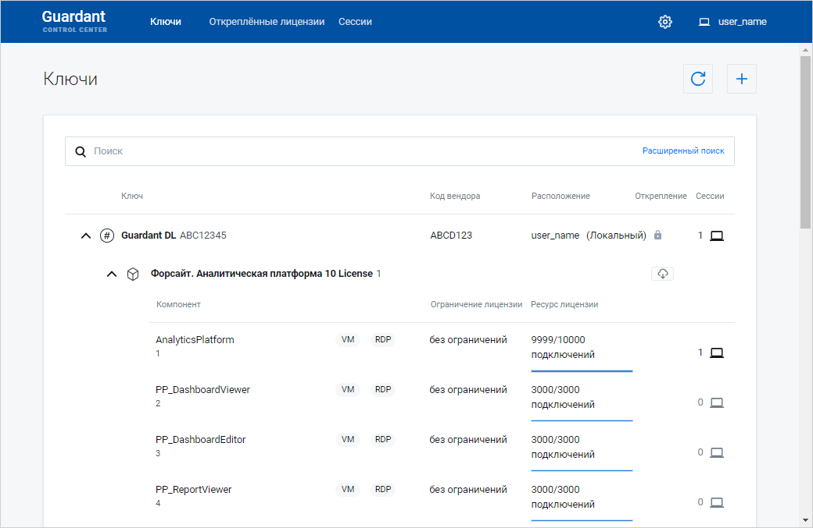
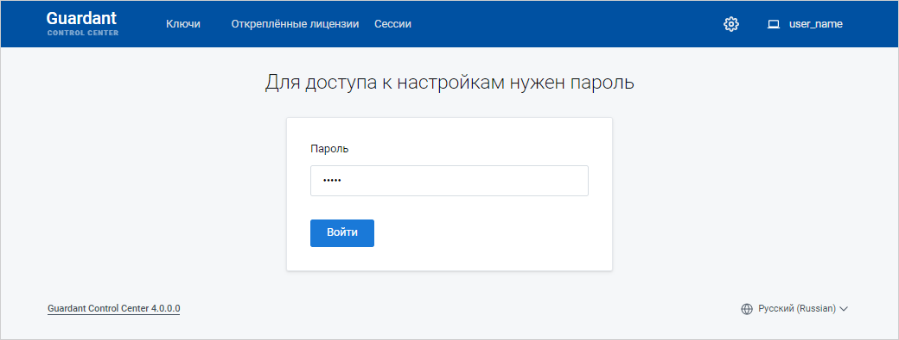
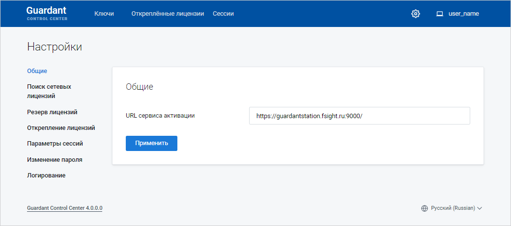
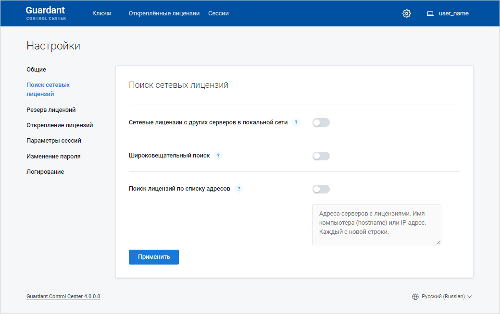
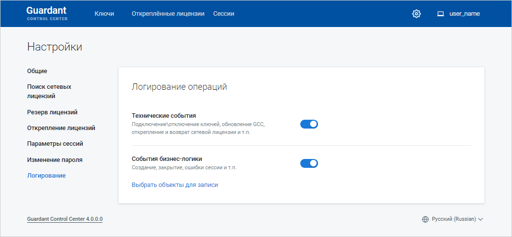
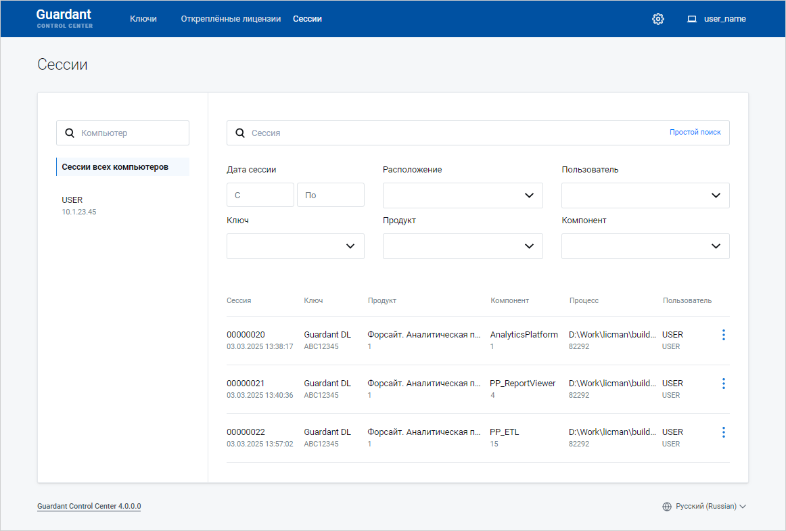

# Сервер лицензий Guardant и особенности его использования

Сервер лицензий Guardant и особенности его использования
-

# Сервер лицензий Guardant и особенности его использования

	Сервер лицензий используется для активации продукта «Форсайт. Аналитическая платформа»
	 с помощью [сетевой
	 лицензии](../Admin_Licensing_Variants.htm#network). Сервер лицензий контролирует количество одновременно
	 работающих пользователей, обеспечивает простоту и гибкость администрирования.
	 Лицензия передаётся в виде серийного номера.

	Для получения подробной информации о программном обеспечении Guardant
	 обратитесь к [официальной
	 документации](https://dev.guardant.ru/).

## Установка сервера лицензий

	Для установки сервера лицензий на базе программного обеспечения
	 Guardant:

		- Установите Guardant Control Center.

	Примечание.
	 Для получения дистрибутива установки Guardant Control Center в ОС
	 Linux/Windows обратитесь в техническую поддержку по адресу [support@fsight.ru](mailto:support@fsight.ru)
	 или через [сервисы
	 технической поддержки](https://www.fsight.ru/support/), которые доступны после регистрации на сайте.

	Папка установки Guardant Control Center
	 по умолчанию:

			- /opt/guardant/grdcontrol в ОС Linux;

			- C:\Program Files (x86)\Guardant\Guardant Control Center
			 в ОС Windows.

		- Укажите адрес Guardant Control Center в строке браузера:

	http://<IP-адрес или DNS-имя сервера>:3189/

	По умолчанию Guardant Control Center
	 доступен по адресу:

	http://localhost:3189/

	После выполнения действия будет открыт
	 Guardant Control Center:

	

		- Нажмите кнопку  «Настройки»
		 в правом верхнем углу.

		- Введите пароль «admin» и нажмите кнопку «Войти»:

	

	Примечание.
	 При необходимости измените пароль для доступа к настройкам сервера
	 лицензий в разделе «Изменение пароля».

		- Измените настройки в разделах:

			- Общие. Укажите
			 URL-адрес сервиса активации:

	https://guardantstation.fsight.ru:9000/

	

	Для сохранения изменений нажмите кнопку
	 «Применить».

			- Поиск сетевых лицензий.
			 Переведите переключатели «Сетевые
			 лицензии с других серверов в локальной сети», «Широковещательный поиск»
			 в неактивное состояние:

	

	Для сохранения изменений нажмите кнопку
	 «Применить».

			- Логирование.
			 Переведите переключатели «Технические
			 события», «События
			 бизнес-логики» в активное состояние:

	

	После выполнения действий будет установлен и настроен сервер лицензий
	 на базе программного обеспечения Guardant. Далее перейдите к установке
	 [сервиса лицензирования](../Service/Licensing_Service.htm).

## Работа с лицензией

	Для работы с лицензией используйте раздел «Ключи».
	 В разделе содержатся лицензии, активированные в [мастере
	 лицензий Guardant](License_Activation_Guardant.htm), с набором [единиц
	 лицензирования](../AboutFeatures.htm) (компонентов):

	

	[Обновление
	 списка лицензий](javascript:TextPopup(this))

		Для обновления списка лицензий при активации новой или [обновлении
		 существующей лицензии](License_Update_Internet_Access.htm) в мастере лицензий Guardant нажмите
		 кнопку  «Обновить список ключей». После
		 чего будет добавлена новая лицензия в списке лицензий или обновлена
		 существующая лицензия, например, по количеству допустимых подключений
		 или набору единиц лицензирования.

	[Просмотр
	 активных сессий пользователей](javascript:TextPopup(this))

		Для просмотра активных сессий пользователей нажмите кнопку 
		 «Активные сессии». После
		 чего будет открыт раздел «Сессии»:

		

		Также количество активных сессий пользователей по соответствующей
		 единице лицензирования отображается в столбце «Сессия».
		 При захвате единицы лицензирования уменьшается количество подключений
		 в столбце «Ресурс лицензии»
		 в разделе «[Ключи](#work)».

	[Поиск единицы
	 лицензирования](javascript:TextPopup(this))

		Для быстрого поиска единицы лицензирования начните вводить её
		 наименование частично или целиком в строке поиска.

См. также:

[Активация
 продукта «Форсайт. Аналитическая платформа»](../Admin_Licensing.htm)
 | [Сервис лицензирования и особенности
 его использования](../Service/Licensing_Service.htm) | [Мастер
 лицензий Guardant](License_Activation_Guardant.htm)

		Справочная
		 система на версию 10.9
		 от 18/08/2025,
		 © ООО «ФОРСАЙТ»,
