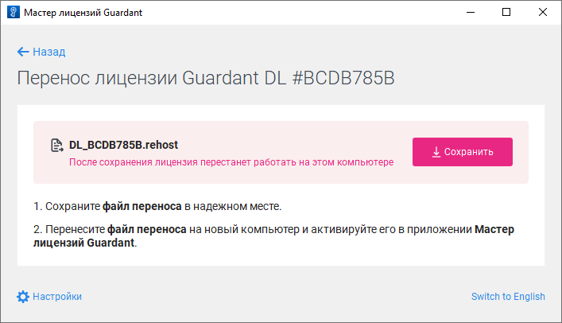
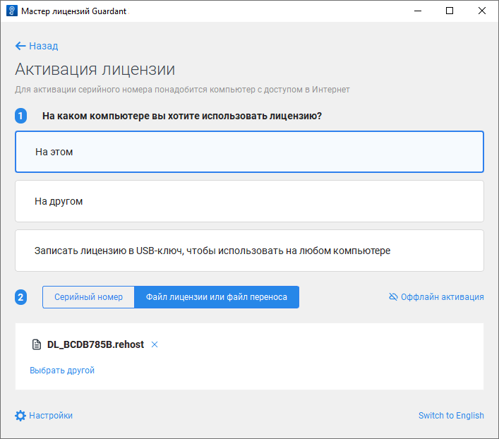

# Перенос лицензии

Перенос лицензии
-

# Перенос лицензии

Лицензия доступна для переноса на другой компьютер в [мастере
 лицензий Guardant](License_Activation_Guardant.htm) в [графическом](#graphic) или [консольном](#console)
 режиме.

## Перенос лицензии в графическом режиме

Для переноса лицензии на другой компьютер в графическом режиме:

	- Выполните команду «Перенести
	 на другой компьютер» в раскрывающемся меню кнопки  «Действия».

	- Сохраните файл переноса лицензии:

	- Откройте мастер лицензий Guardant на другом компьютере и [активируйте лицензию](License_Activation_Internet_Access.htm)
	 с помощью файла переноса лицензии:

После выполнения действий лицензия будет перенесена с одного компьютера
 на другой.

## Перенос лицензии в консольном режиме

Для переноса лицензии на другой компьютер в консольном режиме:

	- Получите список лицензий:

	ОС
	 Linux ОС Windows

		./license_wizard --console --list

		license_wizard.exe --console --list

	- Скопируйте идентификатор лицензии, указанный после знака «#».
	 Например, в полученной строке «Guardant DL Net #C852BDAD» идентификатор
	 лицензии - C852BDAD.

	- Сохраните файл переноса лицензии на текущем компьютере:

	ОС
	 Linux ОС Windows

		./license_wizard --console --rehost-extract
		 <идентификатор лицензии>
		 <наименование файла переноса
		 лицензии>.rehost

		license_wizard.exe --console --rehost-extract
		 <идентификатор лицензии>
		 <наименование файла переноса
		 лицензии>.rehost

В подстановках:

		- <идентификатор лицензии>.
		 Укажите идентификатор лицензии, полученный с помощью команды list;

		- <наименование файла переноса лицензии>. Укажите наименование файла
		 переноса лицензии с расширением *.rehost, который будет создан
		 рядом с утилитой license_wizard.

	- Активируйте лицензию с помощью файла переноса лицензии на другом
	 компьютере:

	ОС
	 Linux ОС Windows

		./license_wizard --console --rehost <путь до файла переноса лицензии>
		 --host https://guardantstation.fsight.ru:9000/

		license_wizard.exe --console --rehost <путь до файла переноса лицензии>
		 --host https://guardantstation.fsight.ru:9000/

В подстановке <путь до файла переноса
 лицензии> укажите полный
 путь до полученного файла переноса лицензии с расширением *.rehost.

См. также:

[Мастер
 лицензий Guardant](License_Activation_Guardant.htm) | [Активация
 лицензии при наличии доступа к сети Интернет](License_Activation_Internet_Access.htm) | [Активация
 лицензии при отсутствии доступа к сети Интернет](License_Activation_Internet_Access_Denied.htm) | [Обновление
 лицензии при наличии доступа к сети Интернет](License_Update_Internet_Access.htm) | [Обновление
 лицензии при отсутствии доступа к сети Интернет](License_Update_Internet_Access_Denied.htm)

		Справочная
		 система на версию 10.9
		 от 18/08/2025,
		 © ООО «ФОРСАЙТ»,
