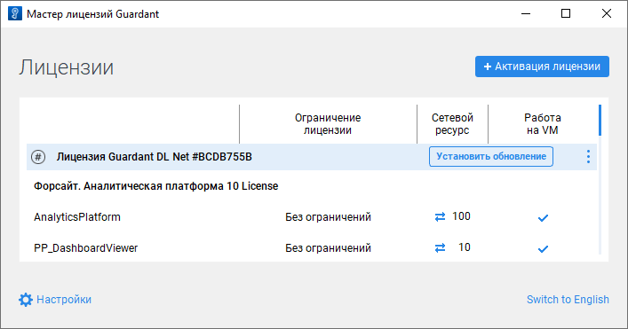

# Обновление лицензии при наличии доступа к сети Интернет

Обновление лицензии при наличии доступа к сети Интернет
-

# Обновление лицензии при наличии доступа к сети Интернет

	Лицензия доступна для обновления в [мастере
	 лицензий Guardant](License_Activation_Guardant.htm) в [графическом](#graphic) или [консольном](#console) режиме.

	Для обновления лицензии при отсутствии доступа к сети Интернет обратитесь
	 к разделу «[Обновление
	 лицензии при отсутствии доступа к сети Интернет](License_Update_Internet_Access_Denied.htm)».

## Обновление лицензии в графическом режиме

	Для обновления лицензии в графическом режиме:

		- Выполните команду «Проверить
		 наличие обновлений» в раскрывающемся меню кнопки  «Действия»:

			- если обновление отсутствует, то будет отображено соответствующее
			 всплывающее сообщение;

			- если обновление доступно, то будет отображена кнопка
			 «Установить обновление»:

	

		- Нажмите кнопку «Установить
		 обновление».

	После выполнения действий лицензия будет обновлена.

	Для применения изменений и обновления лицензии в Guardant Control
	 Center [обновите список
	 лицензий](License_Server_Guardant.htm#update) после обновления лицензии в мастере лицензий Guardant.

## Обновление лицензии в консольном режиме

	Для обновления лицензии в консольном режиме:

		- Получите список лицензий:

		ОС
		 Linux ОС Windows

			./license_wizard --console --list

			license_wizard.exe --console --list

		- Скопируйте идентификатор лицензии, указанный после знака
		 «#». Например, в полученной строке «Guardant DL Net #C852BDAD»
		 идентификатор лицензии - C852BDAD.

		- Обновите лицензию:

		ОС
		 Linux ОС Windows

			./license_wizard --console --update
			 <идентификатор лицензии>
			 --host https://guardantstation.fsight.ru:9000/

			license_wizard.exe --console --update
			 <идентификатор лицензии>
			 --host https://guardantstation.fsight.ru:9000/

	В подстановке <идентификатор лицензии> укажите идентификатор лицензии,
	 полученный с помощью команды list.

См. также:

[Мастер
 лицензий Guardant](License_Activation_Guardant.htm) | [Активация
 лицензии при наличии доступа к сети Интернет](License_Activation_Internet_Access.htm) | [Активация
 лицензии при отсутствии доступа к сети Интернет](License_Activation_Internet_Access_Denied.htm) | [Обновление
 лицензии при отсутствии доступа к сети Интернет](License_Update_Internet_Access_Denied.htm) | [Перенос
 лицензии](License_Transfer.htm)

		Справочная
		 система на версию 10.9
		 от 18/08/2025,
		 © ООО «ФОРСАЙТ»,
