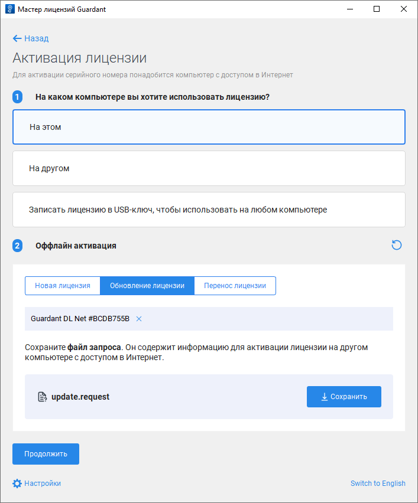
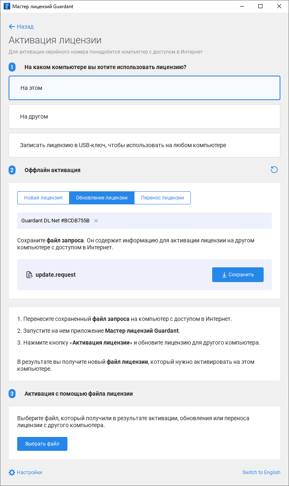
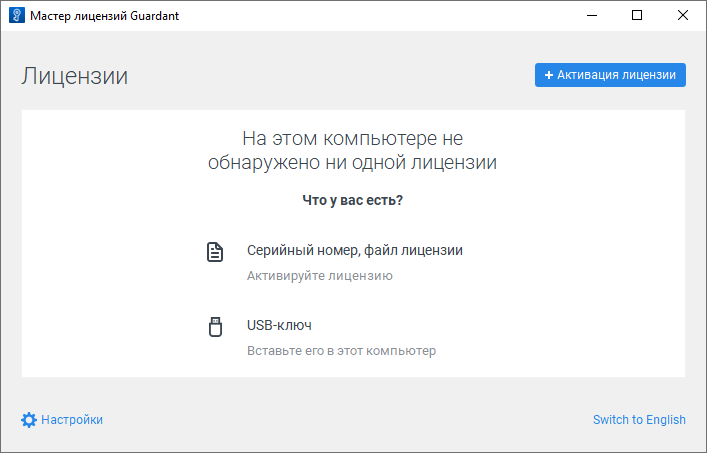
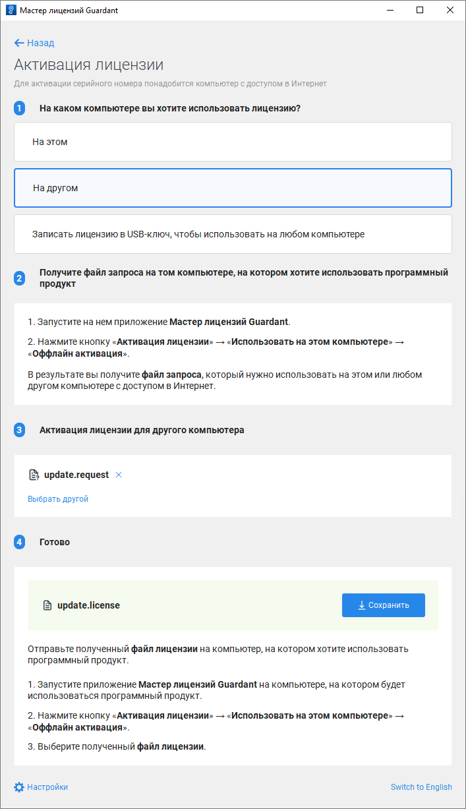

# Обновление лицензии при отсутствии доступа к сети Интернет

Обновление лицензии при отсутствии доступа к сети Интернет
-

# Обновление лицензии при отсутствии доступа к сети Интернет

	Лицензия доступна для обновления в [мастере
	 лицензий Guardant](License_Activation_Guardant.htm) в [графическом](#graphic) или [консольном](#console) режиме.

	Для обновления лицензии при наличии доступа к сети Интернет обратитесь
	 к разделу «[Обновление
	 лицензии при наличии доступа к сети Интернет](License_Update_Internet_Access.htm)».

## Обновление лицензии в графическом режиме

	Для обновления лицензии в графическом режиме:

		- Выполните команду «Оффлайн
		 обновление» в раскрывающемся меню кнопки  «Действия».

		- Выполните действия:

			- Выберите вариант обновления лицензии «На
			 этом».

			- Нажмите кнопку «Сохранить»
			 на вкладке «Обновление лицензии»
			 для сохранения файла запроса на обновление лицензии с расширением
			 *.request.

	

		- Передайте файл запроса на обновление лицензии с расширением
		 *.request на другой компьютер с доступом к сети Интернет или обратитесь
		 в техническую поддержку по адресу [support@fsight.ru](mailto:support@fsight.ru).
		 Для формирования файла обновления лицензии на компьютере с доступом
		 к сети Интернет обратитесь к подразделу «[Формирование
		 файла обновления на компьютере с доступом к сети Интернет](#file_update)».

		- Получите файл обновления лицензии с расширением
		 *.license и выполните действия:

			- Нажмите кнопку «Продолжить».

			- Нажмите кнопку «Продолжить,
			 у меня есть файл лицензии».

			- Нажмите кнопку «Выбрать
			 файл» и загрузите полученный файл обновления лицензии
			 с расширением *.license.

	

	После выполнения действий лицензия будет обновлена.

	Для применения изменений и обновления лицензии в Guardant Control
	 Center [обновите список
	 лицензий](License_Server_Guardant.htm#update) после обновления лицензии в мастере лицензий Guardant.

### Формирование файла обновления на компьютере
	 с доступом к сети Интернет

	Для формирования файла обновления на компьютере с доступом к сети
	 Интернет:

		- Получите файл запроса на обновление лицензии с расширением
		 *.request.

		- Запустите мастер лицензий Guardant:

	

		- Нажмите кнопку 
		 «Активация лицензии».

		- Убедитесь, что на текущем компьютере доступна сеть Интернет,
		 и выполните действия:

			- Выберите вариант активации лицензии «На
			 другом».

			- Нажмите кнопку «Продолжить».

			- Нажмите кнопку «Выбрать
			 файл» и загрузите полученный файл запроса на обновление
			 лицензии с расширением *.request.

			- Нажмите кнопку «Обновить
			 эту лицензию».

			- Нажмите кнопку «Сохранить»
			 для сохранения файла обновления лицензии с расширением *.license.

	

	После выполнения действий будет сохранён файл обновления лицензии
	 с расширением *.license. Передайте сформированный файл на компьютер,
	 на котором был сохранён файл запроса на обновление лицензии, и [обновите лицензию](#file) с помощью файла.

## Обновление лицензии в консольном режиме

	Для обновления лицензии в консольном режиме:

		- Получите список лицензий:

		ОС
		 Linux ОС Windows

			./license_wizard --console --list

			license_wizard.exe --console --list

		- Скопируйте идентификатор лицензии, указанный после знака
		 «#». Например, в полученной строке «Guardant DL Net #C852BDAD»
		 идентификатор лицензии - C852BDAD.

		- Создайте файл запроса на обновление лицензии с расширением
		 *.request:

		ОС
		 Linux ОС Windows

			./license_wizard --console --update-request
			 <идентификатор лицензии>
			 <путь до файла запроса>

			license_wizard.exe --console --update-request
			 <идентификатор лицензии>
			 <путь до файла запроса>

	В подстановках:

			- <идентификатор лицензии>.
			 Укажите идентификатор лицензии, полученный с помощью команды
			 list;

			- <путь до файла запроса>.
			 Укажите полный путь до папки, в которой будет сохранён файл
			 запроса на обновление лицензии с расширением *.request, и
			 задайте наименование файла.

		- Передайте файл запроса на обновление лицензии с расширением
		 *.request на другой компьютер с доступом к сети Интернет или обратитесь
		 в техническую поддержку по адресу [support@fsight.ru](mailto:support@fsight.ru).

	На компьютере с доступом к сети Интернет
	 сформируйте файл обновления лицензии с расширением *.license:

		ОС
		 Linux ОС Windows

			./license_wizard --console --update-response
			 <путь до файла запроса> <путь до файла
			 обновления> --host https://guardantstation.fsight.ru:9000/

			license_wizard.exe --console --update-response
			 <путь до файла запроса>
			 <путь до файла обновления>
			 --host https://guardantstation.fsight.ru:9000/

	В подстановках:

			- <путь до файла запроса>.
			 Укажите полный путь до файла запроса на обновление лицензии
			 с расширением *.request;

			- <путь до файла обновления>.
			 Укажите полный путь до папки, в которой будет сохранён файл
			 обновления лицензии с расширением *.license, и задайте наименование
			 файла.

	После выполнения
	 команды будет сохранён файл обновления лицензии с расширением *.license.
	 Передайте сформированный файл на компьютер, на котором был сохранён
	 файл запроса на обновление лицензии.

		- Получите файл обновления лицензии с расширением *.license
		 и выполните команду:

		ОС
		 Linux ОС Windows

			./license_wizard --console --update-offline
			 <путь до файла обновления>

			license_wizard.exe --console --update-offline
			 <путь до файла обновления>

	В подстановке <путь до файла обновления> укажите полный путь до полученного
	 файла обновления лицензии с расширением *.license.

См. также:

[Мастер
 лицензий Guardant](License_Activation_Guardant.htm) | [Активация
 лицензии при наличии доступа к сети Интернет](License_Activation_Internet_Access.htm) | [Активация
 лицензии при отсутствии доступа к сети Интернет](License_Activation_Internet_Access_Denied.htm) | [Обновление
 лицензии при наличии доступа к сети Интернет](License_Update_Internet_Access.htm) | [Перенос
 лицензии](License_Transfer.htm)

		Справочная
		 система на версию 10.9
		 от 18/08/2025,
		 © ООО «ФОРСАЙТ»,
