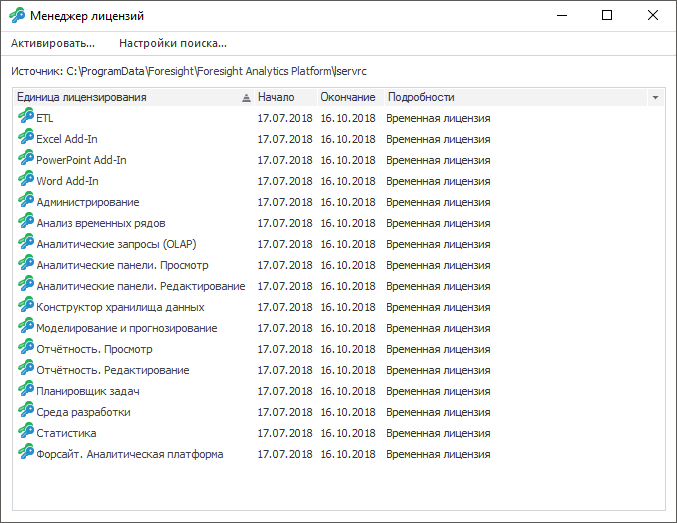
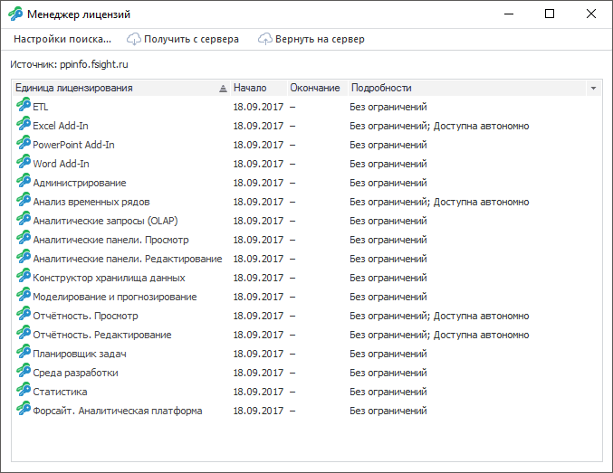

# Работа с лицензией в ОС Windows

Работа с лицензией в ОС Windows
-

# Работа с лицензией в ОС Windows

В ОС Windows для работы с [лицензией](../Admin_Licensing.htm)
 приложения используется [менеджер лицензий](Intro_LicenseManager.htm),
 который:

	- активирует продукт;

	- отображает параметры текущей лицензии и единиц лицензирования;

	- задает настройки поиска лицензии.

Примечание.
 Работа с менеджером лицензий доступна только в настольном приложении при
 активации продукта на базе [RMS](Activation_Product_RMS.htm).

Для запуска менеджера лицензий:

	-
выполните команду «Форсайт. Аналитическая платформа 10.9 > Менеджер лицензий» в главном меню Windows;

	-
выполните команду «Справка >
 О программе» в главном меню продукта
 «Форсайт. Аналитическая платформа»,
 затем нажмите кнопку «Изменить лицензии».

В результате будет открыто окно [менеджера
 лицензий](Intro_LicenseManager.htm).

Вид окна менеджера лицензий зависит:

	- от результатов поиска лицензии. При отсутствии лицензии или
	 при истечении срока действия текущей лицензии отображается [диалог
	 с информацией](Intro_LicMngr_Info.htm);

	- от используемого [типа
	 лицензии](../Admin_Licensing_Variants.htm). При использовании автономной или сетевой лицензии окно
	 [менеджера лицензий](Intro_LicenseManager.htm) меняется.

## Активация автономной лицензией

Для активации настольного приложения [автономной
 лицензией](../Admin_Licensing_Variants.htm#standalone):

	- Откройте [настройки поиска
	 лицензий](Intro_LicMngr_SearchLic.htm).

	- Выберите переключатель «Поиск
	 только автономных лицензий».

	- Нажмите кнопку «ОK».
	 Будет открыто окно [менеджера лицензий](Intro_LicenseManager.htm).

	- Нажмите кнопку «Активировать»
	 в окне менеджера лицензий.

	- Выберите файл с кодом активации с помощью [мастера
	 активации продукта](Intro_LicMngr_MasterActivation.htm).

После выполнения действий настольное приложение активируется автономной
 лицензией. В менеджере лицензий будет доступна работа с автономной лицензией,
 например:

## Активация сетевой лицензией

Для активации настольного приложения [сетевой
 лицензией](../Admin_Licensing_Variants.htm#network):

	- Откройте [настройки поиска
	 лицензий](Intro_LicMngr_SearchLic.htm).

	- Выберите переключатель «Поиск
	 лицензий на сервере» и укажите наименование сервера лицензий.

	- Нажмите кнопку «ОK».

После выполнения действий настольное приложение активируется сетевой
 лицензией. В менеджере лицензий будет доступна работа с сетевой лицензией,
 например:

Примечание.
 Активировать приложение сетевой лицензией можно с помощью системных переменных
 [LSHOST, LSFORCEHOST или настроек в
 реестре](LicenseServer.htm#lshost).

## Активация отдельной единицы лицензирования

Для активации единицы лицензирования и прикладных единиц лицензирования
 используйте [мастер активации
 модуля](Intro_LicMngr_ActivateModule.htm). Мастер открывается при использовании метода [RequestLicense](KeHost.chm::/Interface/ILicenseManager/ILicenseManager.RequestLicense.htm),
 когда запрашиваемая лицензия отсутствует или является не валидной.

См. также:

[Работа
 с лицензией в ОС Linux](LicensingLinux.htm)

		Справочная
		 система на версию 10.9
		 от 18/08/2025,
		 © ООО «ФОРСАЙТ»,
