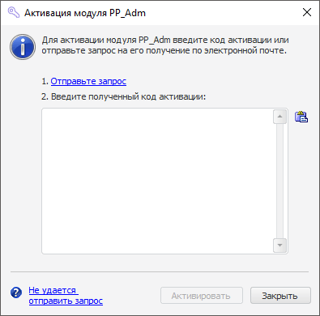

# Активация модуля

Активация модуля
-

# Активация модуля

Мастер активации модуля используется для активации:

	- единицы лицензирования на отдельный инструмент или функциональность
	 продукта «Форсайт. Аналитическая платформа»;

	- [прикладных единиц
	 лицензирования](../ApplicationSystemLicensing.htm).

Диалог «Активация модуля» открывается
 с помощью приложения, разработанного на базе «Форсайт. Аналитическая платформа»,
 если происходит запрос лицензии методом [RequestLicense](KeSomHost.chm::/Interface/ILicenseManager/ILicenseManager.RequestLicense.htm).

В заголовке окна отображается название единицы лицензирования, которая
 требует активации:

Порядок активации модуля аналогичен порядку [активации
 платформы](Intro_LicMngr_MasterActivation.htm) с помощью автономной лицензии.

Примечание.
 Валидные лицензии сохраняются в файл. Файл автономной лицензии хранится
 по следующему пути: %PROGRAMDATA%\Foresight\Foresight Analytics Platform\lservrc.
 Для успешной активации пользователь должен обладать правами на запись
 в файл лицензии.

См. также:

[Работа
 с лицензией в ОС Windows](Intro_LicMngr.htm)

		Справочная
		 система на версию 10.9
		 от 18/08/2025,
		 © ООО «ФОРСАЙТ»,
