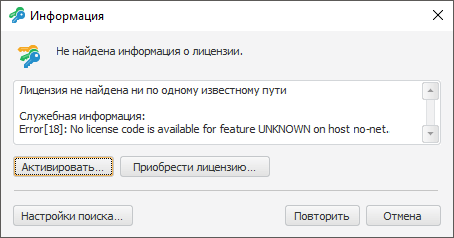

# Информация о результатах поиска лицензии

Информация о результатах поиска лицензии
-

# Информация о результатах поиска лицензии

Окно «Информация» открывается,
 если отсутствует [лицензия](../Admin_Licensing.htm) или срок
 действия текущей лицензии истек и др.:

Окно содержит текст ошибки (лицензия не найдена ни по одному известному
 пути, срок действия лицензии истек и др.) и служебную информацию о процессе
 поиска лицензии.

	- Активировать.
	 Закрывает текущий диалог и открывает [мастер
	 активации продукта](Intro_LicMngr_MasterActivation.htm).

	- Приобрести
	 лицензию. Открывает веб-сайт продукта «Форсайт. Аналитическая платформа»
	 для приобретения лицензии.

	- Настройки поиска. Открывает
	 [диалог с настройками поиска
	 лицензии](Intro_LicMngr_SearchLic.htm), после его закрытия выполняется повторный поиск лицензии
	 с учётом сделанных изменений.

	- Повторить. Выполняет
	 повторный поиск лицензии с учётом установленных параметров поиска.

См. также:

[Работа
 с лицензией в ОС Windows](Intro_LicMngr.htm)

		Справочная
		 система на версию 10.9
		 от 18/08/2025,
		 © ООО «ФОРСАЙТ»,
