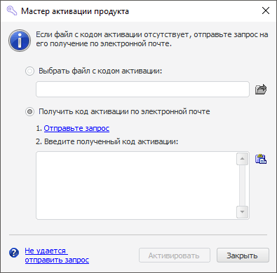

# Мастер активации продукта

Мастер активации продукта
-

# Мастер активации продукта

Мастер активации продукта используется для активации приложения с помощью
 [автономной лицензии](../Admin_Licensing_Variants.htm#standalone),
 для замены текущей лицензии на другую.

[Для открытия
 мастера активации](javascript:TextPopup(this))

	Нажмите кнопку «Активировать»:

		- в окне «[Информация](Intro_LicMngr_Info.htm)»,
		 который отображается автоматически, если отсутствует лицензия
		 или срок действия текущей лицензии истек и др.;

		- в окне менеджера лицензий, для открытия которого выберите
		 один из способов:

			-
выполните команду «Форсайт. Аналитическая платформа 10.9 > Менеджер лицензий» в главном меню Windows;

			-
выполните команду «Справка >
 О программе» в главном меню продукта
 «Форсайт. Аналитическая платформа»,
 затем нажмите кнопку «Изменить лицензии».

		- в [окне
		 приветствия](GetStarted.chm::/GetStarted/Get_Started.htm)
		 настольного приложения, если используется лицензия с [пробным
		 периодом](../Admin_Licensing_Variants.htm#trial);

		- в сообщении о приближении окончания срока действия временной
		 лицензии или об отсутствии необходимой единицы лицензирования.
		 Сообщение об отсутствии необходимой единицы лицензирования появится
		 в процессе работы продукта «Форсайт. Аналитическая платформа» при вызове функциональности,
		 на которую отсутствует единица лицензирования.

Мастер активации предлагает активировать продукт двумя способами: с
 помощью файла лицензии или с помощью кода активации, полученного по электронной
 почте.

Для активации продукта:

	- Установите необходимый переключатель:

		- Выбрать файл с кодом активации.
		 При выборе данного способа активации укажите путь к этому файлу;

		- Получить код активации
		 по электронной почте. При выборе данного способа активации
		 выполните последовательно шаги:

			- Отправьте запрос, используя гиперссылку «Отправьте
			 запрос». Мастер активации сформирует текст письма при
			 помощи почтового клиента, используемого по умолчанию. Если
			 на компьютере отсутствует почтовый клиент по умолчанию или
			 не удаётся отправить сформированное письмо, то нажмите гиперссылку
			 «Не удаётся отправить запрос».
			 Скопируйте отображенную информацию и отправьте на указанный
			 адрес доступным способом. Текст письма будет содержать информацию,
			 необходимую для получения лицензии: название проекта, единица
			 лицензирования, цифровой отпечаток компьютера и др. Код активации
			 продукта придет в ответном письме.

			- Введите полученный код в соответствующее поле. Для вставки
			 текста из буфера обмена в компонент ввода нажмите кнопку  или сочетание клавиш CTRL+V.

	- Для завершения активации нажмите кнопку «Активировать».

Примечание.
 Если менеджер лицензий открывался из окна «О
 программе», [окна
 приветствия](GetStarted.chm::/GetStarted/Get_Started.htm)
 или из сообщения об ошибке, то изменения вступят в силу после перезапуска
 «Форсайт. Аналитическая платформа».
 Для успешной активации пользователь должен обладать правами на запись
 в папку %PROGRAMDATA%\Foresight\Foresight Analytics Platform\.

См. также:

[Работа
 с лицензией в ОС Windows](Intro_LicMngr.htm)

		Справочная
		 система на версию 10.9
		 от 18/08/2025,
		 © ООО «ФОРСАЙТ»,
