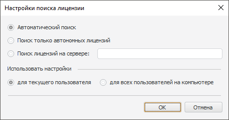

# Настройки поиска лицензии

Настройки поиска лицензии
-

# Настройки поиска лицензии

Настройки поиска [лицензии](../Admin_Licensing.htm) определяют,
 каким образом будет искаться лицензия и для каких пользователей компьютера
 будут доступны заданные настройки.

[Для открытия
 диалога](javascript:TextPopup(this))

		- Запустите менеджер лицензий:

			-
выполните команду «Форсайт. Аналитическая платформа 10.9 > Менеджер лицензий» в главном меню Windows;

			-
выполните команду «Справка >
 О программе» в главном меню продукта
 «Форсайт. Аналитическая платформа»,
 затем нажмите кнопку «Изменить лицензии».

		- В открывшемся диалоге нажмите кнопку «Настройки
		 поиска».

Для изменения настроек поиска лицензии:

	- Выберите вариант поиска лицензии:

		- Автоматический поиск.
		 Поиск лицензии на компьютере локально. Если лицензия не найдена,
		 то выполняется поиск сервера лицензий через широковещательный
		 запрос по сети. Указанный алгоритм поиска используется по умолчанию
		 и не применяется, если заданы настройки поиска [с
		 помощью системных переменных LSHOST, LSFORCEHOST или реестра](LicenseServer.htm#lshost);

		- Поиск только автономных
		 лицензий. Поиск автономной лицензии на текущем компьютере;

		- Поиск лицензий на сервере.
		 Поиск сетевой лицензии на указанном сервере лицензий. При выборе
		 варианта в поле напротив введите наименование сервера лицензий.

	- Установите переключатель, определяющий вариант применения заданных
	 настроек поиска:

		- Для текущего пользователя.
		 Настройки поиска лицензии будут применены только для текущего
		 пользователя компьютера;

		- Для всех пользователей
		 на компьютере. Настройки поиска лицензии будут применены
		 для всех пользователей данного компьютера. Настройка доступна
		 для выбора, если пользователь обладает правами администратора
		 на компьютере.

Важно. Продукт
 «Форсайт. Аналитическая платформа»
 активируется на BI-сервере только с помощью [сетевой](../Admin_Licensing_Variants.htm)
 или временной автономной лицензии.

Для корректного поиска лицензии на BI-сервере используйте один из вариантов:

1. Задайте настройки поиска лицензий в диалоге «Поиск
 лицензий» и установите переключатель «Для
 всех пользователей на компьютере», так как процесс BI-сервера запускается
 под разными пользователями. Выбор переключателя «Для
 текущего пользователя» повлечет проблемы в активации при запуске
 приложения под другими пользователями.

2. Задайте настройки поиска лицензий с помощью [системных
 переменных LSHOST, LSFORCEHOST или через реестр](LicenseServer.htm#lshost).

Нажмите кнопку «ОК» для выполнения повторного поиска лицензии с указанными
 параметрами.

Примечание.
 Если менеджер лицензий открывался из окна «О
 программе», [окна
 приветствия](GetStarted.chm::/GetStarted/Get_Started.htm)
 или из сообщения об ошибке, то изменения вступят в силу после перезапуска
 «Форсайт. Аналитическая платформа».

См. также:

[Работа
 с лицензией в ОС Windows](Intro_LicMngr.htm)

		Справочная
		 система на версию 10.9
		 от 18/08/2025,
		 © ООО «ФОРСАЙТ»,
