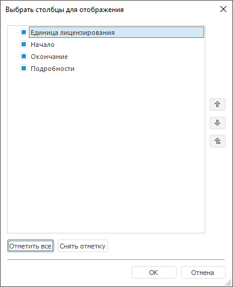

# Менеджер лицензий

Менеджер лицензий
-

# Менеджер лицензий

Менеджер лицензий позволяет просмотреть параметры текущей лицензии,
 задать настройки поиска лицензии или заменить лицензию, получить временную
 локальную лицензию с сервера лицензий.

[Для открытия
 менеджера лицензий](javascript:TextPopup(this))

	Выберите один из способов запуска:

		-
выполните команду «Форсайт. Аналитическая платформа 10.9 > Менеджер лицензий» в главном меню Windows;

		-
выполните команду «Справка >
 О программе» в главном меню продукта
 «Форсайт. Аналитическая платформа»,
 затем нажмите кнопку «Изменить лицензии».

Вид окна менеджера лицензий зависит от используемого [типа
 лицензии](../Admin_Licensing_Variants.htm). Ниже приведены скриншоты окна менеджера лицензий для сетевой
 лицензии, затем для автономной лицензии:

 

В менеджере лицензий содержится таблица, отображающая параметры лицензии:

	- Единица лицензирования. Содержит
	 предопределенный [набор единиц лицензирования](../AboutFeatures.htm).
	 Состояние лицензии по единице лицензирования отображается с помощью
	 пиктограмм:

		- 
		 - лицензия на единицу лицензирования активирована;

		-  - лицензия на единицу лицензирования
		 отсутствует или просрочена;

	- Начало.
	 Дата начала использования единицы лицензирования. Если дата начала
	 не определена, то вместо даты будет прочерк;

	- Окончание.
	 Дата окончания использования единицы лицензирования имеет значение
	 при использовании [временной
	 лицензии](../Admin_Licensing_Variants.htm#temporary).
	 Если дата окончания не определена, то вместо даты будет прочерк;

	- Подробности.
	 Содержит информацию о единице лицензирования:

		- Без
		 ограничений. Лицензия не ограничена во времени использования
		 и по количеству пользователей;

		- Лимит
		 подключений: <количество подключений>.
		 Сетевая лицензия с ограничением по количеству пользователей;

		- Доступна
		 автономно. Сетевая лицензия,
		 полученная с сервера лицензий для автономной работы;

		- Временная
		 лицензия. Временная лицензия,
		 позволяющая использовать приложение в период, заданный конкретными
		 датами;

		- Пробная версия,
		 всего дней: <количество дней>.
		 Лицензия с пробным периодом, позволяющая использовать приложение
		 в течение заданного периода с момента первого запуска;

		- Автономная
		 с <сервер лицензий>.
		 Временная локальная лицензия, полученная с сервера лицензий, для
		 автономной работы с приложением вне сетевого окружения в течение
		 30 дней.

Над списком единиц лицензирования указан источник лицензии и её текущее
 состояние при отсутствии подключения к серверу лицензий или при ограничении
 в количестве дней использования [временной
 локальной лицензии](../Admin_Licensing_Variants.htm#network). Источником лицензии может быть [сервер
 лицензий](LicenseServer.htm), путь к файлу с лицензией.

## Активация и замена лицензий

Для активации, замены или обновления [автономной
 лицензии](../Admin_Licensing_Variants.htm#standalone):

	- Нажмите кнопку «Активировать».

Примечание.
 Кнопка «Активировать» доступна
 только для [автономных
 лицензий](../Admin_Licensing_Variants.htm#standalone).

	- Выберите файл с кодом активации с помощью [мастера
	 активации продукта](Intro_LicMngr_MasterActivation.htm).

После выполнения действий настольное приложение активируется автономной
 лицензией или текущая автономная лицензия заменится выбранной автономной
 лицензией.

Для замены текущей [автономной
 лицензии](../Admin_Licensing_Variants.htm#standalone) на [сетевую
 лицензию](../Admin_Licensing_Variants.htm#network):

	- Нажмите кнопку «Настройки поиска».

	- Выберите переключатель «Поиск
	 лицензий на сервере» в [настройках
	 поиска лицензии](Intro_LicMngr_SearchLic.htm).

После выполнения действий и успешного поиска лицензии на сервере автономная
 лицензия будет заменена сетевой лицензией.

Для замены текущей [сетевой
 лицензии](../Admin_Licensing_Variants.htm#network) на [автономную
 лицензию](../Admin_Licensing_Variants.htm#standalone):

	- Нажмите кнопку «Настройки поиска».

	- Выберите переключатель «Поиск
	 только автономных лицензий» в [настройках
	 поиска лицензии](Intro_LicMngr_SearchLic.htm).

После выполнения действий и успешного поиска лицензии на компьютере
 сетевая лицензия будет заменена автономной лицензией.

Для замены [сетевой
 лицензии](../Admin_Licensing_Variants.htm#network) на [сервере лицензий](LicenseServer.htm) обратитесь
 к системному администратору.

## Поиск лицензий

Для изменения настроек параметров поиска лицензии нажмите кнопку «Настройки поиска». После чего откроется
 окно «[Настройки
 поиска лицензии](Intro_LicMngr_SearchLic.htm)».

## Получение и возврат лицензий

 Сетевая
 лицензия может разрешать получение временной локальной лицензии для автономной
 работы с приложением вне сетевого окружения в течение 30 дней. При получении
 лицензий для автономной работы количество одновременно работающих пользователей
 с сетевой лицензией сокращается до одного. Пользователь может использовать
 только одно соединение с репозиторием. При возврате полученных лицензий
 или по истечении 30 дней сетевая лицензия восстанавливается.

Если временная локальная лицензия
 неактуальна, возможен возврат до истечения срока действия. После чего
 лицензию с сервера лицензий можно взять вновь. По истечении 30 дней приложение
 не будет работать. Для продолжения работы подключитесь к сети, в которой
 расположен сервер лицензий.

Для автономной работы с сетевой
 лицензией нажмите кнопку  «Получить с сервера», для возврата
 полученной лицензии нажмите кнопку 
 «Вернуть на сервер».

Примечание.
 Если сервер лицензий недоступен, поменяйте [настройки поиска лицензии](Intro_LicMngr_SearchLic.htm)
 на автоматический поиск лицензий, чтобы полученная ранее лицензия работала
 в автономном режиме.

Для успешного возвращения лицензии
 на сервер [настройки
 поиска лицензии](Intro_LicMngr_SearchLic.htm) должны совпадать с настройками, которые
 были заданы в момент получения [временной локальной
 лицензии](../Admin_Licensing_Variants.htm#network) с сервера лицензий.

## Настройка отображения столбцов

Для настройки отображения столбцов
 в менеджере лицензий:

	- Нажмите кнопку , расположенную в конце строки
	 с заголовками столбцов.

	- Установите/снимите флажок напротив столбца с соответствующей
	 информацией:

		- в раскрывающемся списке;

		- через пункт «Выбрать столбцы»
		 раскрывающегося списка. Будет открыто окно «Выбрать
		 столбцы для отображения».

Окно «Выбрать
 столбцы для отображения»:

Для установки/снятия всех флажков
 используйте кнопку «Отметить все»/«Снять отметку».

Для задания порядка столбцов в списке
 используйте кнопки  и .

Примечание.
 Напротив столбца «Единица лицензирования» невозможно снять флажок и поменять
 порядок столбца.

См. также:

[Работа
 с лицензией в ОС Windows](Intro_LicMngr.htm)

		Справочная
		 система на версию 10.9
		 от 18/08/2025,
		 © ООО «ФОРСАЙТ»,
