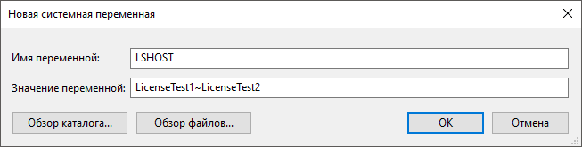
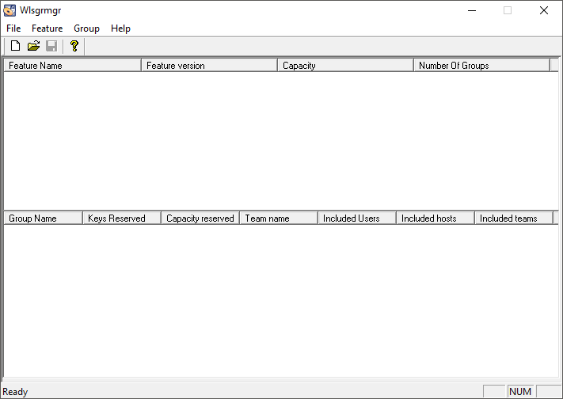
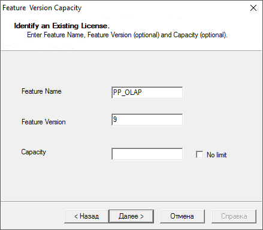
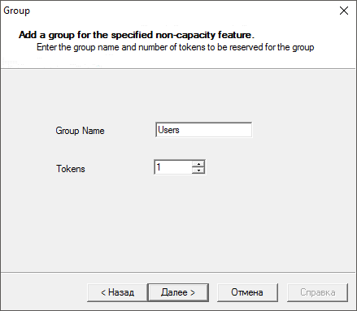
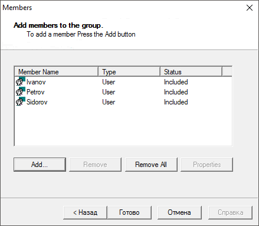
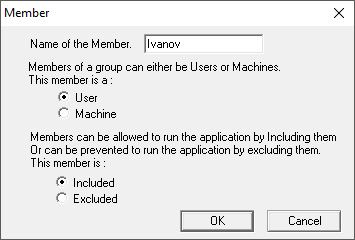

# Сервер лицензий RMS и особенности его использования

Сервер лицензий RMS и особенности его использования
-

# Сервер лицензий RMS и особенности
 его использования

Сервер лицензий используется для активации продукта «Форсайт. Аналитическая платформа»
 с помощью [сетевой лицензии](../Admin_Licensing_Variants.htm#network).
 Сервер лицензий контролирует количество одновременно работающих пользователей,
 обеспечивает простоту и гибкость администрирования. Лицензия передаётся
 в виде файла lservrc без расширения и размещается на сервере лицензий
 в локальной сети.

Совет. Начиная с версии 10.8,
 рекомендуется использовать программное обеспечение Guardant. В следующих
 версиях «Форсайт. Аналитическая платформа»
 поддержка RMS будет прекращена.

Для активации продукта «Форсайт. Аналитическая платформа»
 разместите компьютер, на котором установлен сервер лицензий, в той же
 подсети, что и:

	- сервер, на котором установлен [BI-сервер](../../UiWebSetup/UiWebSetup_TitlePage.htm);

	- клиентские компьютеры, на которых пользователи работают с настольным
	 приложением.

Для ускорения работы с сервером лицензий установите [сервис
 лицензирования](../Service/Licensing_Service.htm) при необходимости.

Для получения подробной информации о программном обеспечении RMS обратитесь
 к [официальной документации](https://docs.sentinel.thalesgroup.com/softwareandservices/rms/RMSDocumentation/Vendor/Content/DevGuide/Chapter 2_Components/License Manager.htm).

## Работа с сервером лицензий

[Системные
 требования к серверу лицензий](javascript:TextPopup(this))

	Рекомендуемые системные требования указаны в официальной документации
	 на Sentinel RMS:

		- [ОС Linux](https://docs.sentinel.thalesgroup.com/softwareandservices/rms/RMSDocumentation/RN/LinuxPDF.pdf);

		- [ОС Windows](https://docs.sentinel.thalesgroup.com/softwareandservices/rms/RMSDocumentation/RN/WindowsPDF.pdf).

	Для запуска, остановки и конфигурирования сервера лицензий требуются
	 права администратора.

	Примечание.
	 Не рекомендуется использовать виртуальную машину для установки сервера
	 лицензий.

	Сервер лицензий работает в виртуальных частных сетях (VPN), но официальной
	 поддержки этой функции нет. Если возникли проблемы при работе в сетях
	 VPN, то выполните следующие действия:

		- Разрешите на межсетевом экране (Firewall) фрагментацию пакетов.

		- Измените значение MTU на стороне сервера лицензий, сначала
		 установите 1500 байт, затем 8000 байт.

[Принцип
 работы сервера лицензий](javascript:TextPopup(this))

	Сервер лицензий работает по протоколу UDP, открывает порт 5093 для
	 коммуникаций клиент-сервер. Коммуникации сервер-сервер используются
	 при каскаде серверов лицензий - Redundant Licensing.

	Для изменения порта сервера лицензий используйте при его запуске
	 параметр port <port number> или используйте системную
	 переменную среды LSPORT на компьютере, где установлен сервер лицензий.

	Клиент определяет местоположение сервера лицензий при помощи широковещательного
	 запроса. Повторные запросы клиент отправляет к серверу напрямую.

	Для избежания широковещательных запросов выберите
	 одно из решений:

		- укажите имя компьютера, на котором установлен
		 сервер лицензий, в [настройках
		 поиска лицензий](Intro_LicMngr_SearchLic.htm);

		- создайте на клиенте системную переменную среды [LSHOST
		 или LSFORCEHOST](LicenseServer.htm#lshost).

[Установка
 и активация сервера лицензий на Windows](javascript:TextPopup(this))

	Для установки сервера лицензий в операционной системе Windows выполните
	 следующие действия:

		- Запустите инсталлятор Sentinel RMS License Manager Installer.

	Примечание.
	 Устанавливайте Sentinel RMS License Manager с настройками, предлагаемыми
	 по умолчанию.

	По умолчанию сервер лицензий устанавливается
	 в виде службы Sentinel RMS License Manager в папку ОС Windows: C:\Program
	 Files (x86)\Common Files\SafeNet Sentinel\Sentinel RMS License Manager\WinNT.

	Служба Sentinel RMS License Manager автоматически
	 запускается после установки и в дальнейшем при каждом запуске компьютера.
	 Проверьте наличие службы в разделе «Администрирование
	 > Службы» панели управления Windows.

	Совет.
	 Раздел «Службы» можно быстро
	 открыть, выполнив в командной строке команду: services.msc.

		- [Получите цифровой отпечаток компьютера](LockingCode.htm)
		 и отправьте запрос на получение сетевой лицензии
		 по адресу [support@fsight.ru](mailto:support@fsight.ru).
		 Лицензия будет выслана в ответном письме на электронную почту.

		- Расположите полученную лицензию в папке, в которой установлен
		 сервер лицензий. Проверьте, что файл с лицензией имеет имя lservrc
		 без расширения. Если требуется обновить текущую лицензию, то замените
		 файл лицензии lservrc в этой папке на новый.

		- Перезапустите службу Sentinel RMS License Manager.

		- [Проверьте работу сервера
		 лицензии](#verifyingoperability).

[Установка
 и активация сервера лицензий на Linux](javascript:TextPopup(this))

	Для установки сервера лицензий в ОС Linux выполните следующие действия:

		- На сервере в локальной сети создайте каталог /opt/lserv
		 для установки сервера лицензий и скопируйте в неё файлы:.

			- echoid - утилита для получения цифрового отпечатка
			 компьютера;

			- lserv (lserv64) - сервер лицензий;

			- lsinit - утилита для инициализации подсистемы лицензирования;

			- lsmon - утилита для проверки работоспособности
			 сервера лицензий.

	Примечание.
	 Для получения файлов обратитесь в техническую поддержку по адресу
	 [support@fsight.ru](mailto:support@fsight.ru) или через
	 [сервисы технической
	 поддержки](https://www.fsight.ru/support/), которые доступны после регистрации на сайте.

		- [Получите цифровой отпечаток компьютера](LockingCode.htm)
		 и отправьте запрос на получение сетевой лицензии
		 по адресу [support@fsight.ru](mailto:support@fsight.ru).
		 Лицензия будет выслана в ответном письме на электронную почту.

		- Разместите полученную лицензию в созданном каталоге, рядом
		 с приложением lserv. Проверьте, что файл с лицензией имеет имя
		 lservrc без расширения. Если требуется обновить текущую лицензию,
		 то замените файл лицензии lservrc в этом каталоге на новый.

		- Сделайте сервер лицензий (lserv) выполняемым, для этого
		 в консоли выполните команду:

	chmod +x lserv

		- Перейдите в каталог, в котором расположен lserv.

		- Запустите сервер лицензий. Для этого выполните команду под
		 пользователем root:

	sudo ./lserv

	При запуске сервера лицензий проверяется
	 наличие файла лицензии в текущем каталоге, который открыт в данный
	 момент. Если текущий каталог отличается от каталога, в котором расположен
	 lserv, то явно укажите путь до файла лицензии с помощью параметра
	 –s в формате:

	/opt/lserv/lserv
	 -s <путь до каталога с файлом
	 лицензии>/lservrc

	Например:

	/opt/lserv/lserv
	 -s /opt/lserv/lservrc

	Примечание.
	 Если используется 64-х разрядная версия операционной системы, то при
	 запуске сервера лицензий может возникнуть ошибка «Command not found».
	 В этом случае поставьте набор 32-х разрядных библиотек. В DEB-based
	 дистрибутивах установка библиотек выполняется командой: sudo
	 apt-get install ia32-libs.

	В RPM-based дистрибутивах для запуска сервера лицензий может потребоваться
	 установка 32-х разрядной библиотеки glibc: sudo
	 yum install glibc.i686.

		- Настройте автоматический запуск сервера лицензий при запуске
		 компьютера, добавив команду запуска lserv в скрипты автозапуска
		 Linux.

[Обновление
 лицензии на сервере лицензий](javascript:TextPopup(this))

	Для обновления лицензии на сервере лицензий выполните следующие
	 шаги:

		- Замените файл лицензии lservrc на новый:

	- в ОС Windows файл лицензии lservrc располагается в папке установки
	 сервера лицензий. По умолчанию сервер лицензий устанавливается в папку
	 ОС Windows: C:\Program Files (x86)\Common Files\SafeNet Sentinel\Sentinel
	 RMS License Manager\WinNT;

	- в ОС Linux файл лицензии lservrc располагается рядом с приложением
	 lserv.

		- В ОС Windows перезапустите службу Sentinel RMS License Manager.
		 В ОС Linux перезапустите приложение lserv под пользователем root.

	После этого будет использоваться новая лицензия.

[Объединение
 лицензий, пополнение лицензии новыми единицами](javascript:TextPopup(this))

	Используйте единый сервер лицензий Prognoz Platform и «Форсайт. Аналитическая платформа».

	Для этого объедините файлы лицензий для разных версий в один файл,
	 выполнив шаги:

		- Откройте файлы лицензии с помощью любого текстового редактора,
		 скопируйте их содержимое в один файл и сохраните с именем lservrc
		 без расширения.

		- Замените файл лицензии lservrc на объединенный файл:

	- в ОС Windows файл лицензии lservrc располагается в папке установки
	 сервера лицензий. По умолчанию сервер лицензий устанавливается в папку
	 ОС Windows: C:\Program Files (x86)\Common Files\SafeNet Sentinel\Sentinel
	 RMS License Manager\WinNT;

	- в ОС Linux файл лицензии lservrc располагается рядом с приложением
	 lserv.

		- В ОС Windows перезапустите службу Sentinel RMS License Manager.
		 В ОС Linux перезапустите приложение lserv под пользователем root.

	После этого будет использоваться объединенная лицензия.

	Для добавления кодов активации по дополнительным [единицам
	 лицензирования](../AboutFeatures.htm) в текущую лицензию выполните следующие шаги:

		- Откройте файл лицензии lservrc на сервере лицензий с помощью
		 любого текстового редактора, добавьте дополнительные лицензии,
		 сохраните файл.

		Файл лицензии lservrc располагается в папке установки сервера лицензий.
		 Пути установки сервера лицензий, используемые по умолчанию, приведены
		 выше.

		- В ОС Windows перезапустите службу Sentinel RMS License Manager.
		 В ОС Linux перезапустите приложение lserv под пользователем root.

	После этого будет использоваться обновленная лицензия.

[Проверка
 работоспособности сервера лицензий на Windows](javascript:TextPopup(this))

	Для проверки корректности работы сервера лицензий в операционной
	 системе Windows используется утилита lsmon.exe.

	Утилита возвращает информацию:

		- о текущей лицензии на сервере лицензий;

		- о подключенных к серверу пользователях;

		- об ошибках, если сервер лицензий некорректно установлен,
		 не запущен или не подхватывает лицензию.

	Утилита запускается в режиме командной строки, поддерживается использование
	 параметров:

	lsmon.exe [Server-host] [> “filename”]

	Параметр Server-host определяет, какой
	 сервер лицензий тестируется, параметр filename определяет файл, в
	 который выгружается полученная от сервера лицензий информация. При
	 запуске утилиты без параметров сервер лицензий ищется при помощи широковещательного
	 запроса.

	Выводите информацию в файл, если к серверу лицензий подключено много
	 пользователей. Пример команды:

	lsmon.exe > “c:\License.log”

	Если утилита возвращает информацию о
	 проблемах функционирования сервера лицензий, то проверьте, выполнены
	 ли указанные ниже условия:

		- установлен сервер лицензий версии 9.7.2 (Sentinel RMS License
		 Manager);

		- лицензия создана в точности с [цифровым
		 отпечатком компьютера](LockingCode.htm) — проверьте цифровой отпечаток
		 сервера лицензий;

		- файл с лицензией находится в папке установки сервера лицензий;

		- файл с лицензией имеет имя lservrc без расширения;

		- служба Sentinel RMS License Manager перезапущена
		 после обновления файла лицензии;

		- работа сервера лицензий проверяется с компьютера, расположенного
		 в той же подсети, что и сервер лицензий, широковещательные запросы
		 в сети разрешены, необходимые порты открыты.

[Проверка
 работоспособности сервера лицензий на Linux](javascript:TextPopup(this))

	Для проверки корректности работы сервера лицензий в операционной
	 системе Linux используется утилита lsmon.

	Утилита возвращает информацию:

		- о текущей лицензии на сервере лицензий;

		- о подключенных к серверу пользователях;

		- об ошибках, если сервер лицензий некорректно установлен,
		 не запущен или не подхватывает лицензию.

	Для работы с утилитой сделайте ее выполняемой, для этого выполните
	 команду в консоли:

	chmod +x lsmon

	Для запуска утилиты выполните команду в консоли:

	./lsmon [Server-host] [> “filename”]

	Параметр Server-host определяет, какой сервер лицензий тестируется,
	 параметр filename определяет путь к файлу, в который выгружается полученная
	 от сервера лицензий информация. Рекомендуется выводить информацию
	 в файл, если к серверу лицензий подключено много пользователей. При
	 запуске утилиты без параметров сервер лицензий ищется при помощи широковещательного
	 запроса.

	Пример команды:

	./lsmon > License.log

	Файл будет создан рядом с утилитой lsmon.

	Если утилита возвращает информацию о проблемах функционирования
	 сервера лицензий, то проверьте, выполнены ли указанные ниже условия:

		- [установлен сервер
		 лицензий](LicenseServer.htm#setuptolinux) версии 9.7.2;

		- лицензия создана в точности с [цифровым
		 отпечатком компьютера](LockingCode.htm) — проверьте цифровой отпечаток
		 сервера лицензий;

		- файл с лицензией находится в папке вместе с сервером лицензий
		 (lserv);

		- файл с лицензией имеет имя lservrc без расширения;

		- сервер лицензий (lserv) запущен под пользователем root;

		- сервер лицензий (lserv) перезапущен после обновления файла
		 лицензии;

		- работа сервера лицензий проверяется с компьютера, расположенного
		 в той же подсети, что и сервер лицензий, широковещательные запросы
		 в сети разрешены, необходимые порты открыты.

[Использование
 системных переменных LSHOST, LSFORCEHOST и реестра для настройки поиска
 лицензии](javascript:TextPopup(this))

	Для избежания широковещательных запросов по сети при поиске лицензий
	 и в случаях, когда сервер лицензий и клиенты находятся в разных подсетях,
	 используйте:

		- системную переменную LSFORCEHOST.
		 Если задана переменная LSFORCEHOST, то приложение обращается за
		 лицензией только к одному серверу лицензий, имя которого указано
		 в значении переменной. Если этот сервер не найден, то отобразится
		 сообщение, что лицензия недоступна. Если используется один сервер
		 лицензий, то рекомендуется использовать переменную LSFORCEHOST.
		 Для поиска [автономной
		 лицензии](../Admin_Licensing_Variants.htm) задайте в переменной значение NO-NET. Если она не
		 найдена, то выдается соответствующее сообщение.

		Переменная LSFORCEHOST перекрывает значение переменной LSHOST и
		 настройки серверов лицензий, заданные через реестр;

		- системную переменную LSHOST.
		 В значении системной переменной LSHOST указываются названия рабочих
		 станций, которые по порядку опрашиваются на предмет наличия на
		 них серверов лицензий. Имена рабочих станций разделяются знаком
		 тильды (~) без пробелов. Если указанные серверы не найдены, то
		 ищется [автономная лицензия](../Admin_Licensing_Variants.htm).

		Для поиска только [автономной
		 лицензии](../Admin_Licensing_Variants.htm) задайте в переменной значение NO-NET. Если автономная
		 лицензия не найдена, то ищется сервер лицензий с помощью широковещательного
		 запроса по сети;

	Важно.
	 В более ранних версиях Prognoz Platform 8.0 и 7, в АК «Прогноз-5»
	 для разделения имен рабочих станций в LSHOST использовалось двоеточие
	 (:). Для обеспечения одновременной работы старых версий (Prognoz Platform
	 8.0, 7.2, 7.0 и АК «Прогноз-5») и новых версий (Prognoz Platform 8.2,
	 8.1 и «Форсайт. Аналитическая платформа»):

	 1. Задайте названия серверов лицензий в LSHOST через двоеточие
	 (:) без пробелов.

	 2. Задайте названия серверов лицензий через реестр.

		- задание серверов лицензий
		 через реестр. В реестре задается список серверов лицензий,
		 которые по порядку опрашиваются на предмет наличия на них лицензий.
		 В реестре в разделе License создайте строковые параметры с именем
		 ServerName<N>, где N-номер сервера лицензий, например: ServerName1,
		 ServerName2 и т.д. В значении параметра укажите название сервера
		 лицензий. Настройки серверов лицензий в реестре ищутся по очереди
		 по следующим подразделам:

			- [HKEY_CURRENT_USER\Software\Foresight\Foresight Analytics Platform\10.0\10.9\License]

			- [HKEY_CURRENT_USER\Software\Foresight\Foresight Analytics Platform\10.0\License]

			- [HKEY_LOCAL_MACHINE\SOFTWARE\Foresight\Foresight Analytics Platform\10.0\10.9\License]

			- [HKEY_LOCAL_MACHINE\SOFTWARE\Wow6432Node\Foresight\Foresight Analytics Platform\10.0\10.9\License]

	Если заданные серверы лицензий не найдены,
	 то далее сервер лицензий ищется с помощью широковещательного запроса
	 по сети.

	Настройка серверов лицензий через реестр имеет больший приоритет, чем
	 значение переменной LSHOST.

	Примечание.
	 В ОС Linux настройки реестра хранятся в файле registry.reg. Расположение
	 файла зависит от того, из какой ветки реестра произведен экспорт настроек.
	 Более подробно читайте в статье «[Установка
	 веб-приложения ОС Linux](../../UiWebSetup/Install_Web_on_Linux.htm)».

	Настройки поиска лицензии, заданные через системные переменные и
	 реестр, имеют больший приоритет над настройкой «Автоматический
	 поиск» в диалоге «[Настройки
	 поиска лицензий](Intro_LicMngr_SearchLic.htm)».

	Важно.
	 Для корректного поиска лицензии на BI-сервере используйте один из
	 вариантов:

	1. Задайте настройки поиска лицензий в диалоге «[Настройки
	 поиска лицензий](Intro_LicMngr_SearchLic.htm)» и установите переключатель «Для
	 всех пользователей на компьютере», так как процесс BI-сервера
	 запускается под разными пользователями. Выбор переключателя «Для текущего пользователя» повлечет
	 проблемы в активации при запуске приложения под другими пользователями.

	2. Задайте настройки поиска лицензий с помощью системных переменных
	 LSHOST, LSFORCEHOST или через реестр.

### Создание переменных LSHOST и LSFORCEHOST в ОС Windows

	В ОС Windows выполните следующие действия для создания переменных
	 LSHOST и LSFORCEHOST:

		- Через контекстное меню компьютера
		 откройте дополнительные параметры системы: Свойства > Дополнительные
		 параметры системы.

		- На вкладке «Дополнительно»
		 окна «Свойства системы»
		 нажмите кнопку «Переменные среды».

		- В разделе «Системные
		 переменные» окна «Переменные
		 среды» нажмите кнопку «Создать».

	После выполнения действий задайте имя и значение переменной в окне
	 «Новая системная переменная»,
	 например:

	

### Создание переменных LSHOST и LSFORCEHOST в ОС Linux

	В ОС Linux переменные LSFORCEHOST и LSHOST на уровне операционной
	 системы указываются в файле: /etc/environment. Настройки применяются
	 после [перезапуска
	 BI-сервера](../../UiWebSetup/01_BIServer/bi-service_restart.htm) или перезагрузки ОС.

	Пример задания переменной LSHOST при использовании серверов лицензий:

	export LSHOST=LicenseTest1~LicenseTest2

	где LicenseTest1 и LicenseTest2 - это имена серверов лицензий.

	Пример задания переменной LSFORCEHOST при использовании автономной
	 лицензии:

	export LSFORCEHOST=NO-NET

	Примечание.
	 Если для BI-сервера необходимо задать переменные, отличные от переменных
	 уровня операционной системы, то укажите их в файле /opt/foresight/fp10.x-biserver/etc/envvars.

[Резервирование лицензий для
 заданных пользователей на сервере лицензий](javascript:TextPopup(this))

	Резервирование определенных единиц лицензирования необходимо в том
	 случае, если на сервере лицензий используется лицензия с ограниченным
	 количеством пользователей.

	Резервирование единиц лицензирования гарантирует определенным пользователям
	 доступ к функциональности. Пользователям всегда будут предоставлены
	 свободные конкурентные сессии на заданные единицы лицензирования.

### Резервирование единиц лицензирования для ОС Windows

	Для определения списка пользователей и единиц лицензирования, которые
	 резервируются на сервере лицензий, выполните следующие действия:

		- Запустите утилиту WlsGrmgr.exe:

	

		- Создайте новый файл резервирования с помощью команды главного
		 меню «File >
		 New».

		- Откройте мастер для задания резервирования единицы лицензирования
		 с помощью команды главного меню «Feature
		 > Add».

		- Задайте параметры резервирования в окне «Feature
		 Version Capacity»:

	

	Заполните обязательные поля:

			- Feature Name.
			 Задайте наименование резервируемой [единицы
			 лицензирования](../AboutFeatures.htm);

			- Feature Version.
			 Задайте значение «9» - версия лицензии «Форсайт. Аналитическая платформа».

	Параметры «Capacity»
	 и «No limit» оставьте неизменными.

	Для продолжения нажмите кнопку «Далее».

		- Задайте параметры для группы пользователей в окне «Group»:

	

	Для резервирования конкурентных сессий
	 по определенной единице лицензирования задается группа пользователей,
	 в которую может входить один или несколько пользователей:

			- если в группе состоит один пользователь, то зарезервированная
			 конкурентная сессия по единице лицензирования гарантирует
			 пользователю доступ к функциональности;

			- если в группе состоит несколько пользователей и зарезервирована
			 одна конкурентная сессия по единице лицензирования, то этой
			 конкурентной сессией может воспользоваться только один пользователь
			 группы;

			- если в группе состоит несколько пользователей и зарезервировано
			 более одной конкурентной сессии по единице лицензирования,
			 то любой из пользователей группы может захватить все выделенные
			 конкурентные сессии, например, открыть несколько репозиториев,
			 тогда другим пользователям группы не будет гарантирован доступ
			 к функциональности.

	Заполните поля:

			- Group Name.
			 Задайте наименование группы пользователей на английском языке;

			- Tokens. Задайте
			 количество резервируемых конкурентных сессий по единице лицензирования
			 для группы пользователей.

	Для продолжения нажмите кнопку «Далее».

		- Нажмите кнопку «Add»
		 в окне «Members» для добавления
		 имен пользователей в группу:

	

	Будет открыто окно «Member»:

	

	В поле «Name
	 of the Member» введите имя пользователя, под которым выполняется
	 вход в репозиторий.

	При вводе имени пользователя учитывайте используемый [тип
	 аутентификации](../../06_AK_Client_Config/UiNav_RepoConfig_repo1.htm#authentication_type). Если используется доменный тип аутентификации,
	 то укажите имя доменного пользователя без указания домена. Если используется
	 парольный тип аутентификации, то укажите имя пользователя СУБД.

	Переключатели оставьте неизменными.

	Примечание.
	 Для одной единицы лицензирования имена пользователей в группах не
	 должны совпадать.

		- Нажмите кнопку «ОК»
		 в окне «Member».

		- Нажмите кнопку «Готово»
		 в окне «Members» после
		 добавления всех имен пользователей.

		- Повторите выполнение действий с шага 3 для добавления резервирования
		 нескольких единиц лицензирования.

		- Сохраните файл резервирования с помощью команды главного
		 меню «File >
		 Save As»
		 под именем lsreserv в каталоге с установленным сервером лицензий
		 ОС Windows: C:\Program Files (x86)\Common Files\SafeNet Sentinel\Sentinel
		 RMS License Manager\WinNT.

		- Перезапустите службу Sentinel RMS License Manager.

	После выполнения действий сервер лицензий будет использовать файл
	 с лицензией lservrc и дополнительно резервировать лицензии в соответствии
	 с настройками, указанными в файле lsreserv.

	Для группы, состоящей из одного пользователя, будет гарантирован
	 доступ к функциональности по зарезервированной конкурентной сессии.
	 В группе, состоящей из нескольких пользователей, все зарезервированные
	 конкурентные сессии может захватить первый воспользовавшийся пользователь,
	 тогда другим пользователям группы не будет гарантирован доступ к функциональности.

### Резервирование единиц лицензирования для ОС Linux

	Для резервирования определенных единиц лицензирования в операционной
	 системе Linux:

		- Создайте файл резервирования с помощью любого текстового
		 редактора и сохраните с именем lsreserv без расширения.

		- Задайте содержимое файла в формате:

	Feature,FeatureVersion:GroupName:TokensCount:UserName

	<Пустая строка>

	где:

		- Feature.
		 Наименование резервируемой [единицы
		 лицензирования](../AboutFeatures.htm);

		- FeatureVersion.
		 Значение версии лицензии «Форсайт. Аналитическая платформа»
		 - «9»;

		- GroupName.
		 Наименование группы;

		- TokensCount.
		 Количество зарезервированных лицензий для группы пользователей;

		- UserName.
		 Имя пользователя. В зависимости от количества пользователей используйте
		 пробел для разделения имен пользователей, например: UserName1
		 UserName2 UserName3.

		- Повторите шаг 2 для добавления резервирования нескольких
		 единиц лицензирования.

		- Добавьте пустую строку после резервирования лицензий.

		- Сохраните файл lsreserv рядом с приложением lserv.

		- Перезапустите приложение lserv под пользователем root.

	Пример файла резервирования:

	ForesightAnalyticsPlatform,9:GroupMorozov:1:Morozov

	PP_OLAP,9:GroupUsers:1:Ivanov Petrov Sidorov

	<Пустая строка>

См. также:

[Активация продукта «Форсайт. Аналитическая платформа»](../Admin_Licensing.htm)
 | [Сервис лицензирования и особенности
 его использования](../Service/Licensing_Service.htm)

		Справочная
		 система на версию 10.9
		 от 18/08/2025,
		 © ООО «ФОРСАЙТ»,
