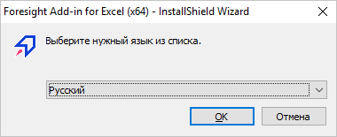
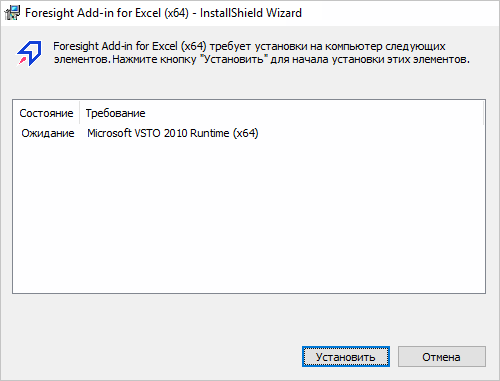
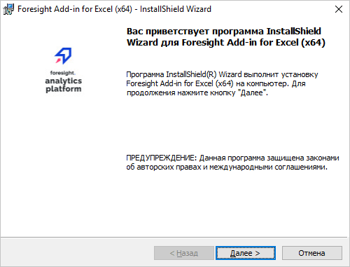
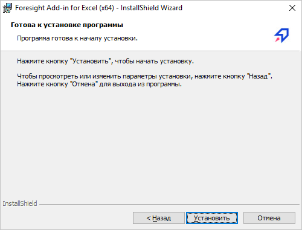
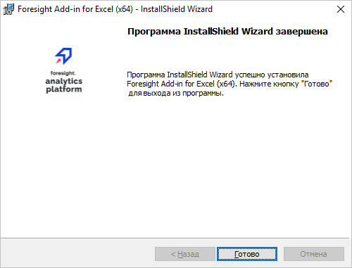
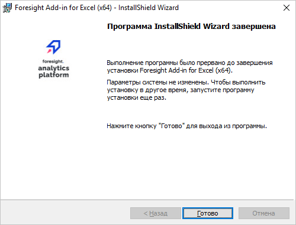

# Установка надстроек для Microsoft Office

Установка надстроек для Microsoft Office
-

# Установка надстроек для Microsoft
 Office

Надстройки - компоненты, позволяющие встраивать возможности одного приложения
 в другое.

В «Форсайт. Аналитическая платформа»
 доступны следующие надстройки для Microsoft Office:

	- [Foresight Add-in for Word](wordaddin.chm::/title.htm).
	 Надстройка для работы с Microsoft Word. Инсталляторы: Foresight
	 Add-in for Word_x64.exe;

	- [Foresight
	 Add-in for Excel](exceladdin.chm::/ExcelAddin_Purpose.htm). Надстройка для работы
	 с Microsoft Excel. Инсталлятор: Foresight
	 Add-in for Excel_x64.exe;

	- [Foresight Add-in for PowerPoint](PowerPointAddin.chm::/PowerPointAddIn_Title.htm).
	 Надстройка для работы с Microsoft PowerPoint. Инсталлятор: Foresight
	 Add-in for PowerPoint_x64.exe.

## Особенности установки надстроек

Перед установкой надстроек убедитесь в том, что:

	- соблюдены системные требования к клиентскому
	 окружению и требования к [настройкам
	 операционной системы](../01_SysReq/EnviromentRequirements.htm);

	- на компьютере установлено настольное приложение «Форсайт. Аналитическая платформа»,
	 при этом версия и разрядность надстройки должны совпадать с версией
	 и разрядностью установленного настольного приложения;

	- разрядность надстройки и разрядность установленного настольного
	 приложения «Форсайт. Аналитическая платформа»
	 совпадают с разрядностью установленных приложений Microsoft Office;

	- на компьютере установлено исправление Windows6.1-KB2533623-x64.msu (для
	 64-х разрядной Windows 7).

	- Скачать исправление
	 можно по ссылке: [http://support.microsoft.com/KB/2533623](http://support.microsoft.com/KB/2533623).

Установку необходимо производить от имени пользователя, обладающего
 правами локального администратора компьютера.

## Процесс установки надстроек

Процесс установки надстроек совпадает. После запуска программа установки
 проверяет наличие других сборок устанавливаемой версии надстройки:

	- если на компьютере установлена другая сборка, то будет предложено
	 [обновление надстройки](AddIn_Update.htm);

	- если другой сборки не обнаружено, то будет запущена установка
	 надстройки, состоящая из следующих операций:

[Выбор
 языка для установки](javascript:TextPopup(this))

	По умолчанию будет предложен язык, установленный
	 в региональных настройках (см. Панель управления > Язык и
	 региональные настройки > вкладка «Форматы»):

	

[Проверка
 наличия дополнительного программного обеспечения](javascript:TextPopup(this))

	Далее будет проверено наличие дополнительного
	 программного обеспечения (пререквизитов) на рабочей станции. Если
	 необходимые пререквизиты не установлены (или установлена более ранняя
	 версия), то будет предложена их установка, например:

	

	После нажатия кнопки «Установить»
	 будет произведена попытка последовательной установки всех предлагаемых
	 компонентов. Если необходимые пререквизиты отсутствуют в папке «ISSetupPrerequisites»,
	 то установка надстройки будет остановлена и будет выдано соответствующее
	 сообщение.

	Если необходимые пререквизиты входят
	 в комплект поставки, то в столбце «Состояние»
	 будет отражено состояние установки для каждого компонента: успешно,
	 установка, ожидание.

	После установки некоторых пререквизитов
	 может появиться сообщение о необходимости перезагрузки ОС. При положительном
	 ответе будет осуществлена перезагрузка, в противном случае - продолжена
	 установка. При появлении сообщения рекомендуется перезагрузить компьютер,
	 так как это необходимо для корректной установки оставшихся пререквизитов
	 и надстройки. После перезагрузки установка будет продолжена автоматически:
	 будет открыт диалог для продолжения установки пререквизитов или будет
	 открыта первая страница мастера установки надстройки.

[Переход
 к запуску установки](javascript:TextPopup(this))

	Если необходимые файлы извлечены, то
	 отображается вводная информация:

	

	Для перехода к запуску установки нажмите
	 кнопку «Далее».

[Запуск
 установки надстройки](javascript:TextPopup(this))

	Инсталлятор готов к установке надстройки:

	

	Для начала установки надстройки нажмите
	 кнопку «Установить».

[Установка
 надстройки](javascript:TextPopup(this))

	Выполняется установка компонентов надстройки:

	

	Для прерывания работы инсталлятора нажмите
	 кнопку «Отмена».

[Завершение
 установки](javascript:TextPopup(this))

	Установка выполнена успешно:

	

	Если установка была прервана или завершилась
	 с ошибками:

	

См. также:

[Установка
 настольного приложения](../02_AK_Install/Setup_AK_Install.htm)

		Справочная
		 система на версию 10.9
		 от 18/08/2025,
		 © ООО «ФОРСАЙТ»,
