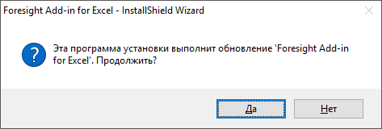
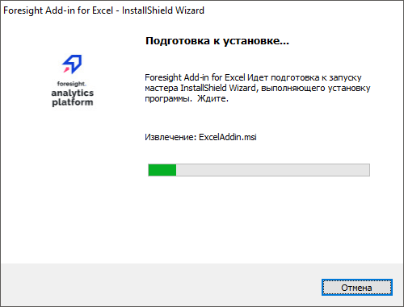
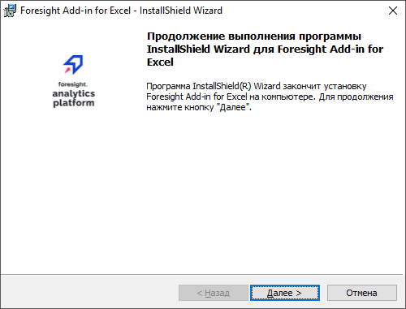

# Обновление надстроек

Обновление надстроек
-

# Обновление надстроек

Обновление выполняется, если был запущен [инсталлятор
 надстройки](AddIn_Setup.htm) и на компьютере установлена другая сборка текущей версии
 надстройки.

Примечание.
 Процесс обновления надстроек для MS Word, MS Excel и MS PowerPoint совпадает.

Обновление состоит из следующих операций:

[Подтверждение
 обновления](javascript:TextPopup(this))

	После запуска инсталлятора отображается диалог, в котором требуется
	 подтвердить обновление надстройки:

	

	Установка обновления возможна, если на компьютере установлена более
	 ранняя сборка текущей версии надстройки. Если на компьютере установлена
	 более поздняя сборка текущей версии надстройки, то обновление невозможно
	 и отображается соответствующее сообщение.

[Подготовка к
 установке обновления](javascript:TextPopup(this))

	Выполняется извлечение необходимых файлов:

	

	Для прерывания работы инсталлятора нажмите кнопку «Отмена».

[Запуск установки
 обновления](javascript:TextPopup(this))

	Инсталлятор готов к обновлению надстройки:

	

	Для начала установки надстройки нажмите кнопку «Далее».

[Установка обновления](javascript:TextPopup(this))

	Выполняется обновление компонентов надстройки:

	

	Для прерывания работы инсталлятора нажмите кнопку «Отмена».

[Завершение обновления](javascript:TextPopup(this))

	Обновление выполнено успешно:

	

	Если обновление было прервано или завершилось с ошибками:

	

См. также:

[Обновление
 платформы](../Update/Update.htm)

		Справочная
		 система на версию 10.9
		 от 18/08/2025,
		 © ООО «ФОРСАЙТ»,
