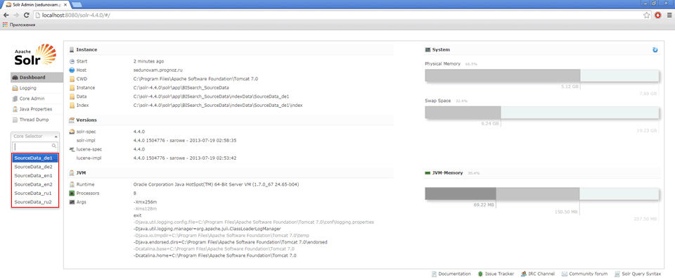

# Добавление языков в Solr

Добавление языков в Solr
-

# Добавление языков в Solr

После установки Solr и [настройки
 его экземпляров](Instance_Solr_Setting.htm) будет возможность произвести индексацию и BI-поиск
 по значениям на русском и английском языке. При необходимости список языков
 можно расширить. Для этого необходимо добавить новый экземпляр Solr
 и доработать конфигурационные файлы.

Чтобы добавить новый экземпляр Solr
 для нового языка выполните следующие действия:

	- В папке «Conf» создайте
	 копию конфигурационного файла sourceDataSchema_en.xml.

	- Переименуйте скопированный файл, изменив постфикс языка. Например,
	 для немецкого языка - sourceDataSchema_de.xml.

	- Откройте в браузере страницу со списком анализаторов для языков,
	 поддерживаемых Solr: [http://wiki.apache.org/solr/LanguageAnalysis](http://wiki.apache.org/solr/LanguageAnalysis).
	 Найдите конфигурацию для необходимого языка, например, для немецкого:

<filter class="solr.SnowballPorterFilterFactory" language="German2" />

	- Откройте скопированный файл sourceDataSchema_de.xml
	 на редактирование и найдите строки:

<filter class="solr.KStemFilterFactory"/>:

<...>
<fieldType name="name_searcher" class="solr.TextField"><analyzer type="index">

<tokenizer class="solr.WhitespaceTokenizerFactory"/>

<filter class="solr.WordDelimiterFilterFactory" generateWordParts="1" generateNumberParts="1" catenateWords="1" catenateNumbers="1" catenateAll="0" splitOnCaseChange="1"/>

<filter class="solr.LowerCaseFilterFactory"/>

<filter class="solr.RemoveDuplicatesTokenFilterFactory"/>

<filter class="solr.KStemFilterFactory"/>

</analyzer>

<analyzer type="query">

<tokenizer class="solr.WhitespaceTokenizerFactory"/>

<filter class="solr.WordDelimiterFilterFactory" generateWordParts="1" generateNumberParts="1" catenateWords="0" catenateNumbers="0" catenateAll="0" splitOnCaseChange="1"/>

<filter class="solr.LowerCaseFilterFactory"/>

<filter class="solr.StopFilterFactory" ignoreCase="true" words="stopwords.txt"/>

<filter class="solr.RemoveDuplicatesTokenFilterFactory"/>

<filter class="solr.KStemFilterFactory"/>

</analyzer>

</fieldType>
<...>

	- Замените все найденные строки
	 на строки конфигурации необходимого языка:

<...>
<fieldType name="name_searcher" class="solr.TextField"><analyzer type="index">

<tokenizer class="solr.WhitespaceTokenizerFactory"/>

<filter class="solr.WordDelimiterFilterFactory" generateWordParts="1" generateNumberParts="1" catenateWords="1" catenateNumbers="1" catenateAll="0" splitOnCaseChange="1"/>

<filter class="solr.LowerCaseFilterFactory"/>

<filter class="solr.RemoveDuplicatesTokenFilterFactory"/>

<filter class="solr.SnowballPorterFilterFactory" language="German2" />

</analyzer>

<analyzer type="query">

<tokenizer class="solr.WhitespaceTokenizerFactory"/>

<filter class="solr.WordDelimiterFilterFactory" generateWordParts="1" generateNumberParts="1" catenateWords="0" catenateNumbers="0" catenateAll="0" splitOnCaseChange="1"/>

<filter class="solr.LowerCaseFilterFactory"/>

<filter class="solr.StopFilterFactory" ignoreCase="true" words="stopwords.txt"/>

<filter class="solr.RemoveDuplicatesTokenFilterFactory"/>

<filter class="solr.SnowballPorterFilterFactory" language="German2" />

</analyzer>

</fieldType>
<...>

	- Сохраните файл.

Конфигурационный файл для добавляемого языка готов. Чтобы создать экземпляр
 Solr для этого языка откройте
 на редактирования файл solr.xml
 из папки «solr-4.4.0\solr\app».
 Скопируйте строку, отвечающую за уже имеющийся экземпляр Solr,
 вставьте ее и скорректируйте для добавляемого языка, например:

<core schema="sourceDataSchema_de.xml" instanceDir="BISearch_SourceData\" name="SourceData_de1" config="sourceData_solrconfig.xml" dataDir="indexData/SourceData_de1"/>
В атрибуте schema укажите наименование
 созданного конфигурационного файла, в атрибуте name
 укажите наименование экземпляра Solr
 для добавляемого языка, а в атрибуте dataDir
 укажите папку, в которой будут храниться индексные файлы добавляемого
 языка. Список и назначение всех атрибутов указаны в пункте 5 подраздела
 «[Настройка экземпляров Solr](Instance_Solr_Setting.htm)».

Перезагрузите Tomcat, если все
 выполнено верно, то веб-страница менеджера будет выглядеть примерно следующим
 образом:

Для использования добавленных языков также необходимо произвести настройку
 [настольного приложения](Desktop_application_setting.htm) или
 BI-сервера.

См. также:

[Установка
 и настройка программного обеспечения](software_installation.htm)

		Справочная
		 система на версию 10.9
		 от 18/08/2025,
		 © ООО «ФОРСАЙТ»,
