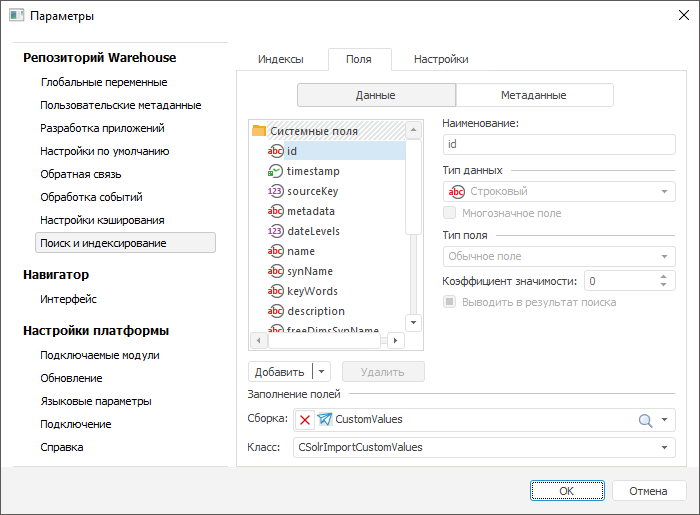

# Настройка настольного приложения

Настройка настольного приложения
-

# Настройка поиска и индексирования в репозитории

	После установки всех [приложений](software_installation.htm)
	 и настройки конфигурационных файлов Solr необходимо настроить репозиторий.

	Для задания настроек выполните команду главного меню «Сервис
	 > Параметры» и перейдите на вкладку «Поиск
	 и индексирование». На вкладке доступны три группы параметров:
	 [Индексы](#indexes), [Поля](#fields) и [Настройки](#settings).
	 После указания всех настроек можно произвести [индексацию](Indexing_DataSource.htm)
	 необходимых источников.

	Примечание.
	 После изменения настроек поиска и индексирования рекомендуется перезайти
	 в репозиторий.

## Индексы

	На вкладке «Индексы» указываются
	 адреса экземпляров Solr, которые будут использоваться при индексации
	 и поиске. Для добавления нового экземпляра нажмите кнопку «Добавить»,
	 укажите URL-адрес и выберите язык, на который [настроен](Add_Language.htm)
	 указываемый экземпляр Solr.

	

	В зависимости от назначения экземпляры Solr указываются в трех подгруппах:

		- Данные. Указываются
		 экземпляры Solr, предназначенные для индексации и поиска информации
		 об элементах измерений, которые формируют срезы данных.

		- Метаданные. Указываются
		 экземпляры Solr, предназначенные для хранения индексированных
		 метаданных источников или определенных классов объектов.

		- Смарт-поиск. Указываются
		 экземпляры Solr, сконфигурированные для поиска по свободным измерениям
		 источников. Свободное измерение - это измерение, по которому производится
		 поиск, но элементы этого измерения не включаются в наименование
		 результата поиска.

	Для каждого назначения реализован собственный алгоритм поиска, поэтому
	 указываемые экземпляры Solr должны иметь различные адреса. Алгоритмы
	 определяются конфигурационными файлами, которые были скопированы при
	 [настройке экземпляров Solr](Instance_Solr_Setting.htm)
	 и указаны в конфигурационном файле solr.xml.

	В общем виде адрес экземпляра Solr формируется следующим образом:
	 http://<server>:<port>/<hostContext>/<instance>,
	 где:

		- <server> -
		 наименование или IP-адрес компьютера, на котором установлен Apache Tomcat;

		- <port> - номер
		 порта, по которому работает Apache
		 Tomcat;

		- <hostContext>
		 - контекстный путь, который был [задан](software_installation.htm#apache_solr_4.4.0)
		 при запуске Solr в Apache
		 Tomcat;

		- <instance>
		 - имя экземпляра Solr, заданное в файле [solr.xml](Instance_Solr_Setting.htm)
		 (атрибут name, заданный для экземпляра Solr).

	Для индексации данных используются экземпляры Solr, наименования
	 которых начинаются с «SourceData_»,
	 для индексации метаданных используются экземпляры Solr с наименованием
	 «mbObjects_»; для смарт-поиска
	 - экземпляры Solr с наименованием «freeDimsensions_».

	Примечание.
	 URL-адрес экземпляра Solr указывается без символа «#», который используется
	 при работе с Solr в браузере, например - http://localhost:8080/solr-4.4.0/SourceData_ru1.

## Поля

	На вкладке «Поля» формируется
	 список полей, в которых будет храниться индексируемая информация.

	

### Системные поля

	По умолчанию в список входят только системные поля, их набор обусловлен
	 структурой конфигурационных файлов, которые были [скопированы](Instance_Solr_Setting.htm)
	 при настройке экземпляров Solr. Список системных полей фиксированный,
	 изменять его нельзя. Для каждого системного поля можно изменить только
	 коэффициент значимости, который влияет на релевантность результатов
	 поиска по этому полю.

### Пользовательские поля

	Пользовательские поля используются для индексации любой дополнительной
	 информации. Для создания поля необходимо внести изменения в [конфигурационные
	 файлы](Instance_Solr_Setting.htm) схем Solr. В разделе <fields>...</fields>
	 добавьте запись аналогичную тем, которые уже имеются в этом разделе.
	 В атрибутах укажите наименование, тип данных, назначение поля, а также
	 признак возможности хранения нескольких значений:

<field name="CustomField" type="name_searcher" indexed="true" stored="true" multiValued="false" required="false"/>
	Более подробно со структурой конфигурационного файла схемы Solr
	 можно ознакомиться в справочной системе Sorl: [https://wiki.apache.org/solr/SchemaXml](https://wiki.apache.org/solr/SchemaXml).

	Примечание.
	 Изменения необходимо внести в файлы для всех добавленных языков. После
	 внесения всех изменений необходимо перезагрузить Apache Tomcat.

	После этого в параметрах репозитория вызовите меню рядом с кнопкой
	 «Добавить» и выполните команду
	 «Загрузить из Solr». Список
	 всех полей будет обновлен. Для пользовательских полей необходимо будет
	 указать следующие настройки:

		- Тип поля. Тип поля
		 указывает каким-образом поле будет использоваться при формировании
		 запросов в Apache Solr. Допустимые значения:

			- Обычное поле.
			 Не используется при поиске, может использоваться в выражениях
			 фильтрации и сортировки, которые могут быть организованы на
			 прикладном уровне с помощью языка Fore;

			- Поле для поиска.
			 Поле используется при поиске;

			- Поле для фасетного
			 поиска. Поле используется при фасетном поиске (поиск
			 с группировкой найденных объектов по категориям).

		- Коэффициент значимости.
		 Коэффициент, который влияет на релевантность результатов поиска
		 по этому полю.

	В раскрывающихся списках «Сборка»
	 и «Класс» выберите Fore-сборку
	 и класс, который реализует интерфейс ISolrImportCustomValues. Метод
	 этого интерфейса будет использоваться для задания значений пользовательских
	 полей. Метод генерируется для каждого индексируемого источника. Пример:

				Class CSolrImportCustomValues: Object, ISolrImportCustomValues

	    Sub FillValues(MbObject: IMetabaseObject; Values: ISolrFieldValues);

	    Begin

	        If MbObject.Id = "S_CUBE" Then

	            Values.FindById("CustomField", SearchEngineTargetType.SourceData).Value := "Базовый источник данных";

	        End If;

	    End Sub FillValues;

	End Class CSolrImportCustomValues;

## Настройки

	На вкладке «Настройки» задаются
	 различные настройки, используемые при поиске.

		- Логический оператор при
		 поиске. Указывается логический оператор, который будет
		 подставляться между словами при формировании запроса во время
		 поиска.

		- Формула влияния на релевантность.
		 Формула, на основании которой будет определяться значимость значений
		 индексированных полей. В формуле могут использоваться созданные
		 поля и различные функции. Список доступных функций представлен
		 в справочной системе по Solr: [https://wiki.apache.org/solr/FunctionQuery](https://wiki.apache.org/solr/FunctionQuery).

См. также:

[Установка сервиса BI-поиска](BISearch_Setup.htm)

		Справочная
		 система на версию 10.9
		 от 18/08/2025,
		 © ООО «ФОРСАЙТ»,
