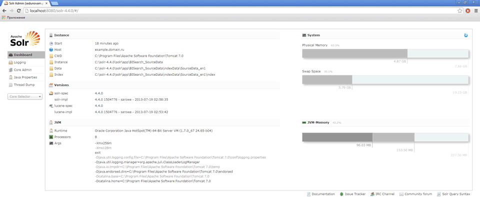

# Настройка экземпляров Solr

Настройка экземпляров Solr
-

# Настройка экземпляров Solr

Для настройки экземпляров Solr,
 которые будут использоваться для поиска, выполните следующие действия:

	- В папке «solr-4.4.0\solr\app»
	 создайте подкаталог, назовите его, например «BISearch_SourceData».

	- В папке «BISearch_SourceData»
	 создайте подкаталоги «Conf»
	 и «indexData».

	- Скопируйте архив [solr_conf.zip](../solr_conf.zip)
	 (описание содержимого архива представлено ниже), распакуйте его содержимое
	 в папку «BISearch_SourceData\Conf».

	- Измените содержимое файла «sourceData_solrconfig.xml»:
	 во всех строках «<lib dir=...»
	 необходимо скорректировать путь, указав куда были распакованы файлы
	 solr-4.4.0 [при
	 установке](software_installation.htm#apache_solr_4.4.0), например:

<lib dir="c:\solr-4.4.0\dist" regex="solr-cell-\d.*\.jar" />
<lib dir="c:\solr-4.4.0\contrib/extraction/lib" regex=".*\.jar" />

	- В папке «solr-4.4.0\solr\app»
	 создайте файл «solr.xml»
	 со следующим содержимым:

<?xml version="1.0" encoding="UTF-8" ?>
<solr persistent="true" sharedLib="lib"><cores host="${host:}" adminPath="/admin/cores" zkClientTimeout="${zkClientTimeout:150000}" hostPort="8080" hostContext="solr-4.4.0">

<core schema="sourceDataSchema_ru.xml" instanceDir="BISearch_SourceData\" name="SourceData_ru1" config="sourceData_solrconfig.xml" dataDir="indexData/SourceData_ru1"/>

<core schema="sourceDataSchema_ru.xml" instanceDir="BISearch_SourceData\" name="SourceData_ru2" config="sourceData_solrconfig.xml" dataDir="indexData/SourceData_ru2"/>

<core schema="sourceDataSchema_en.xml" instanceDir="BISearch_SourceData\" name="SourceData_en1" config="sourceData_solrconfig.xml" dataDir="indexData/SourceData_en1"/>

<core schema="sourceDataSchema_en.xml" instanceDir="BISearch_SourceData\" name="SourceData_en2" config="sourceData_solrconfig.xml" dataDir="indexData/SourceData_en2"/>

<core schema="mbObjectsSchema_ru.xml" instanceDir="BISearch_SourceData\" name="mbObjects_ru1" config="mbObjects_solrconfig.xml" dataDir="indexData/mbObjects_ru1"/>

<core schema="mbObjectsSchema_ru.xml" instanceDir="BISearch_SourceData\" name="mbObjects_ru2" config="mbObjects_solrconfig.xml" dataDir="indexData/mbObjects_ru2"/>

<core schema="mbObjectsSchema_en.xml" instanceDir="BISearch_SourceData\" name="mbObjects_en1" config="mbObjects_solrconfig.xml" dataDir="indexData/mbObjects_en1"/>

<core schema="mbObjectsSchema_en.xml" instanceDir="BISearch_SourceData\" name="mbObjects_en2" config="mbObjects_solrconfig.xml" dataDir="indexData/mbObjects_en2"/>

<core schema="freeDimsensionsSchema_ru.xml" instanceDir="BISearch_SourceData\" name="freeDimsensions_ru1" config="freeDimsensions_solrconfig.xml" dataDir="indexData/freeDimsensions_ru1"/>

<core schema="freeDimsensionsSchema_ru.xml" instanceDir="BISearch_SourceData\" name="freeDimsensions_ru2" config="freeDimsensions_solrconfig.xml" dataDir="indexData/freeDimsensions_ru2"/>

<core schema="freeDimsensionsSchema_en.xml" instanceDir="BISearch_SourceData\" name="freeDimsensions_en1" config="freeDimsensions_solrconfig.xml" dataDir="indexData/freeDimsensions_en1"/>

<core schema="freeDimsensionsSchema_en.xml" instanceDir="BISearch_SourceData\" name="freeDimsensions_en2" config="freeDimsensions_solrconfig.xml" dataDir="indexData/freeDimsensions_en2"/>

</cores>

</solr>
Каждая строка <core...>
 содержит настройки отдельного экземпляра Solr.
 При необходимости для одного языка можно создать несколько экземпляров
 Solr. Это актуально, если предполагается
 работа с репозиторием, в котором будет индексироваться большое количество
 источников. Оптимальным количеством экземпляров Solr
 для каждого языка является количество ядер процессора (физических и виртуальных),
 так как при индексации/BI-поиске работа с каждым экземпляром будет происходить
 в отдельном потоке. Список атрибутов, которые необходимо скорректировать,
 в зависимости от заданных параметров Tomcat
 и Solr:

		- hostPort. Порт,
		 заданный при установке Apache
		 Tomcat;

		- hostContext. Контекстный
		 путь, который был задан при запуске Solr
		 в Apache Tomcat
		 (путь указывается без слеша);

		- schema. Наименование
		 файла, содержащего настройки для экземпляра Solr;

		- instanceDir. Папка,
		 которая была создана в папке «solr\app»
		 на первом шаге;

		- name. Имя экземпляра
		 Solr;

		- config. Наименование
		 конфигурационного файла Solr;

		- dataDir. Папка,
		 в которой будут храниться индексные файлы экземпляра Solr.

	- Перезапустите Apache
	 Tomcat. Если все настройки
	 выполнены верно, то для рассматриваемого примера при переходе по ссылке
	 http://localhost:8080/solr-4.4.0 должна открыться примерно следующая
	 страница:

	

Для дальнейшего использования Solr
 для BI-поиска задайте настройки [поиска
 и индексирования в репозитории](Desktop_application_setting.htm).

[Содержимое архива
 solr_conf.zip](javascript:TextPopup(this))

	Архив содержит следующие файлы:

		- sourceData_solrconfig.xml, mbObjects_solrconfig.xml, freeDimsensions_solrconfig.xml.
		 Конфигурационные файлы Solr,
		 используемые при поиске по данным, метаданным и смарт-поиске соответственно;

		- sourceDataSchema_en.xml, mbObjectsSchema_en.xml, freeDimsensionsSchema_en.xml.
		 Конфигурационные файлы схем Solr
		 для английского языка;

		- sourceDataSchema_ru.xml, mbObjectsSchema_ru.xml, freeDimsensionsSchema_ru.xml.
		 Конфигурационные файлы схем Solr
		 для русского языка;

		- synonyms.txt. Файл
		 с синонимами.

		- stopwords.txt. Список
		 слов, которые не должны попасть в индекс.

См. также:

[Установка и настройка программного
 обеспечения](software_installation.htm)

		Справочная
		 система на версию 10.9
		 от 18/08/2025,
		 © ООО «ФОРСАЙТ»,
