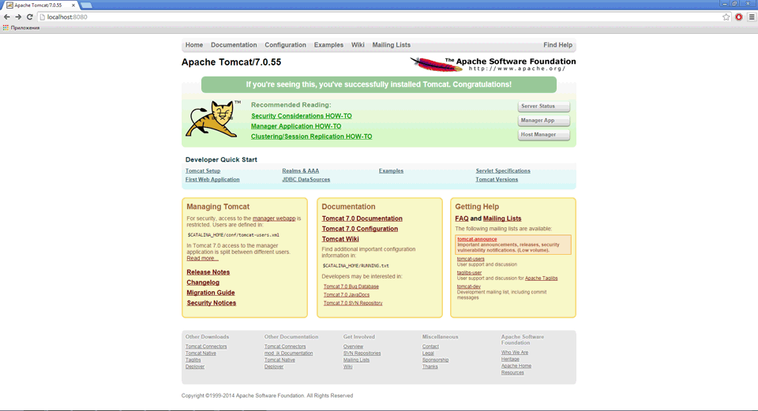
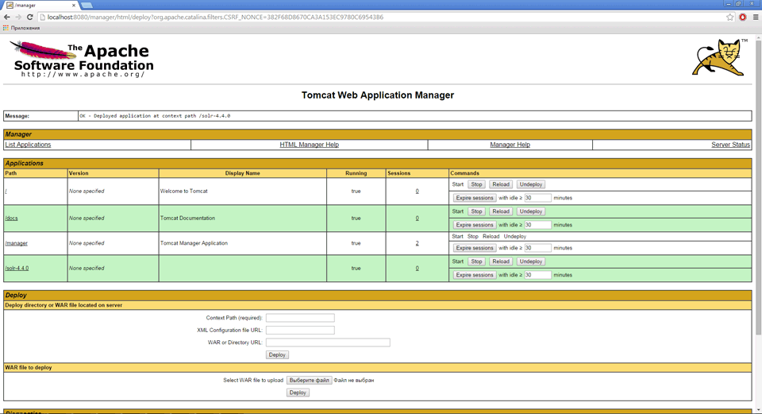

# Установка и настройка программного обеспечения

Установка и настройка программного обеспечения
-

# Установка и настройка программного
 обеспечения

Для работы сервиса BI-поиска необходимо установить и настроить следующее
 программное обеспечение:

[Java
 SE Development Kit](javascript:TextPopup(this))

	Инсталлятор для Java SE Development Kit (JDK) можно скачать на официальном
	 сайте Oracle по следующему адресу: [http://www.oracle.com/technetwork/java/javase/downloads/jdk7-downloads-1880260.html](http://www.oracle.com/technetwork/java/javase/downloads/jdk7-downloads-1880260.html).
	 После скачивания следуйте инструкциям мастера для установки JDK.

	Примечание.
	 Версия JDK должна соответствовать системным требованиям, которые предъявляет
	 Apache Solr 4.4.0. Не рекомендуется устанавливать JDK старше 8 версии.

[Apache
 Tomcat 7](javascript:TextPopup(this))

	Инсталлятор для Apache Tomcat 7
	 можно скачать по следующему адресу: [http://tomcat.apache.org/download-70.cgi](http://tomcat.apache.org/download-70.cgi).
	 После скачивания следуйте инструкциям мастера для установки Apache Tomcat. Во время настройки
	 конфигурации определите имя пользователя и пароль администратора.
	 Указанные учётные данные в дальнейшем потребуются для работы в интерфейсе
	 Apache Tomcat. После успешной
	 установки будет предложено запустить Apache
	 Tomcat. При запуске в панели уведомлений будет отображен значок:
	 .

	Для дальнейшей работы необходимо скачать и скопировать в папку «Lib» установленного Apache
	 Tomcat следующие файлы:

		- jcl-over-slf4j-1.6.6.jar,
		 jul-to-slf4j-1.6.6.jar,
		 slf4j-api-1.6.6.jar, slf4j-log4j12-1.6.6.jar. Файлы можно взять по адресу:
		 [https://repo1.maven.org/maven2/org/slf4j/](https://repo1.maven.org/maven2/org/slf4j/);

		- log4j-1.2.17.jar.
		 Файл доступен по следующему адресу: [http://logging.apache.org/log4j/1.2/download.html](http://logging.apache.org/log4j/1.2/download.html).

	Примечание.
	 После установки дополнительных файлов перезапустите Apache
	 Tomcat.

[Apache
 Solr 4.4.0](javascript:TextPopup(this))

	Архив с файлами для Apache Solr
	 4.4.0 доступен по следующему адресу: [https://archive.apache.org/dist/lucene/solr/4.4.0/](https://archive.apache.org/dist/lucene/solr/4.4.0/).

		- Распакуйте папку «solr-4.4.0»
		 из архива в удобное место, например в корень диска «С».

		- В папке «solr-4.4.0»
		 создайте два подкаталога «solr»
		 и «tomcat-config». В «solr-4.4.0\solr» создайте подкаталог
		 «app».

		- Скопируйте в «solr-4.4.0\solr»
		 файл «solr-4.4.0.war»
		 из папки «solr-4.4.0\dist».

		- В папке «solr-4.4.0\tomcat-config»
		 создайте файл «solr.xml»
		 со следующим содержимым:

<?xml version="1.0" encoding="utf-8"?>
<Context docBase="C:\solr-4.4.0\solr\solr-4.4.0.war" crossContext="true"><Environment name="solr/home" type="java.lang.String" value="C:\solr-4.4.0\solr\app" override="true"/>

</Context>
	В атрибуте docBase укажите
	 путь к файлу «solr-4.4.0.war»,
	 в атрибуте value - путь к
	 папке «app».

	Дальнейшая настройка осуществляется в консоли администрирования
	 Apache Tomcat 7. Откройте
	 консоль используя следующий адрес: http://localhost:<port>,
	 где <port> - порт, указанный при установке.

	

	Нажмите кнопку «Manager app»,
	 на запрос авторизации укажите учетные данные администратора, которые
	 были заданы при установке Apache
	 Tomcat. После авторизации будет открыто окно со списком запущенных
	 приложений, работающих под управлением Apache
	 Tomcat. В подразделе Deploy
	 выполните следующие действия:

		- В поле «Context Path (required)»
		 укажите контекстный путь, который будет добавляться в строке браузера
		 для доступа к параметрам Apache
		 Solr, например «/solr-4.4.0».

		- В поле «XML Configuration
		 file URL» укажите путь к файлу «solr.xml».
		 Пример: «C:\solr-4.4.0\tomcat-config\solr.xml».

		- Нажмите кнопку «Deploy».

	Если все пункты были выполнены корректно, то Apache
	 Solr будет запущено и страница будет выглядеть следующим образом:

	

	Для дальнейшей работы Apache Solr
	 и использования его для BI-поиска в «Форсайт. Аналитическая платформа»
	 необходимо [настроить экземпляры
	 Solr](Instance_Solr_Setting.htm).

См. также:

[Установка сервиса BI-поиска](BISearch_Setup.htm)

		Справочная
		 система на версию 10.9
		 от 18/08/2025,
		 © ООО «ФОРСАЙТ»,
