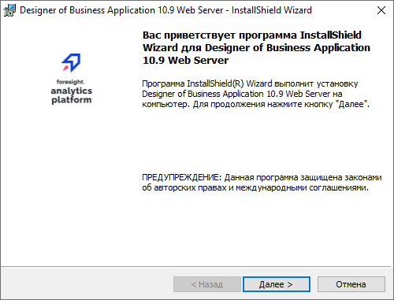
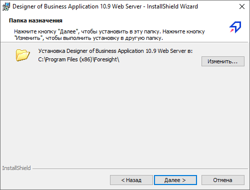
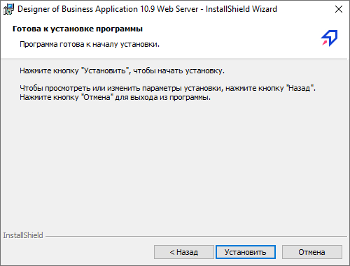

# Установка серверной части конструктора бизнес-приложений на IIS

Установка серверной части конструктора бизнес-приложений на IIS
-

# Установка серверной части конструктора
 бизнес-приложений на IIS

Установка серверной части конструктора бизнес-приложений на веб-сервер
 IIS выполняется автоматически с помощью [дистрибутива](../../02_AK_Install/DistributionKit.htm#32_and_64)
 DBAWebServer.exe или [вручную](Manual_Install_Designer_of_Business_Applications_ASP_NET.htm).
 Ручной способ установки и настройки IIS используется в качестве альтернативного
 варианта для доступа к ресурсам конструктора бизнес-приложений.

Дистрибутив выполняет следующие действия:

	- устанавливает файлы конструктора бизнес-приложений;

	- настраивает IIS;

	- создаёт пул приложений DBA Pool v10.x
	 и виртуальный каталог DBA_App_v10.x.

Перед началом установки, если веб-сервер будет устанавливаться на серверной
 операционной системе Windows, убедитесь, что была [добавлена
 роль сервера](../../UiWebSetup/03_Setup_Web/Add_WebServer_Role.htm). Если веб-сервер будет установлен не на серверной OC
 Windows, то перед установкой [подключите
 службы IIS](../../UiWebSetup/03_Setup_Web/IIS_turn_on.htm).

Для установки серверной части конструктора бизнес-приложений:

	- Запустите дистрибутив от имени пользователя, обладающего правами
	 локального администратора компьютера, и выберите язык установки. После
	 подготовки к установке будет отображена стартовая страница с вводной
	 информацией:

Для продолжения установки нажмите кнопку
 «Далее».

	- На следующем этапе установки необходимо определить папку, в
	 которую будут установлены файлы серверной части. По умолчанию предлагается
	 папка «C:\Program Files (x86)\Foresight\». Для изменения папки нажмите
	 кнопку «Изменить» В выбранной
	 папке при установке будет создан подкаталог «Designer of Business
	 Application 10.x
	 Web Server».

Для продолжения установки нажмите кнопку
 «Далее».

	- На следующей странице для начала установки нажмите кнопку «Установить».

	- На последней странице нажмите кнопку «Готово»
	 для завершения установки.

После выполнения действий будет установлена серверная часть конструктора
 бизнес-приложений.

Описание возможных ошибок, возникающих при настройке веб-сервера [IIS](../../UiWebSetup/04_FAQ/ProblemPP.htm#dba_iis), приведено
 в статье «[Проблемы при
 настройке веб-приложения «Форсайт. Аналитическая платформа» на IIS](../../UiWebSetup/04_FAQ/ProblemPP.htm)».

См. также:

[Серверная
 часть конструктора бизнес-приложений](../Backend_Designer_of_Business_Applications.htm) | [Установка
 серверной части конструктора бизнес-приложений на Apache2](../Apache2/Install_Backend_Designer_of_Business_Applications_Apache.htm) | [Установка
 серверной части конструктора бизнес-приложений на Java](../Java/Install_Backend_Designer_of_Business_Applications_Java.htm)

		Справочная
		 система на версию 10.9
		 от 18/08/2025,
		 © ООО «ФОРСАЙТ»,
