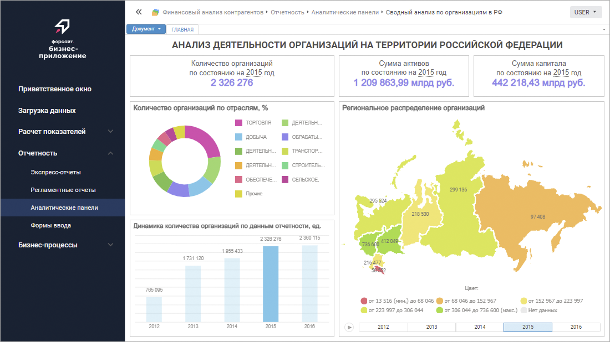
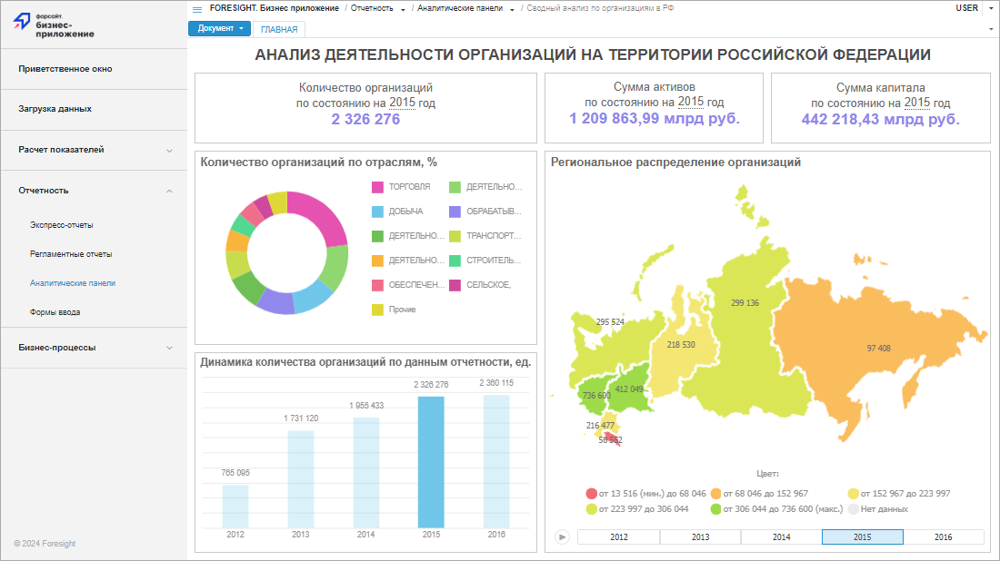

# Серверная часть конструктора бизнес-приложений

Серверная часть конструктора бизнес-приложений
-

# Серверная часть конструктора бизнес-приложений

Серверная часть конструктора бизнес-приложений используется для открытия
 и работы с готовым бизнес-приложением в веб-интерфейсе. Бизнес-приложение
 создаётся с помощью расширения «[Конструктор бизнес-приложений](Constructor.chm::/Intro/Designer_business_applications.htm)».

Для работы серверной части конструктора бизнес-приложений требуется
 наличие установленного и настроенного [BI-сервера](../UiWebSetup/UiWebSetup_TitlePage.htm),
 а также созданного в репозитории [бизнес-приложения](Constructor.chm::/Intro/Component_interface.htm#create).
 Убедитесь, что на рабочей станции, где будет запускаться бизнес-приложение,
 установлен [поддерживаемый](../03_DB_Server_Config/Setup_DB_ServerSysReq.htm#client)
 браузер.

Процесс установки серверной части конструктора бизнес-приложений зависит
 от веб-сервера, на который она будет установлена:

	- [Apache2
	 (Apache HTTP Server)](Apache2/Install_Backend_Designer_of_Business_Applications_Apache.htm). Доступно только в ОС Linux:

		- автоматическая установка выполняется с помощью [дистрибутивов](../02_AK_Install/DistributionKit.htm#linux)
		 foresight-fp10.x-dba*.deb, foresight-fp10.x-dba*.rpm;

Совет.
 Для быстрой установки серверной части конструктора бизнес-приложений обратитесь
 к разделу «[Установка
 веб-приложения «Форсайт. Аналитическая платформа» в ОС Linux (СУБД PostgreSQL)](../UiWebSetup/Install_Web_on_Linux_PostgreSQL.htm)».

		- ручная установка выполняется с помощью архива DBA.war;

	- [IIS
	 (Internet Information Services)](ASP_NET/Install_Backend_Designer_of_Business_Applications_ASP_NET.htm). Доступно только в ОС Windows:

		- автоматическая установка выполняется с помощью [дистрибутива](../02_AK_Install/DistributionKit.htm#32_and_64)
		 DBAWebServer.exe;

		- ручная установка выполняется с помощью архива dba.zip;

Примечание.
 Архив dba.zip не входит в [комплект
 поставки продукта «Форсайт. Аналитическая платформа»](../02_AK_Install/DistributionKit.htm).
 Для получения архива обратитесь в техническую поддержку по адресу [support@fsight.ru](mailto:support@fsight.ru)
 или через [сервисы
 технической поддержки](https://www.fsight.ru/support/), которые доступны после регистрации на сайте.

	- [Java
	 (Apache Tomcat)](Java/Install_Backend_Designer_of_Business_Applications_Java.htm). Доступно в ОС Linux и Windows. Выполняется
	 только ручная установка с помощью архива DBA.war.

Вид бизнес-приложения в веб-интерфейсе зависит от способа установки
 серверной части конструктора бизнес-приложений:

	- если серверная часть конструктора бизнес-приложений установлена
	 автоматически на веб-сервер Apache2 в ОС Linux или вручную на IIS
	 в ОС Windows, то бизнес-приложение отображается в соответствии с веб-интерфейсом
	 продукта «Форсайт. Аналитическая платформа»
	 версии 10.0 и выше:

	- если серверная часть конструктора бизнес-приложений установлена
	 вручную на веб-сервер Apache2 в ОС Linux, Java в ОС Linux/Windows
	 или автоматически на IIS в ОС Windows, то бизнес-приложение отображается
	 в соответствии с веб-интерфейсом продукта «Форсайт. Аналитическая платформа»
	 версии 9.9 и ниже:

Базовые настройки конфигурации конструктора бизнес-приложений задаются
 в файле [config.json](Configuration_Designer_of_Business_Applications.htm#config_json)
 или [DBA.config.json](Configuration_Designer_of_Business_Applications.htm#dba_config_json).

Совет. Для доступа
 к бизнес-приложению обратитесь к разделу «[Открытие
 бизнес-приложения](Open_Business_Application.htm)».

См.
 также:

[Установка
 расширений продукта](install_or_update_extensions.htm) | [Установка
 серверной части конструктора бизнес-приложений на Apache2](Apache2/Install_Backend_Designer_of_Business_Applications_Apache.htm) | [Установка
 серверной части конструктора бизнес-приложений на IIS](ASP_NET/Install_Backend_Designer_of_Business_Applications_ASP_NET.htm) | [Установка
 серверной части конструктора бизнес-приложений на Java](Java/Install_Backend_Designer_of_Business_Applications_Java.htm)

		Справочная
		 система на версию 10.9
		 от 18/08/2025,
		 © ООО «ФОРСАЙТ»,
