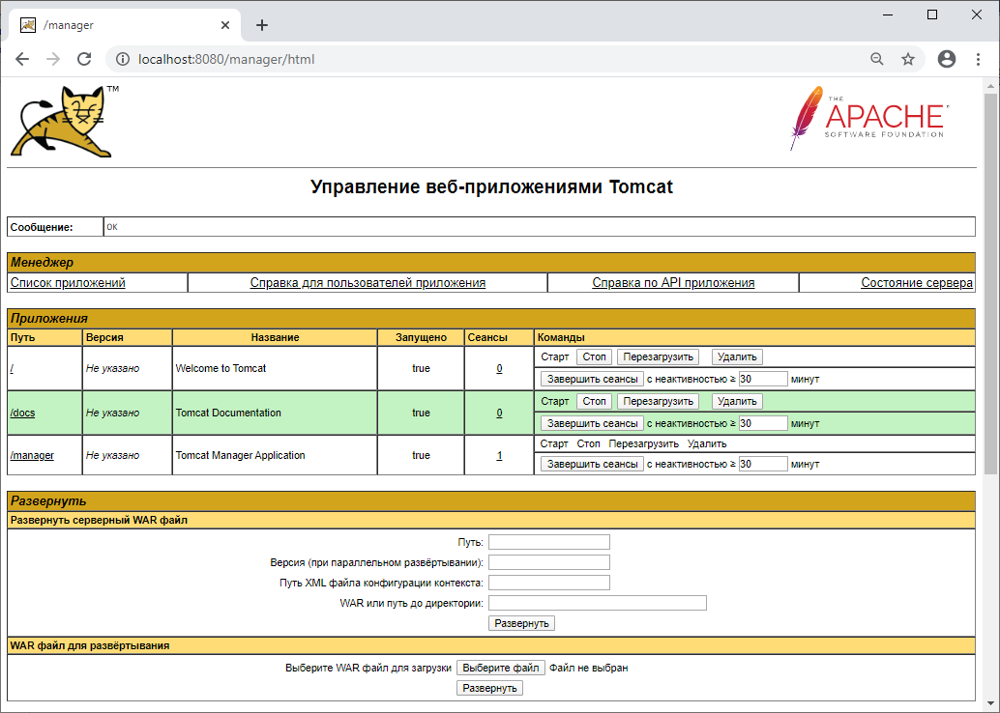

# Установка серверной части конструктора бизнес-приложений на Java

Установка серверной части конструктора бизнес-приложений на Java
-

# Установка серверной части конструктора бизнес-приложений на Java

Установка серверной части конструктора бизнес-приложений выполняется
 с помощью архива DBA.war. Файл располагается в папке Java_DBAWeb [комплекта
 поставки продукта «Форсайт. Аналитическая платформа»](../../02_AK_Install/DistributionKit.htm).

Процесс установки зависит от используемой версии Java. В инструкции
 приведен пример установки серверной части конструктора бизнес-приложений на Java веб-сервер
 Apache Tomcat версии 9.

Примечание.
 Также в ОС Linux имеется возможность запустить конструктор бизнес-приложений
 на веб-сервере [Apache2](../Apache2/Install_Backend_Designer_of_Business_Applications_Apache.htm)
 без использования Java.

Предварительно установите и настройте Apache Tomcat в соответствии с
 инструкциями для [OC
 Windows](../../BISearch/software_installation.htm#apache_tomcat_7) и [OC
 Linux](../../UiWebSetup/03_Setup_Web/General_for_linux/Install_Apache_Tomcat.htm).

Для установки серверной части конструктора бизнес-приложений:

	- Откройте консоль администрирования Apache Tomcat, используя
	 следующий адрес:

http://localhost:<port>/

где <port> - порт, указанный при установке
 Apache Tomcat. По умолчанию имеет значение 8080.

	- Нажмите кнопку «Manager app».
	 Будет открыто всплывающее окно для запроса авторизации.

	- Укажите учётные данные администратора указанные при установке
	 Apache Tomcat. После авторизации будет открыта страница:

	- Укажите путь к архиву DBA.war:

		- перейдите к разделу «Развернуть
		 серверный WAR файл» и укажите контекстный путь в поле «Путь», который будет добавляться
		 в строке браузера для доступа к конструктору бизнес-приложений,
		 например «/DBA». Затем укажите путь к архиву DBA.war в поле «WAR или путь до директории»;

		- перейдите к разделу «WAR
		 файл для развёртывания», нажмите кнопку «Выберите
		 файл» и укажите путь к архиву DBA.war.

	- Нажмите кнопку «Развернуть».

Если все шаги были выполнены корректно, то конструктор бизнес-приложений
 будет добавлен в список приложений Apache Tomcat, а на странице появится
 соответствующее сообщение.

См. также:

[Серверная
 часть конструктора бизнес-приложений](../Backend_Designer_of_Business_Applications.htm) | [Установка
 серверной части конструктора бизнес-приложений на Apache2](../Apache2/Install_Backend_Designer_of_Business_Applications_Apache.htm) | [Установка
 серверной части конструктора бизнес-приложений на IIS](../ASP_NET/Install_Backend_Designer_of_Business_Applications_ASP_NET.htm)

		Справочная
		 система на версию 10.9
		 от 18/08/2025,
		 © ООО «ФОРСАЙТ»,
