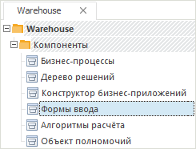
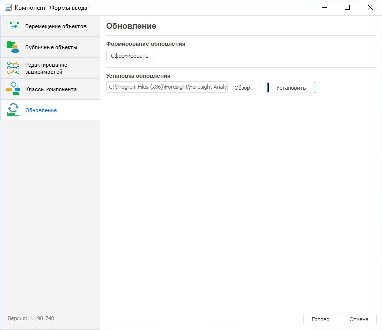
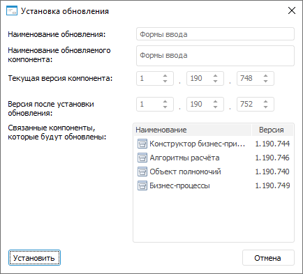
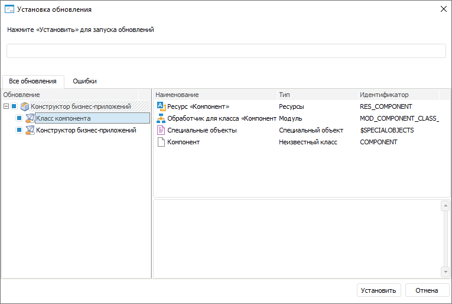
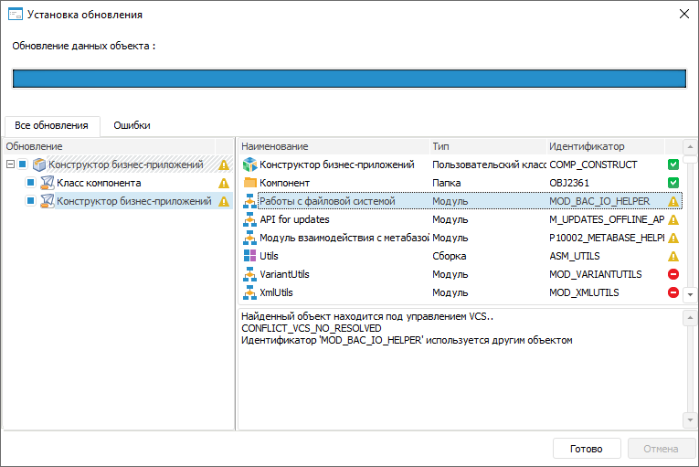
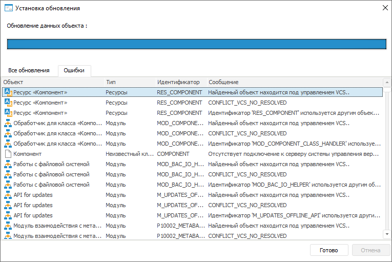

# Обновление расширений

Обновление расширений
-

# Обновление расширений

В новых версиях продукта «Форсайт. Аналитическая платформа»
 может быть изменен состав расширений и их функциональность. Для использования
 новых возможностей и корректной работы расширений выполните обновление
 расширений в соответствующей версии платформы.

Для обновления расширения в настольном приложении используйте [интерфейс
 компонента](#interface).

Для обновления расширения в веб-приложении используйте [менеджер обновлений](UpdManager.chm::/Admin_UpMBObj_RunManager.htm).
 Процесс установки обновлений в веб-приложении описан в разделе «[Установка обновления](UpdManager.chm::/Admin_UpMBObj_DoUpdate.htm)».

## Обновление расширений в настольном приложении

Для обновления расширения в настольном приложении используйте интерфейс
 компонента, который реализует данное расширение. Для этого выполните следующие
 действия:

	- Выберите необходимый компонент в дереве репозитория:

От выбора компонента обновления зависит набор
 связанных компонентов, которые будут обновлены вместе с выбранным. Информация
 о зависимости расширений представлена в разделе «[Установка
 расширений продукта](../install_or_update_extensions.htm)».

	- Откройте компонент на редактирование. Для этого:

		- нажмите кнопку  «Редактировать»
		 в группе «Открыть» на
		 вкладке «Главная» ленты
		 инструментов;

		- выполните команду «Редактировать»
		 в контекстном меню компонента;

		- нажмите клавишу F4.

	- Выбранный компонент будет открыт в новом окне. Перейдите на
	 вкладку «Обновление» и выберете
	 файл расширения, соответствующий обновляемому компоненту. Для выбора
	 файла обновления нажмите кнопку «Обзор».
	 В открывшемся окне укажите тип файла:

		- Обновление.
		 В диалоге будет представлен список доступных файлов с расширением
		 *.pefx;

		- Пакет
		 обновлений. В диалоге будет представлен список доступных
		 файлов с расширением *.updpack.

По умолчанию используется тип «Пакет
 обновлений». Список используемых файлов представлен в статье «[Установка расширений в
 репозитории](../install_extensions_in_repository.htm)». Для запуска установки обновления нажмите на кнопку «Установить»:

	- После выбора файла будет открыто окно «Установка
	 обновления», содержащая информацию об обновлении. При открытии
	 файла обновления осуществляется проверка его содержимого. Установка
	 обновления возможна, если файл содержит нужный компонент и версия
	 компонента выше, чем версия в репозитории. Для продолжения установки
	 обновления на кнопку «Установить»:

После выполнения действия будет открыто одноименное
 окно для запуска обновления.

	- В открывшемся окне необходимо выбрать обновляемые компоненты.
	 По умолчанию обновляется выбранный компонент и все связанные компоненты.
	 При необходимости измените список обновляемых компонентов, сняв/установив
	 соответствующие флажки. Для продолжения обновления нажмите кнопку
	 «Установить»:

Примечание.
 В процессе обновления возможно появление [сообщений](UpdManager.chm::/Admin_UpdateResult.htm)
 и конфликтов. Конфликты, возникающие при установке обновления расширения
 через интерфейс компонента, и пути их решения соответствуют [конфликтам, возникающим при
 установке обновления в менеджере обновления](UpdManager.chm::/Conflicts.htm).

	- После завершения обновления информация
	 о результатах обновления будет отображена на вкладках:

	Все
	 обновления Ошибки

		

		С помощью пиктограммы будет отображен
		 результат обновления каждого объекта:

			- . Обновление
			 объекта завершилось успешно;

			- . Обновление
			 объекта завершилось с ошибками;

			- . Обновление
			 объекта было прервано.

		 Для просмотра сообщения с результатом
		 обновления выберите объект. В случае обновления с ошибками, в
		 поле ниже будут отображены все ошибки, связанные с выбранным объектом.

		

		Если с объектом обновления связано
		 несколько ошибок, каждая из них будет отображена в отдельной строке.

Ошибки могут быть связаны с:

		- подключением объекта к [системе
		 контроля версий](Admin.chm::/04_SecurityPolicy/Editor_of_Politicy/Security_EditorPoliticy_General.htm#version_control);

		- [совпадением
		 идентификаторов](Admin.chm::/04_SecurityPolicy/Editor_of_Politicy/Security_EditorPoliticy_General.htm#identifier_format) обновляемого объекта и объекта
		 обновления.

После завершения обновления в дереве объектов обновляемого компонента
 появится папка «Протокол установки
 обновлений». В ней содержатся текстовые файлы с информацией об
 устанавливаемом обновлении, дочерних обновлениях и лог ошибок.

См. также:

[Установка
 расширений продукта «Форсайт. Аналитическая платформа»](../install_or_update_extensions.htm)

		Справочная
		 система на версию 10.9
		 от 18/08/2025,
		 © ООО «ФОРСАЙТ»,
