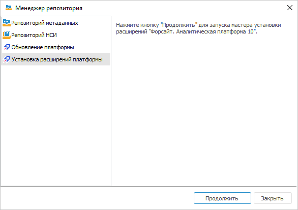
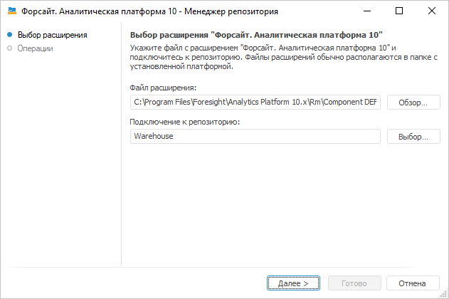
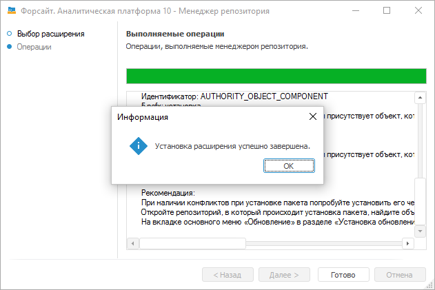

# Установка расширений в репозитории

Установка расширений в репозитории
-

# Установка расширений в репозитории

	Первичная установка расширений выполняется с помощью [менеджера
	 репозитория](../05_RepoMngr/Setup_RepoMngr_Work_Main.htm), который входит в [состав
	 продукта «Форсайт. Аналитическая платформа»](../05_RepoMngr/Setup_RepoMngr_Main.htm).

	Расширения устанавливаются из файла в существующий репозиторий.
	 Необходимые файлы расширений входят в [комплект
	 поставки продукта «Форсайт. Аналитическая платформа»](../02_AK_Install/DistributionKit.htm)
	 и содержатся в папке FP_Extensions.

	В ОС Linux скопируйте файлы расширений, содержащиеся в комплекте
	 поставки, в папку /opt/foresight/fp10.x-biserver/bin/rm.

	В ОС Windows файлы расширений включены во все [инсталляторы](../02_AK_Install/DistributionKit.htm#32_and_64),
	 кроме FP10Standard.
	 После установки [настольного
	 приложения](../02_AK_Install/Setup_AK_Install.htm) файлы расширений будут содержаться в папке C:\Program
	 Files\Foresight\Analytics Platform 10.x\Rm. В веб-приложении
	 доступна работа с уже установленными расширениями.

	Список файлов расширений:

			 Файл
			 Расширение

			 Component DEF.updpack
			 Интерактивные формы ввода данных

			 Component BPM.updpack
			 Управление бизнес-процессами

			 Component ALG.updpack
			 Алгоритмы расчёта

			 Component DBA.updpack
			 Конструктор бизнес-приложений

			 Component CCHE.updpack
			 Кеш кубов

	Продукт «Форсайт. Аналитическая платформа»
	 поддерживает несколько языков интерфейса, поэтому для корректной установки
	 расширений заранее определите [язык репозитория
	 по умолчанию](uinav.chm::/02_Navigator/Repo_Default.htm).

## Установка в ОС Linux

	Для установки расширений в ОС Linux запустите приложение [RepoManager](../05_RepoMngr/RepoManager_Linux.htm),
	 которое расположено в папке установки BI-сервера /opt/foresight/fp10.x-biserver/bin, с помощью
	 скрипта RepoManager_start.sh со следующими параметрами:

	./RepoManager_start.sh --operation=Значение
	 [options]

	Где:

		- --operation или
		 -o. Выполняемая операция.
		 Обязательный параметр;

		- Значение. Значение
		 параметра;

		- [options]. Дополнительные
		 параметры, зависящие от выполняемой операции.

	В качестве значения параметра --operation/-o укажите значение updpack.
	 Далее необходимо указать тип СУБД, к которой будет осуществляться
	 подключение и установка расширения в репозитории. Параметр имеет полное
	 название --type или краткое
	 -t и принимает следующие значения:

		- postgres. Сервер
		 на базе СУБД PostgreSQL;

		- oracle. Сервер на
		 базе Oracle Database Server;

		- sqlite. Репозиторий
		 во встраиваемой СУБД SQLite;

		- mssql. Сервер на
		 базе СУБД Micsoft SQL Server.

	Дальнейший набор параметров зависит от выбранного типа СУБД.

		Oracle PostgreSQL SQLite Microsoft SQL Server

			Параметры для Oracle:

				- --server=Сервер
				 или -sСервер -
				 имя сервера. Данное имя должно быть определено в файле
				 TNS, который располагается в папке клиента СУБД;

				- --schema=Схема
				 или -mСхема -
				 имя схемы, в которой будет создано расширение;

				- --user=Имя
				 или -uИмя - имя
				 пользователя для подключения;

				- --password=Пароль
				 или -wПароль -
				 пароль пользователя для подключения;

				- --updpack-file=Путь
				 или -UПуть - путь
				 к файлу расширения.

			Примеры:

			./RepoManager_start.sh -oupdpack -toracle
			 -sserver -mRepository -uUser -wPassword -Urm/Component\ DEF.updpack

			./RepoManager_start.sh --operation=updpack
			 --type=oracle --server=Server --schema=Repository --user=User
			 --password=Password --updpack-file=rm/Component\ DEF.updpack

			Параметры для PostgreSQL:

				- --server=Сервер
				 или -sСервер -
				 имя или IP-адрес сервера СУБД;

				- --database=БД
				 или -dБД - имя
				 базы данных на сервере;

				- --user=Имя
				 или -uИмя - имя
				 пользователя для подключения;

				- --password=Пароль
				 или -wПароль -
				 пароль пользователя для подключения;

				- --updpack-file=Путь
				 или -UПуть - путь
				 к файлу расширения;

				- --case-sensitive
				 или -i - подключение
				 к БД с чувствительностью к регистру. Необязательный параметр.
				 Если не задан, то регистр не учитывается.

			Примеры:

			./RepoManager_start.sh -oupdpack -tpostgres
			 -s10.10.10.10 -dRepository -uUser -wPassword -Urm/Component\
			 DEF.updpack

			./RepoManager_start.sh --operation=updpack
			 --type=postgres --server=10.10.10.10 --database=Repository
			 --user=User --password=Password --updpack-file=rm/Component\
			 DEF.updpack

			Параметры для SQLite:

				- --database=Путь
				 или -dПуть - путь
				 к файлу с БД SQLite;

				- --updpack-file=Путь
				 или -UПуть - путь
				 к файлу расширения.

			Примеры:

			./RepoManager_start.sh -oupdpack -tsqlite
			 -d/home/test.sqlite -Urm/Component\ DEF.updpack

			./RepoManager_start.sh --operation=updpack
			 --type=sqlite --database=/home/test.sqlite --updpack-file=rm/Component\
			 DEF.updpack

			Параметры для Microsoft SQL Server:

				- --server=Сервер
				 или -sСервер -
				 имя или IP-адрес сервера СУБД;

				- --database=БД
				 или -dБД - имя
				 базы данных на сервере;

				- --user=Имя
				 или -uИмя - имя
				 пользователя для подключения;

				- --password=Пароль
				 или -wПароль -
				 пароль пользователя для подключения;

				- --updpack-file=Путь
				 или -UПуть - путь
				 к файлу расширения;

				- --case-sensitive
				 или -i - подключение
				 к БД с чувствительностью к регистру. Необязательный параметр.
				 Если не задан, то регистр не учитывается.

			Пример:

			./RepoManager_start.sh -oupdpack -tmssql
			 -sMSServer -dRepository -uUser -wPassword -Urm/Component\
			 DEF.updpack

			./RepoManager_start.sh --operation=updpack
			 --type=mssql --server=MSServer --database=Repository --user=User
			 --password=Password --updpack-file=rm/Component\ DEF.updpack

	После выполнения действий расширение будет установлено и доступно
	 для [создания](UiNav.chm::/02_Navigator/General_Principles_of_Work.htm#add_object)
	 в навигаторе объектов. Также в навигаторе объектов будет добавлен
	 компонент, соответствующий установленному расширению, в папке «Компоненты».

## Установка в ОС Windows

	Для установки расширений в ОС Windows:

		- Запустите [менеджер
		 репозитория](../05_RepoMngr/RepoMngr_Windows.htm). Для этого используйте ярлык, который создаётся
		 в главном меню Windows, или приложение RepoMngr.exe, расположенное
		 в папке установки продукта «Форсайт. Аналитическая платформа».
		 После запуска выберите пункт «Установка
		 расширений платформы»:

	

		- Выберите файл расширения и подключите репозиторий, в который
		 будет установлено расширение:

	

	При нажатии на кнопку «Далее»
	 будет произведена установка выбранного расширения.

	Примечание.
	 Подключение к репозиторию должно выполняться от имени пользователя,
	 являющегося владельцем базы данных (схемы).

		- Нажмите кнопку «Готово»:

	

	После выполнения действий расширение будет установлено и доступно
	 для [создания](UiNav.chm::/02_Navigator/General_Principles_of_Work.htm#add_object)
	 в навигаторе объектов. Также в навигаторе объектов будет добавлен
	 соответствующий компонент в папке «Компоненты».

## Особенности установки расширений

	При установке расширения «[Управление бизнес-процессами](BPM.chm::/Modeling_of_business_processes.htm)»
	 в [менеджере
	 безопасности](Admin.chm::/Admin_Title.htm)
	 автоматически создаётся служебная группа BPM_ALL_USERS, предназначенная
	 для пользователей бизнес-процессов.

	Для работы с бизнес-процессами [добавьте пользователей](Admin.chm::/03_Admin/Groups/Group_Members.htm)
	 в созданную группу BPM_ALL_USERS и обновите её с помощью операции
	 «Обновить группу пользователей»
	 на странице «Администрирование»
	 в окне «[Настройка параметров и администрирование
	 бизнес-процессов](BPM.chm::/Desktop/Process/Setting_and_administrating_process_parameters.htm)».

	В структуре создаваемых компонентов имеются различные объекты, включая
	 такие объекты, как таблицы и запросы. Изменение структуры и данных
	 всех объектов компонента запрещено, так как может привести к потери
	 работоспособности как компонента, так и созданных на базе него объектов
	 в репозитории. Также запрещено изменять права доступа на отдельные
	 объекты внутри компонента. Все права должны соответствовать тем правам,
	 которые даны пользователям, входящим в группу BPM_ALL_USERS.

	Примечание.
	 Если в настольном приложении при установке расширения возникли ошибки
	 и группа пользователей не создалась, то используйте операцию «Пересоздать группу пользователей процессов»
	 на странице «Администрирование»
	 в окне «[Настройка параметров и администрирование
	 бизнес-процессов](BPM.chm::/Desktop/Process/Setting_and_administrating_process_parameters.htm)».

	Так же настройте [серверное
	 исполнение бизнес-процессов](BPM.chm::/Desktop/Process/Setting_Server_Process_Execution.htm) по расписанию с помощью
	 планировщика задач.

См. также:

[Установка
 расширений продукта «Форсайт. Аналитическая платформа»](install_or_update_extensions.htm)

		Справочная
		 система на версию 10.9
		 от 18/08/2025,
		 © ООО «ФОРСАЙТ»,
