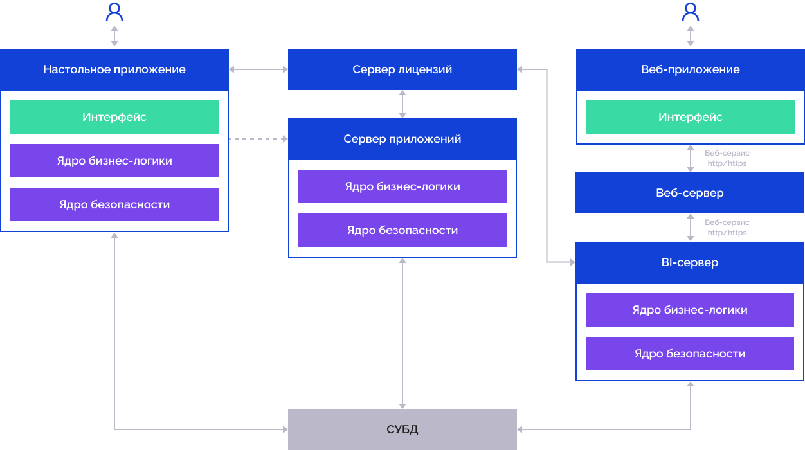
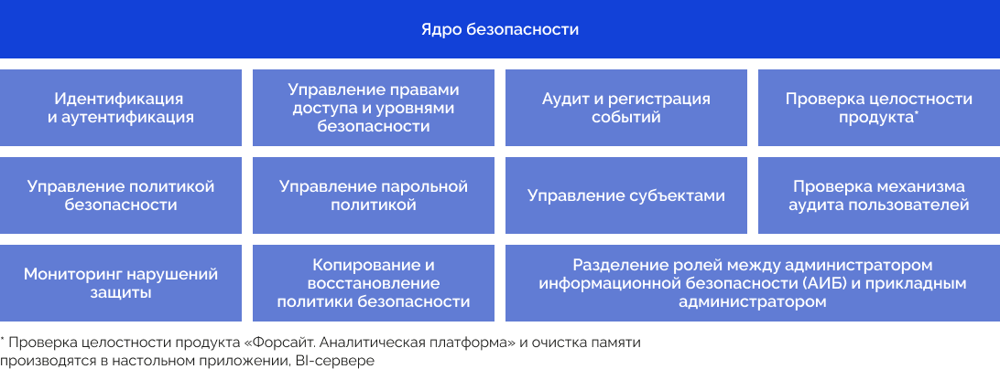
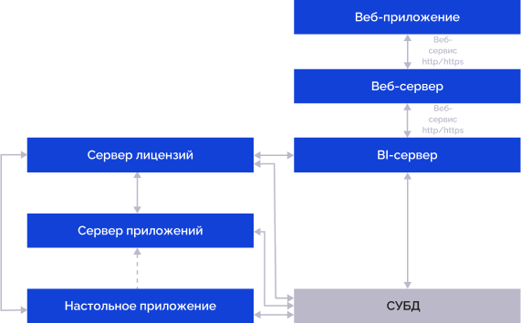
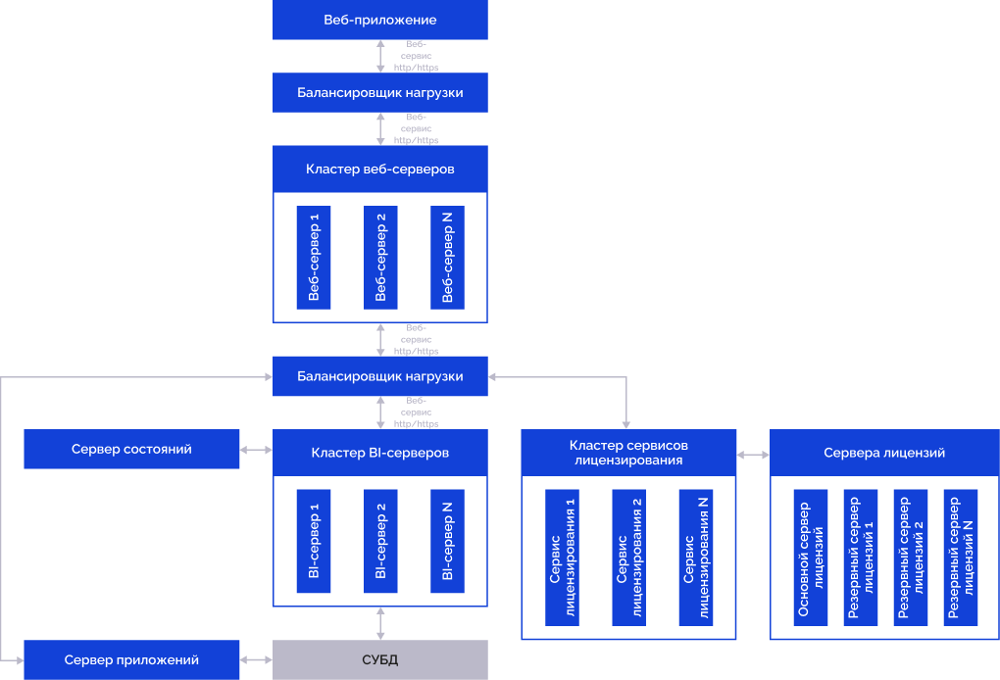
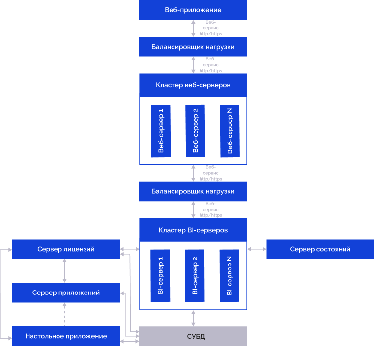

# Конфигурации систем и принцип их работы

Конфигурации систем и принцип их работы
-

# Конфигурации систем и принцип их работы

«Форсайт. Аналитическая платформа»
 может работать в различных конфигурациях, используя отдельные серверы
 для выделения ядра бизнес-логики, ядра безопасности или пользовательского
 интерфейса. Для простых систем, рассчитанных на небольшое количество пользователей,
 достаточно конфигурации с сервером СУБД и настольными приложениями «Форсайт. Аналитическая платформа»
 или BI-сервером и веб-приложениями. Для более сложных систем, в которых
 важна отказоустойчивость, можно сформировать [кластер
 из BI-серверов](UiWebSetup/01_BIServer/Cluster/Cluster_Of_BI_Server.htm), использовать виртуальные среды или облачные решения.
 При использовании двух и более BI-серверов рекомендуется добавлять в конфигурацию
 [сервер состояний](UiWebSetup/01_BIServer/StateServer/State_Server.htm),
 с помощью которого будут восстанавливаться параметры объектов в случае
 сбоя BI-сервера, к которому выполняется запрос. В качестве сервера состояний
 платформа поддерживает работу с [Redis](UiWebSetup/01_BIServer/StateServer/Redis.htm).

Примечание.
 Сервер состояний не входит в [комплект
 поставки продукта «Форсайт. Аналитическая платформа»](02_AK_Install/DistributionKit.htm).

Выбранная конфигурация должна учитывать способ организации серверов
 СУБД, в которых будут создаваться репозитории платформы, а также другие
 [источники данных](01_SysReq/database_Support.htm), к которым
 «Форсайт. Аналитическая платформа»
 может подключаться для получения данных.

Ниже приведена базовая конфигурация с использованием одного BI-сервера.

## Условные обозначения

В приведенных ниже конфигурациях используются следующие условные обозначения:

		 

		 Ядро бизнес-логики обеспечивает логику работы продукта «Форсайт. Аналитическая платформа»,
		 логику взаимодействия объектов, выполняет функции загрузки, обработки,
		 расчёта и сохранения данных.

		 

		 Ядро безопасности обеспечивает выполнение [функций
		 администрирования](#core) и информационной безопасности.

		 

		 Пользовательский интерфейс обеспечивает взаимодействие пользователя
		 с продуктом «Форсайт. Аналитическая платформа».

		 

		 [Веб-сервис](PPSOMService.chm::/Operations/BaseService.htm)
		 предназначен для взаимодействия между веб-приложением и серверами
		 системы, используя http/https запросы.

		 

		 Взаимодействие элементов конфигурации на уровне продукта
		 «Форсайт. Аналитическая платформа».

		 

		 Взаимодействие элементов конфигурации на уровне пользователя
		 в ручном режиме.

## Стандартная конфигурация

Стандартная конфигурация продукта «Форсайт. Аналитическая платформа»
 предполагает использование настольного приложения или веб-приложения:

[

При использовании настольного приложения:

	- Пользователь взаимодействует с интерфейсом настольного приложения.

	- Настольное приложение отправляет запросы к серверу лицензий,
	 по результатам которых настольное приложение определяет доступ к функциональности.

	- Настольное приложение взаимодействует с базой данных через драйвер
	 СУБД](03_DB_Server_Config/Setup_DB_ServerSysReq.htm#client) с помощью ядра бизнес-логики.

При использовании веб-приложения функции бизнес-логики и безопасности
 выполняет [BI-сервер](UiWebSetup/03_Setup_Web/BI_Server_Settings.htm),
 пользовательский интерфейс представлен веб-приложением:

	- Пользователь взаимодействует с интерфейсом веб-приложения.

	- Веб-приложение взаимодействует с [серверной частью](UiWebSetup/03_Setup_Web/Web_server_setup.htm)
	 и [BI-сервером](UiWebSetup/03_Setup_Web/BI_Server_Settings.htm),
	 через точку доступа [PP.SOM.Som](PPSOMService.chm::/Intro/PP7Service_Using.htm).
	 Схема отображает обобщенное взаимодействие, подробное описание взаимодействия
	 веб-приложения с другими компонентами приведено в разделе «[Установка
	 и настройка серверной части веб-приложения](UiWebSetup/03_Setup_Web/Web_server_setup.htm)».

	- BI-сервер отправляет запросы к серверу лицензий, по результатам
	 которых BI-сервер определяет доступ к функциональности.

	- BI-сервер взаимодействуют с базой данных через драйвер [СУБД](01_SysReq/database_Support.htm)
	 с помощью ядра бизнес-логики.

При выполнении отложенных ресурсоёмких задач по заданному расписанию:

	- Пользователь настраивает запланированные задачи в настольном
	 приложении, передает настройки [серверу
	 приложений](UiWebSetup/AppServer.htm) и запускает инструмент «[Планировщик
	 задач](uiappsrv.chm::/UiAppSrv_purpose.htm)».

	- Сервер приложений отправляет запросы к серверу лицензий, по
	 результатам которых сервер приложений определяет доступ к функциональности.

	- Сервер приложений выполняет отложенные ресурсоёмкие задачи по
	 заданному расписанию и взаимодействует с базой данных через драйвер
	 [СУБД](01_SysReq/database_Support.htm) с помощью ядра бизнес-логики.

Примечание.
 Сервер приложений может быть совмещен с BI-сервером. При выполнении ресурсоёмких
 задач располагайте сервер приложений отдельно от BI-сервера.

Установка BI-сервера и веб-приложения приведена в статьях: «[Установка
 веб-приложения на ОС Windows](UiWebSetup/Install_Web_on_Windows.htm)» и «[Установка
 веб-приложения на ОС Linux](UiWebSetup/Install_Web_on_Linux.htm)».

### Функции ядра безопасности

## Конфигурации систем на базе «Форсайт. Аналитическая платформа»

Систему рекомендуется разрабатывать как последовательность контуров,
 которые всё более полно удовлетворяют потребности заказчика.

Количество контуров определяется спецификой системы. Обязательно должно
 быть выделено минимум три контура: разработки, тестирования и промышленной
 эксплуатации.

### Конфигурация контура разработки

Контур разработки (DEV) создается одновременно с контуром тестирования
 для разработки функциональности системы:

[

### Конфигурация контура тестирования

Контур тестирования (TEST) создается одновременно с контуром разработки
 для тестирования разрабатываемой функциональности системы и имеет такую
 же конфигурацию. Разработанная функциональность переносится в контур тестирования
 из контура разработки.

](03_DB_Server_Config/Setup_DB_ServerSysReq.htm#client)
### Конфигурация контура промышленной эксплуатации

Контур промышленной эксплуатации (PROD) создается на стороне заказчика:

	ОС Linux ОС Windows

		

		[

		

В контуре используются реальные данные заказчика. Разработанная функциональность
 переносится на контур промышленной эксплуатации только после успешного
 прохождения тестирования в контуре тестирования.

См. также:

Установка
 и настройка продукта «Форсайт. Аналитическая платформа»](03_DB_Server_Config/Setup_DB_ServerSysReq.htm#bi)

		Справочная
		 система на версию 10.9
		 от 18/08/2025,
		 © ООО «ФОРСАЙТ»,
