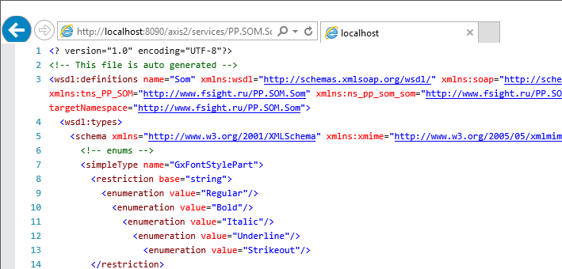
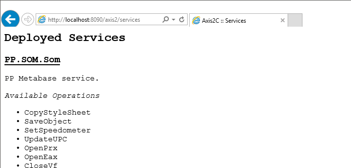

# Проверка работы BI-сервера

Проверка работы BI-сервера
-

# Проверка работы BI-сервера

Для проверки работы [BI-сервера](../UiWebSetup_TitlePage.htm)
 сформируйте две ссылки следующим образом:

	- если BI-сервер был установлен на веб-сервер IIS в ОС Windows,
	 строка будет иметь следующий вид:

		- http://localhost[:<port>]/FPBI_App_v10.x/axis2/services/PP.SOM.Som?wsdl

		- http://localhost[:<port>]/FPBI_App_v10.x/axis2/services

Где: <port> - номер порта, через который
 осуществляется работа (по умолчанию - 80); «FPBI_App_v10.x» - название виртуального
 каталога, который создается при установке BI-сервера. Название каталога
 зависит от версии BI-сервера.

	- если BI-сервер был установлен на веб-сервер Apache2
	 в ОС Linux, строка будет иметь следующий вид:

		- http://localhost:8810/FPBI_App_v10.x/axis2/services/PP.SOM.Som?wsdl

		- http://localhost:8810/FPBI_App_v10.x/axis2/services

Важно. Следующие
 части ссылок являются регистрозависимыми и должны быть указаны в соответствующем
 виде:

1) services;

2) PP.SOM.Som?wsdl.

Откройте полученные ссылки в браузере. Если в браузере отображается
 ошибка, то проверьте настройки веб-сервера и [перезапустите](bi-service_restart.htm)
 его.

Если BI-сервер работает корректно, то:

	- по первой ссылке ответ должен быть в виде XML:

	- по второй ссылке ответ должен содержать список доступных операций:

См. также:

[Проблемы при настройке веб-приложения
 «Форсайт. Аналитическая платформа»](../04_FAQ/ProblemPP.htm)

		Справочная
		 система на версию 10.9
		 от 18/08/2025,
		 © ООО «ФОРСАЙТ»,
