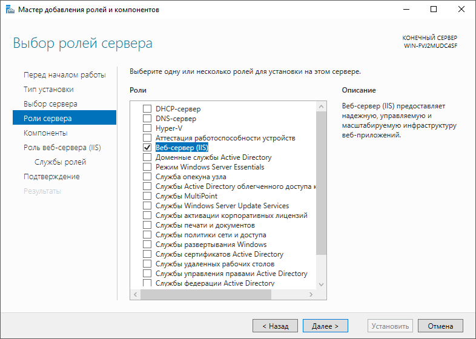
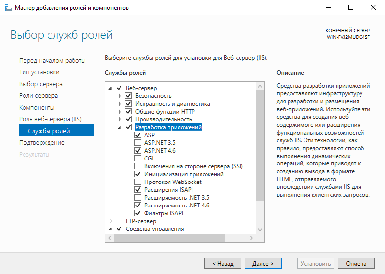

# Добавление роли «Веб-сервер»

Добавление роли «Веб-сервер»
-

# Добавление роли «Веб-сервер»

Добавление роли «Веб-сервер» выполняется перед установкой [BI-сервера](../Install_Web_on_Windows.htm)
 и [серверной части веб-приложения](WebSetup_Setup.htm) для
 ОС Windows, которая является серверной.

Для добавления роли «Веб-сервер»:

	- В «Диспетчере сервера»
	 перейдите на вкладку «Все серверы».
	 В разделе «Серверы» выполните
	 команду контекстного меню «Добавить
	 роли и компоненты» для нужного сервера в списке. Будет открыт
	 мастер добавления ролей и компонентов. Перейдите на вкладку «Роли сервера» и установите флажок
	 «Веб-сервер (IIS)». Будет
	 открыто окно подтверждения добавления компонента. Нажмите кнопку «Добавить компонент»:

	- Перейдите на вкладку «Службы
	 ролей» и откройте раздел «Веб-сервер».
	 Убедитесь, что установлены следующие флажки:

		- в подразделе «Безопасность»:

			- Проверка подлинности Windows;

			- Фильтрация запросов;

		- в подразделе «Разработка
		 приложений»:

			- ASP;

			- ASP.NET;

			- Инициализация приложений;

			- Расширения ISAPI;

			- Расширяемость .NET;

			- Фильтры ISAPI.

Остальные флажки в указанных подразделах
 рекомендуется снять:

	- Перейдите на последнюю страницу мастера и нажмите кнопку «Установить».

После выполнения действий будут установлены дополнительные компоненты
 и добавлена роль «Веб-сервер».

См. также:

[Установка
 BI-сервера в ОС Windows](../Install_Web_on_Windows.htm) | [Установка
 серверной части веб-приложения на IIS](WebSetup_Setup.htm)

		Справочная
		 система на версию 10.9
		 от 18/08/2025,
		 © ООО «ФОРСАЙТ»,
