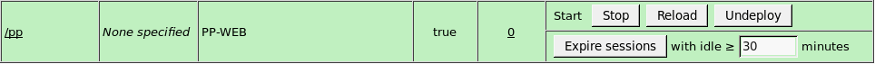

# Установка серверной части веб-приложения на Astra Linux

Установка серверной части веб-приложения на Astra Linux
-

# Установка серверной части веб-приложения на ОС Astra Linux

В данной статье приведен пример установки серверной части веб-приложения
 на ОС Astra Linux. В стандартной поставке ОС Astra Linux нет Java и сервера
 приложений Apache Tomcat, их можно скачать с официальных сайтов [Oracle](http://www.oracle.com) и [Apache
 Tomcat](http://tomcat.apache.org/).

Примечание.
 Java-машина не сертифицирована для использования в Astra Linux, рекомендуется
 использовать веб-сервер [Apache2](../ApacheWebApp/Apache_WebApp.htm).

Производите установку от имени пользователя, обладающего правами локального
 администратора компьютера.

Установка веб-приложения на OC Linux выполняется с помощью установочного
 архива pp.war. Процесс установки зависит от используемой версии Java.
 В инструкции приведен пример установки веб-приложения на Java веб-сервер
 Apache Tomcat версии 7.

	- Установите Java 7 или выше, информацию по установке Java на
	 debian-подобный дистрибутив можно найти в сети интернет.

	- Распакуйте архив Apache Tomcat 7 в домашний каталог пользователя,
	 предполагается что архив лежит в домашнем каталоге пользователя (в
	 терминале):

cd ~

tar xvfz ~/<имя_архива>.tar.gz

	- Откройте файл tomcat-users.xml:

sudo nano ~/<имя архива
 tomcat7>/conf/tomcat-users.xml

	- Добавьте пользователя с правами manager-gui:

<tomcat-users>

    <role
 rolename="manager-gui"/>

    <user
 username="<имя пользователя>" password="<пароль>"
 roles="manager-gui"/>

</tomcat-users>

	- Если размер архива веб-приложения pp.war
	 превышает лимит загрузки по умолчанию равный 50 мегабайт, то
	 отредактируйте допустимый лимит. Для этого откройте файл ~/<имя
	 архива tomcat7>/webapps/manager/config/web.xml:

sudo nano ~/<имя архива
 tomcat7>/webapps/manager/config/web.xml

и измените допустимый лимит:

<multipart-config>

    <max-file-size>524288000</max-file-size>

    <max-request-size>524288000</max-request-size>

</multipart-config>

	- Запустите Apache Tomcat в терминале:

~/<имя архива tomcat7>/bin/catalina.sh
 start

Примечание.
 Для проверки работы Apache Tomcat в браузере откройте страницу http://localhost:8080/.

	- В браузере перейдите на странице администрирования Apache
	 Tomcat по ссылке http://localhost:8080/manager/html. Авторизуйтесь
	 под пользователем, который был указан в tomcat-users.xml.

	- На открывшейся странице перейдите к разделу «WAR file to deploy».
	 Нажмите кнопку «Browse» и укажите путь к файлу pp.war:

Нажмите кнопку «Deploy».
 Убедитесь, что приложение успешно установлено:

	- Добавьте ссылку на BI-сервер и идентификатор репозитория, к
	 которому будет осуществляться подключение, в файле PP.xml. Чтобы открыть
	 файл, в терминале выполните команду:

sudo gedit /var/lib/<имя
 архива tomcat7>/webapps/pp/config/PP.xml

		- для BI-сервера, запущенного с помощью axis2_http_server:

<service url="http://localhost:9090/axis2/services/PP.SOM.Som"
 />

<metabase id="FPREPOSITORY"
 ping="120000" />

Важно.
 Запуск axis2_http_server в промышленной эксплуатации запрещён.

		- для BI-сервера, запущенного под управлением веб-сервера Apache2:

<service url="http://localhost/axis2/services/PP.SOM.Som"
 />

<metabase id="FPREPOSITORY"
 ping="120000" />

Если BI-сервер был установлен с помощью установочного
 пакета, то строка будет иметь следующий вид:

<service url="http://localhost:8810/FPBI_App_v10.x/axis2/services/PP.SOM.Som"
 />

	- Перезапустите Apache Tomcat для применения новой конфигурации.
	 Для этого выполните в терминале:

~/<имя архива tomcat7>/bin/catalina.sh
 stop

~/<имя архива tomcat7>/bin/catalina.sh
 start

	- Откройте веб-приложение, перейдя в браузере по ссылке http://localhost:8080/pp/app/login.html?repo=FPREPOSITORY,
	 где FPREPOSITORY - идентификатор репозитория.

Совет. Для доступа
 к веб-приложению обратитесь к статье «[Открытие
 веб-приложения](../Opening_Web_Application.htm)».

См. также:

[Установка
 и настройка в Debian-подобных дистрибутивах](../Debian/Install_BI_server_to_Debian.htm) | [Установка
 серверной части веб-приложения на Java](../Java_WebApp.htm)

		Справочная
		 система на версию 10.9
		 от 18/08/2025,
		 © ООО «ФОРСАЙТ»,
