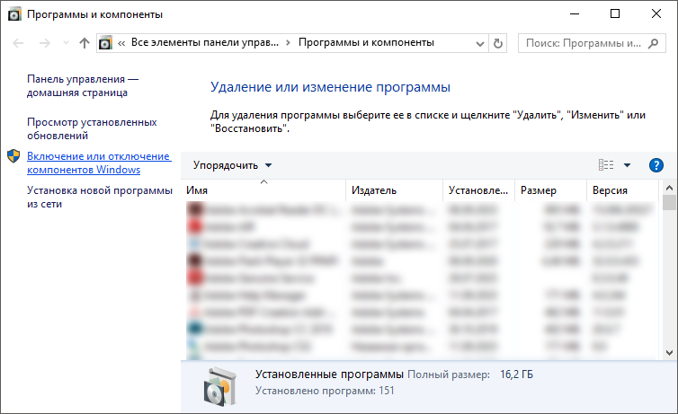

# Подключение служб IIS

Подключение служб IIS
-

# Подключение служб IIS

Подключение служб IIS выполняется перед установкой [BI-сервера](../Install_Web_on_Windows.htm)
 и [серверной части веб-приложения](WebSetup_Setup.htm) для
 ОС Windows, которая не является серверной.

Для подключения служб IIS:

	- Перейдите в панель управления Windows.

	- Перейдите в раздел «Программы
	 > Программы и компоненты». Будет открыто окно «Программы
	 и компоненты»:

	- Нажмите на ссылку «Включение
	 или отключение компонентов Windows» в левой части окна. Будет
	 открыто окно «Компоненты Windows».
	 Установите флажки в разделе «Службы
	 IIS», как указано ниже:

После выполнения действий будут подключены службы IIS.

См. также:

[Установка
 BI-сервера в ОС Windows](../Install_Web_on_Windows.htm) | [Установка
 серверной части веб-приложения на IIS](WebSetup_Setup.htm)

		Справочная
		 система на версию 10.9
		 от 18/08/2025,
		 © ООО «ФОРСАЙТ»,
