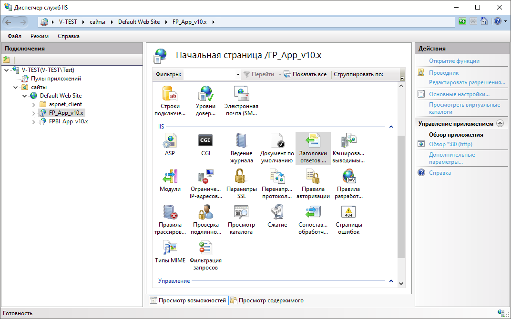
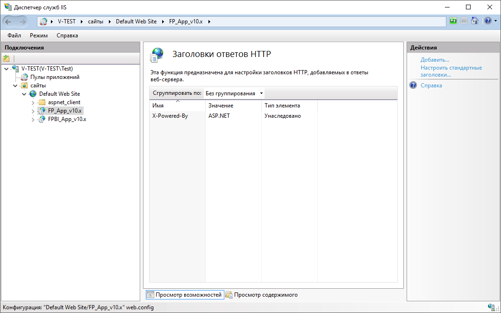
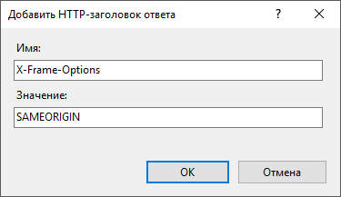
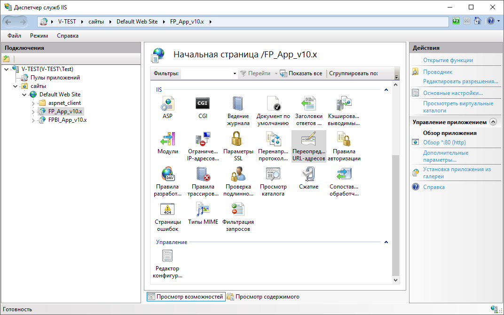
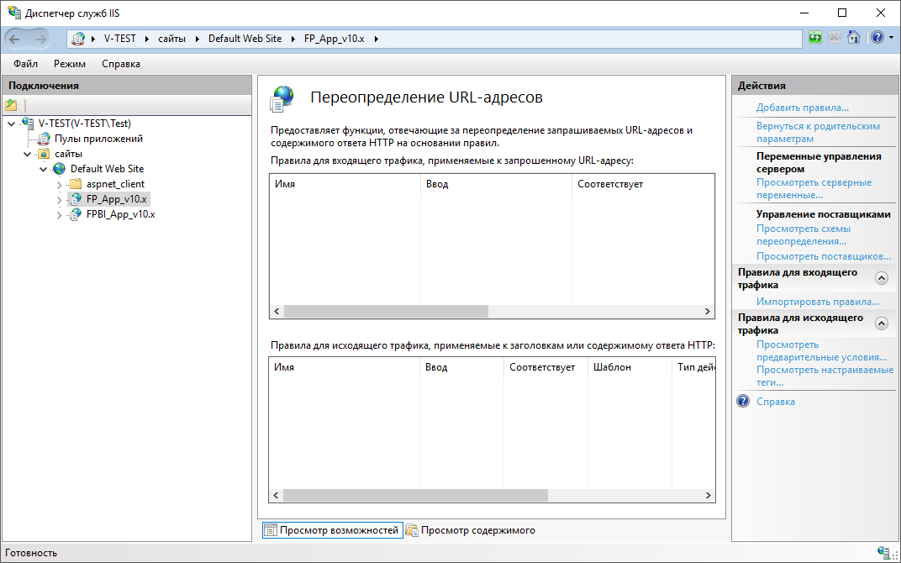
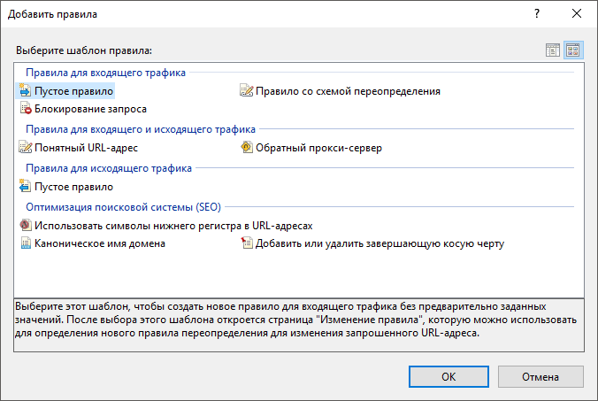
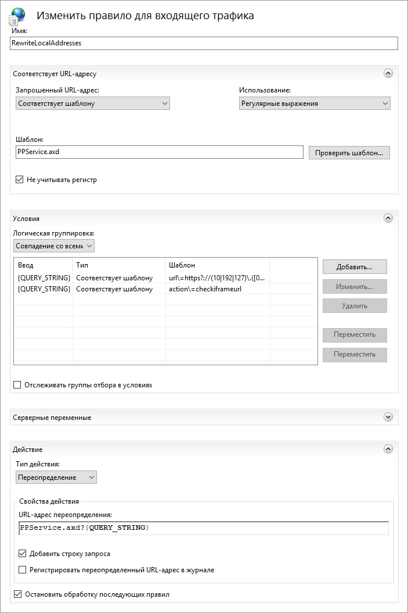
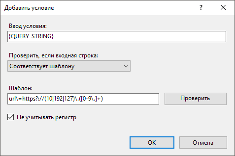

# Повышение безопасности веб-приложения

Повышение безопасности веб-приложения
-

# Повышение безопасности веб-приложения

	Для повышения безопасности веб-приложения добавьте следующие заголовки
	 ответов HTTP в настройках веб-сервера:

		- X-Frame-Options.
		 Обеспечивает блокировку атаки типа Clickjacking;

		- Content-Security-Policy.
		 Обеспечивает выявление и предотвращение атаки типа XSS и других;

		- X-XSS-Protection.
		 Обеспечивает выявление и предотвращение атаки типа XSS, загрузку
		 потенциально опасного кода, написанного на языке JavaScript, а
		 также блокирует удаление существующего кода.

		ОС
		 Windows ОС Linux

			Для добавления заголовков в ОС Windows откройте диспетчер
			 служб IIS и выполните действия:

				- Выберите категорию «FP_App_v10.x»
				 на боковой панели.

			

				- Откройте функцию 
				 «Заголовки ответов HTTP»
				 в разделе «IIS»
				 двойным щелчком мыши или с помощью команды контекстного
				 меню «Открытие функции»:

			

				- Выполните команду контекстного меню «Добавить»
				 или одноименную команду на панели «Действия».

			После выполнения действия будет
			 открыто окно «Добавить HTTP-заголовок
			 ответа»:

			

				- Задайте параметры:

					- Имя.
					 Введите заголовок ответа: X-Frame-Options, Content-Security-Policy
					 или X-XSS-Protection;

					- Значение.
					 Введите значение, соответствующее заголовку:

						- для X-Frame-Options - «DENY» или «SAMEORIGIN»;

						- для Content-Security-Policy - «default-src
						 'self' 'unsafe-inline' 'unsafe-eval' http://server.com;
						 object-src 'none'; script-src 'self' 'unsafe-inline'
						 'unsafe-eval' http://server.com;connect-src http://server.com/FP_App_v10.x/config/PP.xml
						 http://server.com/FPBI_App_v10.x/axis2/services/PP.SOM.Som;img-src
						 'self' data: http://server.com; <пользовательские
						 параметры при необходимости>».

			Замените server.com на DNS-имя
			 или IP-адрес сервера;

						- для X-XSS-Protection - «1» или «1; mode
						 block».

				- Нажмите кнопку «ОК».

				- Перезапустите веб-сервер IIS с помощью команды «Перезапустить» на панели
				 «Действия».

			После выполнения действий будут добавлены заголовки ответов,
			 повышающие безопасность веб-приложения.

			Для добавления заголовков в ОС Linux откройте файл /etc/apache2/sites-available/webserver.conf
			 и добавьте строки с заголовками в теге «FilesMatch»:

				- для X-Frame-Options задайте значение «DENY» или
				 «SAMEORIGIN»;

				- для Content-Security-Policy задайте значение «default-src
				 'self' 'unsafe-inline' 'unsafe-eval' http://server.com:8110; object-src
				 'none'; script-src 'self' 'unsafe-inline' 'unsafe-eval'
				 http://server.com:8110;connect-src
				 http://server.com:8110/fp10.x/config/PP.xml
				 http://server.com:8110/fp10.x/app/PPService.axd;img-src
				 'self' data: http://server.com:8110;
				 <пользовательские
				 параметры при необходимости>».

			Замените server.com на DNS-имя
			 или IP-адрес сервера и укажите используемый порт. По умолчанию
			 серверная часть веб-приложения доступна на порте 8110;

				- для X-XSS-Protection задайте значение «1» или «1;
				 mode block».

			После выполнения действий будут добавлены заголовки ответов,
			 повышающие безопасность веб-приложения.

			Пример добавленных заголовков:

			<FilesMatch "\.([^.]+)$">

			    Header set X-Frame-Options "SAMEORIGIN"

			    Header set Content-Security-Policy
			 "default-src 'self' 'unsafe-inline' 'unsafe-eval' http://server.com:8110; object-src 'none';
			 script-src 'self' 'unsafe-inline' 'unsafe-eval' http://server.com:8110;connect-src http://server.com:8110/fp10.x/config/PP.xml
			 http://server.com:8110/fp10.x/app/PPService.axd;img-src
			 'self' data: http://server.com:8110"

			    Header set X-XSS-Protection "1;
			 mode block"

			</FilesMatch>

## Дополнительные рекомендации

	Для дополнительного усиления безопасности при использовании веб-приложения
	 ознакомьтесь со следующими рекомендациями:

		- [предотвращение сканирования
		 сети и блокировка отправки запросов на непроверенные URL и IP-адреса
		 со стороны веб-приложения в ОС Windows](Security_Enhancement.htm#scan);

		- [отключение
		 вывода конфиденциальной информации при выполнении запросов к веб-сервису
		 PP.SOM.Som в ОС Linux](Security_Enhancement.htm#confidential_information).

### Предотвращение сканирования сети и блокировка
	 отправки запросов

	Для предотвращения сканирования сети и блокировки отправки запросов
	 на непроверенные URL и IP-адреса со стороны веб-приложения в ОС Windows
	 для веб-сервера IIS:

		- Установите расширение [URL Rewrite](https://www.iis.net/downloads/microsoft/url-rewrite)
		 для диспетчера служб IIS.

	После выполнения действия будет доступна
	 функция  «Переопределение
	 URL-адресов» в разделе «IIS»,
	 отвечающая за переопределение URL-адресов и содержимого на основании
	 правил:

	

		- Откройте функцию  «Переопределение
		 URL-адресов» двойным щелчком мыши или с помощью команды
		 контекстного меню «Открытие функции»:

	

		- Выполните команду контекстного меню «Добавить
		 правила» или одноименную команду на панели «Действия»
		 для входящего трафика.

	После выполнения действия будет открыто
	 окно «Добавить правила»:

	

		- Выберите  «Пустое
		 правило» для создания нового шаблона и нажмите кнопку «ОК».

	После выполнения действия будет открыта
	 страница «Изменить правило для входящего
	 трафика»:

	

		- Введите имя правила в поле «Имя».

		- Задайте параметры в разделах:

			- Соответствует URL-адресу.
			 Введите значение «PPService.axd» в поле «Шаблон»;

			- Условия. Добавьте
			 два условия с помощью кнопки «Добавить».

	После выполнения действия будет открыто
	 окно «Добавить условие»:

	

	Для каждого условия введите следующие
	 значения в поле «Шаблон»:

				- «url\=https?://(10|192|127)\.([0-9\.]+)»;

	Примечание.
	 Задайте шаблон в виде регулярного выражения вместо «https?://(10|192|127)\.([0-9\.]+)».
	 Выражение должно соответствовать белому списку, допустимому для выполнения
	 условий эксплуатации продукта «Форсайт. Аналитическая платформа».

				- «action\=checkiframeurl»;

			- Действие. Введите
			 значение «PPService.axd?{QUERY_STRING}» в поле «URL-адрес
			 переопределения» и установите флажок «Остановить
			 обработку последующих правил».

		- Выполните команду  «Применить»
		 на панели «Действия».

	После выполнения действий будет выполняться перенаправление IP-адресов,
	 начинающихся с «http://10.<...>»,
	 «http://192.<...>»
	 или «http://127.<...>»,
	 на ошибку. IP-адреса, начинающиеся с «http://10.<...>»,
	 «http://192.<...>»,
	 «http://127.<...>»,
	 приведены в качестве примера.

### Отключение вывода конфиденциальной
	 информации

	При выполнении POST-запроса к веб-сервису http://<IP-адрес
	 или DNS-имя сервера>[:<номер
	 порта (по умолчанию - 80)>]/FPBI_App_v10.x/axis2/services/PP.SOM.Som
	 может быть получена следующая конфиденциальная информация:

		- наименование базы данных;

		- наименование СУБД;

		- IP-адрес СУБД;

		- наименование схемы базы данных;

		- тип аутентификации в СУБД.

	Например, данная информация отображается при выполнении запроса:

	{"GetMbDefs":{"tArg":{"pattern":{"mbDefs":"Get","logonData":true,"filter":{}}}}}

	Для отключения вывода конфиденциальной информации при выполнении
	 запросов к веб-сервису PP.SOM.Som в ОС Linux:

		- Подключите модуль substitute в конфигурацию экземпляра Apache2
		 для удаление лишней информации при получении ответа от веб-сервера:

	a2enmod-fp10.x
	 substitute

		- Откройте файл /etc/apache2-fp10.x/mods-enabled/fp10.x-biserver.conf
		 и приведите содержимое строк к следующему виду:

	Axis2RepoPath "/opt/foresight/fp10.x-biserver/bin"

	Axis2LogFile "/opt/foresight/fp10.x-biserver/var/log/axis2.log"

	Axis2LogLevel info

	Axis2ServiceURLPrefix services

	<Location /FPBI_App_v10.x/axis2>

	   AddOutputFilterByType SUBSTITUTE application/json

	   Substitute "s|logonData\":.*?}|logonData\":\"\"|"

	   SetHandler axis2_module

	</Location>

	Значение модуля substitute «s|logonData\":.*?}|logonData\":\"\"|»
	 используется в качестве фильтрации конфиденциальной информации. В
	 данном случае содержимое logonData будет заменяться на пустое.

	При необходимости замените значение модуля
	 substitute на одну или несколько строк, например:

	Substitute "s|server\":.*?\,|server\":\"\",|"

	Substitute "s|schema\":.*?\,|schema\":\"\",|"

	Substitute "s|database\":.*?\,|database\":\"\",|"

	Substitute "s|driver\":.*?\,|driver\":\"\",|"

	После выполнения действий будет отключен вывод конфиденциальной
	 информации при выполнении запросов к веб-сервису PP.SOM.Som в соответствии
	 с заданными параметрами модуля substitute.

См. также:

[Настройки
 веб-приложения](PP_config_Java.htm) | [Открытие
 веб-приложения](Opening_Web_Application.htm)

		Справочная
		 система на версию 10.9
		 от 18/08/2025,
		 © ООО «ФОРСАЙТ»,
