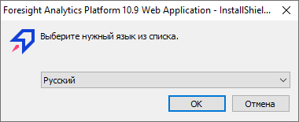
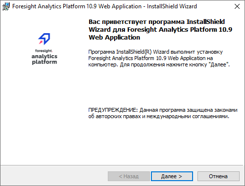
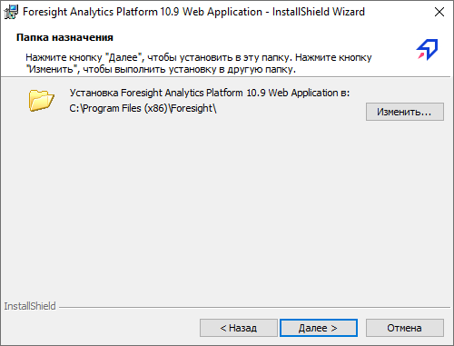
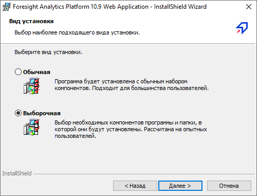
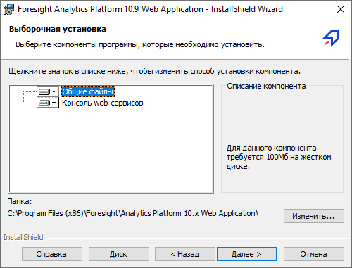
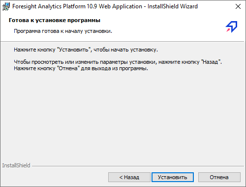

# Установка серверной части веб-приложения на IIS

Установка серверной части веб-приложения на IIS
-

# Установка серверной части веб-приложения
 на IIS

Производите установку от имени пользователя, обладающего правами локального
 администратора компьютера.

Перед началом установки, если веб-сервер будет устанавливаться на серверной
 ОС Windows, убедитесь, что была [добавлена
 роль сервера](Add_WebServer_Role.htm). Если веб-сервер будет установлен не на серверной
 OC Windows, то перед установкой необходимо [подключить
 службы IIS](IIS_turn_on.htm).

Установка серверной части веб-приложения на веб-сервер IIS
 выполняется с помощью инсталлятора FP10WebServer.exe.

Инсталлятор выполняет следующие действия:

	- устанавливает файлы веб-приложения;

	- настраивает IIS;

	- создает пул приложений и виртуальный каталог;

	- устанавливает [консоль
	 веб-сервиса](PPSOMService.chm::/Intro/WSC_Intro.htm)
	 (опционально).

Примечание.
 Для корректной установки проверьте, что на рабочей станции установлен
 программный пакет «Internet Information Services». Инструкции по его установке
 можно найти в документации на соответствующий программный пакет.

## Описание работы с инсталлятором

Для начала установки запустите файл FP10WebServer.exe.
 После запуска программа установки проверяет наличие более ранней сборки
 устанавливаемой версии продукта «Форсайт. Аналитическая платформа»
 и в случае обнаружения будет предложено [обновление
 продукта «Форсайт. Аналитическая платформа»](../../Update/Update.htm).

Если более ранней версии обнаружено не было, то будет выдано окно для
 выбора языка установки:

По умолчанию будет предложен язык, установленный в региональных настройках
 (см. Панель управления > Язык и региональные настройки > вкладка
 «Региональные настройки»).

Далее будет отображена первая страница мастера установки с вводной информацией:

Для продолжения установки нажмите кнопку «Далее».

На следующем этапе мастер установки предложит папку, в которую будет
 установлено веб-приложение «Форсайт. Аналитическая платформа».
 По умолчанию предлагается папка «C:\Program Files (x86)\Foresight\» или
 «C:\Program Files\Foresight\» в зависимости от разрядности операционной
 системы. Для изменения папки нажмите кнопку «Изменить».

Для продолжения установки нажмите кнопку «Далее».

На следующей странице установите переключатель на необходимом типе установки.
 По умолчанию осуществляется обычная установка. Возможность выбора устанавливаемых
 компонентов, в том числе консоли веб-сервисов, будет доступна при выборочной
 установке.

Для продолжения установки нажмите кнопку «Далее».

Выберите необходимые компоненты и нажмите кнопку «Далее».

На следующей странице для начала установки нажмите кнопку «Установить»:

На последней странице нажмите кнопку «Готово»
 для завершения установки.

После установки [настройте конфигурацию
 веб-приложения](PP_config_Java.htm).

Совет. Для доступа
 к веб-приложению обратитесь к статье «[Открытие
 веб-приложения](Opening_Web_Application.htm)».

См. также:

[Системные
 требования к серверу веб-приложения](../../03_DB_Server_Config/Setup_DB_ServerSysReq.htm#web) | [Установка
 BI-сервера на OC Windows](../Install_Web_on_Windows.htm#bi_install_windows)

		Справочная
		 система на версию 10.9
		 от 18/08/2025,
		 © ООО «ФОРСАЙТ»,
