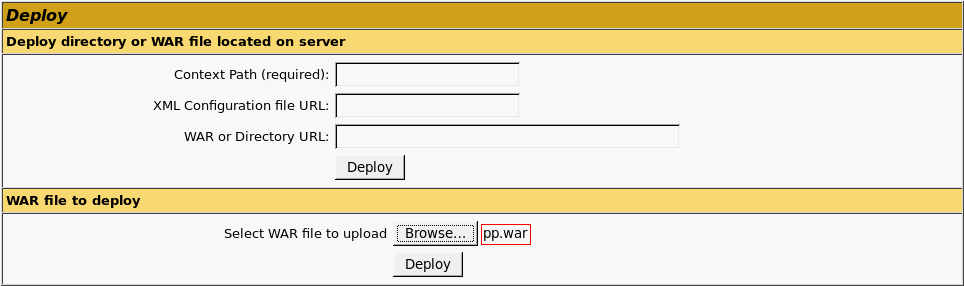

# Установка серверной части веб-приложения на ОС Windows

Установка серверной части веб-приложения на ОС Windows
-

# Установка серверной части веб-приложения на ОС Windows

В данной статье приведён пример установки серверной части веб-приложения
 на ОС Windows (поддерживаемые
 версии) на веб-сервер Java.

Производите установку от имени пользователя, обладающего правами локального
 администратора компьютера.

Установка веб-приложения на OC Windows выполняется с помощью установочного
 архива pp.war. Процесс установки зависит от используемой версии Java.
 В инструкции приведён пример установки веб-приложения на Java веб-сервер
 Apache Tomcat версии 7.

Для установки серверной части веб-приложения на ОС Windows:

	- Убедитесь, что на рабочей станции, где будет запускаться веб-приложение,
	 установлен браузер, соответствующий системным
	 требованиям.

	- Установите пакет [Apache
	 Tomcat версии 7](../../../BISearch/software_installation.htm#apache_tomcat_7). В файле tomcat-users.xml добавьте пользователя Apache
	 Tomcat с правами manager с помощью строк:

<role rolename="manager-gui"/>

<role rolename="manager-script"/>

<role rolename="manager-jmx"/>

<role rolename="manager-status"/>

<user username="<имя пользователя>"
 password="<пароль>"
 roles="manager-gui,manager-script,manager-jmx,manager-status"/>

Указанные имя пользователя и пароль в дальнейшем
 потребуются для авторизации под добавленным пользователем.

	- Для загрузки больших файлов внутри приложения потребуется убрать
	 или увеличить лимит оперативной памяти для Apache Tomcat. Для этого
	 запустите файл Tomcat7w.exe, расположенный в папке «S\bin», где S
	 - папка установки Apache Tomcat версии 7, и измените настройки выделяемой
	 памяти на вкладке Java.

	- Если размер архива веб-приложения pp.war превышает лимит загрузки
	 по умолчанию равный 50 мегабайт, то отредактируйте допустимый лимит.
	 Для этого откройте файл web.xml, расположенный в папке «S\webapps\manager\WEB-INF»,
	 где S - папка установки Apache Tomcat версии 7, и укажите новый допустимый
	 лимит в байтах:

<multipart-config>

    <max-file-size>94371840</max-file-size>

    <max-request-size>94371840</max-request-size>

</multipart-config>

	- Перезапустите Apache Tomcat.

Примечание.
 Для проверки работы Apache Tomcat в браузере перейдите на страницу http://localhost[:<port>]/, где <port>
 - [номер
 порта](../../../01_SysReq/EnviromentRequirements.htm#ports_and_protocols), через который осуществляется работа.

	- В браузере перейдите на страницу администрирования Apache Tomcat
	 по ссылке http://localhost[:<port>]/manager/html,
	 где <port> - [номер
	 порта](../../../01_SysReq/EnviromentRequirements.htm#ports_and_protocols), через который осуществляется работа. Авторизуйтесь под
	 пользователем, который был указан в tomcat-users.xml.

	- На открывшейся странице перейдите к разделу «WAR file to deploy».
	 Нажмите кнопку «Browse» и
	 укажите путь к файлу pp.war:

Нажмите кнопку «Deploy»
 для распаковки архива. В случае возникновения ошибки при распаковке удостоверьтесь,
 что Apache Tomcat установлен и запущен, и повторите попытку.

	- Откройте файл PP.xml, расположенный в папке «S\webapps\pp\config»,
	 где S - папка установки Apache Tomcat версии 7, и добавьте в него
	 ссылку на BI-сервер и идентификатор репозитория, к которому будет
	 осуществляться подключение:

<service url="http://localhost[:<port>]/FPBI_App_v10.x/axis2/services/PP.SOM.Som"
 />

<metabase id="FPREPOSITORY" ping="120000" />

Где: <port>
 - [номер
 порта](../../../01_SysReq/EnviromentRequirements.htm#ports_and_protocols), через который осуществляется работа; «FPBI_App_v10.x» - наименование виртуального
 каталога, который создаётся при установке BI-сервера; FPREPOSITORY - идентификатор
 репозитория.

	- Перезапустите Apache Tomcat.

	- Откройте веб-приложение, перейдя в браузере по одной из следующих
	 ссылок:

		- http://localhost[:<port>]/pp/app/login.html?repo=FPREPOSITORY,
		 где <port> - [номер
		 порта](../../../01_SysReq/EnviromentRequirements.htm#ports_and_protocols), через который осуществляется работа, FPREPOSITORY -
		 идентификатор репозитория;

		- http://localhost:<port>/pp,
		 где <port> - [номер
		 порта](../../../01_SysReq/EnviromentRequirements.htm#ports_and_protocols).

Совет. Для доступа
 к веб-приложению обратитесь к статье «[Открытие
 веб-приложения](../Opening_Web_Application.htm)».

См. также:

[Установка
 BI-сервера в ОС Windows](../../Install_Web_on_Windows.htm) | [Установка серверной
 части веб-приложения на Java](../Java_WebApp.htm)

		Справочная
		 система на версию 10.9
		 от 18/08/2025,
		 © ООО «ФОРСАЙТ»,
