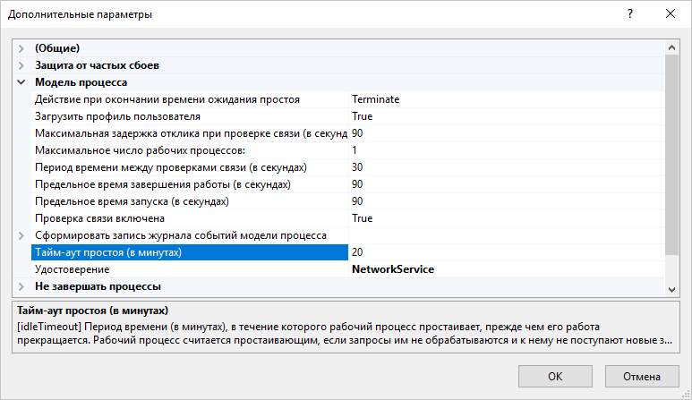

# Настройка таймаутов работы

Настройка таймаутов работы
-

# Настройка таймаутов работы

При работе веб-приложения, в зависимости от различных факторов, могут
 возникнуть ситуации, когда требуется изменить время ожидания запросов/ответов
 какой-либо частью разрабатываемой системы. Стандартная конфигурация приложения
 включает в себя следующие звенья: сервер СУБД, BI-сервер, веб-сервер,
 серверная часть веб-приложения, клиентский компьютер.

Настройка сервера СУБД осуществляется в соответствии с документацией
 по конкретной используемой СУБД. На клиентской станции настройки не задаются.

Ниже представлено описание настройки таймаутов работы BI-сервера, веб-сервера
 IIS, серверной части веб-приложения.

## Настройка BI-сервера

Для настройки таймаутов работы BI-сервера используйте [реестр](BI_Server_Registry_Key.htm)
 или файл [settings.xml](BI_Server_Settings_XML.htm). В ветке
 [HKLM\SOFTWARE\Foresight\Foresight Analytics Platform\10.0\PP\BIS\System\Session]
 или в соответствующем разделе файла settings.xml в параметре TimeoutSec
 задайте время ожидания запросов к репозиторию и его объектам. Время указывается
 в секундах, по умолчанию - 1800 секунд (30 минут). По истечению заданного
 времени сессия с репозиторием будет разорвана.

## Настройка веб-сервера IIS

Для настройки таймаутов работы веб-сервера IIS:

	- Задайте параметр timeout
	 в конфигурационном файле веб-приложения web.config, расположенном
	 в папке установки веб-приложения, в подкаталоге config:

<configuration>
  <system.web>
    <sessionState mode="InProc" cookieless="true" timeout="30" />
  </system.web>
</configuration>

	- Задайте параметр «Тайм-аут
	 простоя (в минутах)» в дополнительных настройках пула веб-приложения,
	 в интерфейсе веб-сервера IIS:

## Настройка серверной части веб-приложения

Для настройки таймаутов работы серверной части веб-приложения:

	- Задайте атрибут timeout
	 в файле [PP.xml](PP_config_Java.htm#pp_xml) в разделе [<service>](PP_config_Java.htm#service). Атрибут позволяет
	 определять время ожидания выполнения запроса, направленного BI-серверу.
	 Значение атрибута задаётся в миллисекундах, например:

<pp>
   <service url="…" timeout="60000" />
</pp>

	- Задайте поле ping в
	 файле [config.json](PP_config_Java.htm#config_json) в поле
	 [metabase](PP_config_Java.htm#metabase_config). Поле позволяет
	 определять время проверки соединения с BI-сервером. Значение поля
	 задаётся в миллисекундах, например:

{
  "metabase":{
    "ping": 20000
  }
}

См. также:

[Системные
 настройки продукта](BI_Server_Settings.htm)

		Справочная
		 система на версию 10.9
		 от 18/08/2025,
		 © ООО «ФОРСАЙТ»,
